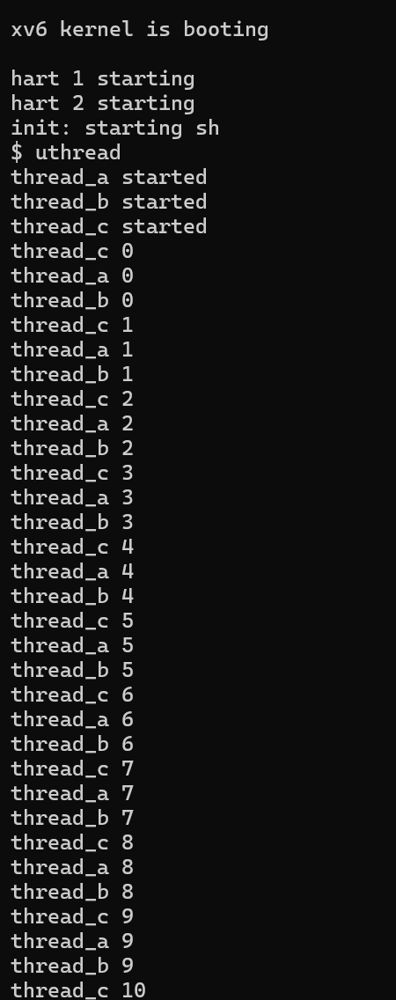
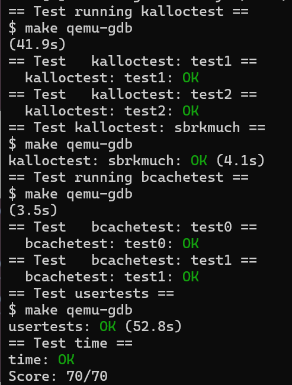

# xv6及Labs课程项目

<!-- TOC Start -->
- [xv6及Labs课程项目](#xv6及labs课程项目)
  - [目录](#目录)
  - [环境搭建](#环境搭建)
    - [实验配置](#实验配置)
  - [Lab1 Xv6 and Unix utilities](#lab1-xv6-and-unix-utilities)
    - [sleep](#sleep)
      - [一、实验目的](#一实验目的)
      - [二、实验内容](#二实验内容)
      - [三、实验中遇到的问题及解决方法](#三实验中遇到的问题及解决方法)
      - [四、实验总结](#四实验总结)
    - [pingpong](#pingpong)
      - [一、实验目的](#一实验目的-2)
      - [二、实验内容](#二实验内容-2)
      - [三、实验中遇到的问题及解决方法](#三实验中遇到的问题及解决方法-2)
      - [四、实验总结](#四实验总结-2)
    - [primes](#primes)
      - [一、实验目的](#一实验目的-3)
      - [二、实验内容](#二实验内容-3)
      - [三、实验中遇到的问题及解决方法](#三实验中遇到的问题及解决方法-3)
      - [四、实验总结](#四实验总结-3)
    - [find](#find)
      - [一、实验目的](#一实验目的-4)
      - [二、实验过程](#二实验过程)
      - [三、实验中遇到的问题及解决方法](#三实验中遇到的问题及解决方法-4)
      - [四、实验心得](#四实验心得)
    - [xargs](#xargs)
      - [一、实验目的](#一实验目的-5)
      - [二、实验过程](#二实验过程-2)
      - [三、实验中遇到的问题及解决方法](#三实验中遇到的问题及解决方法-5)
      - [四、实验心得](#四实验心得-2)
    - [Lab1 通过结果截图](#lab1-通过结果截图)
  - [Lab2 system calls](#lab2-system-calls)
    - [System call tracing](#system-call-tracing)
      - [一、实验目的](#一实验目的-6)
      - [二、实验内容](#二实验内容-4)
      - [三、实验中遇到的问题及解决方法](#三实验中遇到的问题及解决方法-6)
      - [四、实验心得](#四实验心得-3)
    - [Sysinfo](#sysinfo)
      - [一、实验目的](#一实验目的-7)
      - [二、实验过程](#二实验过程-3)
      - [三、实验中遇到的问题及解决方法](#三实验中遇到的问题及解决方法-7)
      - [四、实验心得](#四实验心得-4)
    - [Lab2 通过结果截图](#lab2-通过结果截图)
  - [Lab3 page tables](#lab3-page-tables)
    - [Print a page table](#print-a-page-table)
      - [一、实验目的](#一实验目的-8)
      - [二、实验内容](#二实验内容-5)
      - [三、 实验中遇到的问题及解决方法](#三-实验中遇到的问题及解决方法)
      - [四、实验心得](#四实验心得-5)
    - [A kernel page table per process](#a-kernel-page-table-per-process)
      - [一、 实验目的](#一-实验目的)
      - [二、 实验内容](#二-实验内容)
      - [三、 实验中遇到的问题及解决方法](#三-实验中遇到的问题及解决方法-2)
      - [四、 实验心得](#四-实验心得)
    - [Simplify](#simplify)
      - [一、 实验目的](#一-实验目的-2)
      - [二、 实验内容](#二-实验内容-2)
      - [三、 实验中遇到的问题及解决方法](#三-实验中遇到的问题及解决方法-3)
      - [四、 实验心得](#四-实验心得-2)
    - [Lab3 通过结果截图](#lab3-通过结果截图)
  - [Lab4 traps](#lab4-traps)
    - [RISC-V assembly](#risc-v-assembly)
      - [一、实验目的](#一实验目的-9)
      - [二、实验内容](#二实验内容-6)
      - [三、实验中遇到的问题及解决方法](#三实验中遇到的问题及解决方法-8)
      - [四、实验心得](#四实验心得-6)
    - [Backtrace](#backtrace)
      - [一、实验目的](#一实验目的-10)
      - [二、实验内容](#二实验内容-7)
      - [三、实验中遇到的问题及解决方法](#三实验中遇到的问题及解决方法-9)
      - [四、实验心得](#四实验心得-7)
    - [Alarm](#alarm)
      - [一、 实验目的](#一-实验目的-3)
      - [二、 实验内容](#二-实验内容-3)
      - [三、实验中遇到的问题及解决方法](#三实验中遇到的问题及解决方法-10)
      - [四、 实验心得](#四-实验心得-3)
    - [Lab4 通过结果截图](#lab4-通过结果截图)
  - [Lab5 xv6 lazy page allocation](#lab5-xv6-lazy-page-allocation)
    - [lazy page allocation](#lazy-page-allocation)
      - [一、 实验目的](#一-实验目的-4)
      - [二、 实验内容](#二-实验内容-4)
      - [三、 实验中遇到的问题及解决方法](#三-实验中遇到的问题及解决方法-4)
      - [四、实验心得](#四实验心得-8)
    - [Lab5 通过结果截图](#lab5-通过结果截图)
  - [Lab6 Copy-on-Write](#lab6-copy-on-write)
    - [Implement copy-on write](#implement-copy-on-write)
      - [一、 实验目的](#一-实验目的-5)
      - [二、 实验内容](#二-实验内容-5)
      - [三、 实验中遇到的问题及解决方法](#三-实验中遇到的问题及解决方法-5)
      - [四、 实验心得](#四-实验心得-4)
    - [Lab6 通过结果截图](#lab6-通过结果截图)
  - [Lab7 Multithreading](#lab7-multithreading)
    - [Uthread: switching between threads](#uthread-switching-between-threads)
      - [一、 实验目的](#一-实验目的-6)
      - [二、 实验内容](#二-实验内容-6)
      - [三、 实验中遇到的问题及解决方法](#三-实验中遇到的问题及解决方法-6)
      - [四、 实验心得](#四-实验心得-5)
    - [Using threads](#using-threads)
      - [一、 实验目的](#一-实验目的-7)
      - [二、 实验内容](#二-实验内容-7)
      - [三、 实验中遇到的问题及解决方 法](#三-实验中遇到的问题及解决方-法)
      - [四、 实验心得](#四-实验心得-6)
    - [Barrier](#barrier)
      - [一、 实验目的](#一-实验目的-8)
      - [二、 实验内容](#二-实验内容-8)
      - [三、 实验中遇到的问题及解决方法](#三-实验中遇到的问题及解决方法-7)
      - [四、 实验心得](#四-实验心得-7)
    - [Lab7 通过结果截图](#lab7-通过结果截图)
  - [Lab8 locks](#lab8-locks)
    - [Memory allocator](#memory-allocator)
      - [一、 实验目的](#一-实验目的-9)
      - [二、 实验内容](#二-实验内容-9)
      - [三、 实验中遇到的问题及解决方法](#三-实验中遇到的问题及解决方法-8)
      - [四、 实验心得](#四-实验心得-8)
    - [Buffer cache](#buffer-cache)
      - [一、 实验目的](#一-实验目的-10)
      - [二、 实验内容](#二-实验内容-10)
      - [三、 实验中遇到的问题及解决方法](#三-实验中遇到的问题及解决方法-9)
      - [四、 实验心得](#四-实验心得-9)
    - [Lab8 通过结果截图](#lab8-通过结果截图)
  - [Lab9 File Systems](#lab9-file-systems)
    - [Large File](#large-file)
      - [一、 实验目的](#一-实验目的-11)
      - [二、 实验内容](#二-实验内容-11)
      - [三、 实验中遇到的问题及解决方法](#三-实验中遇到的问题及解决方法-10)
      - [四、 实验心得](#四-实验心得-10)
    - [Symbolic links](#symbolic-links)
      - [一、 实验目的](#一-实验目的-12)
      - [二、 实验内容](#二-实验内容-12)
      - [三、 实验中遇到的问题及解决方法](#三-实验中遇到的问题及解决方法-11)
      - [四、 实验心得](#四-实验心得-11)
    - [Lab9 通过结果截图](#lab9-通过结果截图)
  - [Lab10 mmap](#lab10-mmap)
    - [mmap](#mmap)
      - [一、 实验目的](#一-实验目的-13)
      - [二、 实验内容](#二-实验内容-13)
      - [三、 实验中遇到的问题及解决方法](#三-实验中遇到的问题及解决方法-12)
      - [四、 实验心得](#四-实验心得-12)
    - [Lab10 通过结果截图](#lab10-通过结果截图)
  - [Lab11 Networking](#lab11-networking)
    - [Your job](#your-job)
      - [一、 实验目的](#一-实验目的-14)
      - [二、 实验内容](#二-实验内容-14)
      - [三、 实验中遇到的问题及解决方法](#三-实验中遇到的问题及解决方法-13)
      - [四、 实验心得](#四-实验心得-13)
    - [Lab11 通过结果截图](#lab11-通过结果截图)
<!-- TOC End -->


<a name="环境搭建"></a>
## 环境搭建
* 操作系统：Ubuntu-20.04
<a name="实验配置"></a>
### 实验配置
1. 安装依赖
```c
$ sudo apt-get install git build-essential gdb-multiarch qemu-system-misc gcc-riscv64-linux-gnu binutils-riscv64-linux-gnu 
```
2. 安装QEMU
```c
$ sudo apt-get remove qemu-system-misc
$ sudo apt-get install qemu-system-misc=1:4.2-3ubuntu6
```
3. 安装GDB调试
```c
$ sudo apt-get install libncurses5-dev python python-dev texinfo libreadline-dev
```
4. 测试安装
```c
$ riscv64-unknown-elf-gcc --version
$ qemu-system-riscv64 --version
```


<a name="lab1-xv6-and-unix-utilities"></a>
## Lab1 Xv6 and Unix utilities

<a name="sleep"></a>
### sleep
<a name="一实验目的"></a>
#### 一、实验目的

* 编写一个用户级程序 `sleep`，使其能暂停指定数量的时间片。

<a name="二实验内容"></a>
#### 二、实验内容
1. 获取并切换分支
```bash
  cd xv6-labs-2021
  git checkout util
```
2. 创建并编写 user/sleep.c
```c
#include "kernel/types.h"
#include "kernel/stat.h"
#include "user/user.h"

int main(int argc, char *argv[]) {
  if (argc != 2) {
    fprintf(2, "usage: sleep [ticks num]\n");
    exit(1);
  }

  int ticks = atoi(argv[1]);
  int ret = sleep(ticks);
  exit(ret);
}
```
3. 修改 Makefile,在 `UPROGS` 中添加一项：
```make
  UPROGS=\
    $U/_sleep\
```
4. 编译并运行
```bash
  make qemu
```
输入 `sleep 10` 后，程序成功暂停一段时间，再次返回 shell 提示符，说明 `sleep` 实现正确。
```bash
  $ sleep 10
```
<a name="三实验中遇到的问题及解决方法"></a>
#### 三、实验中遇到的问题及解决方法
* sleep.c中3个头文件必须按照固定的顺序，因为他们有依赖关系。
```c
#include "kernel/types.h"
#include "kernel/stat.h"
#include "user/user.h"
```
* 注意要在 Makefile 中将 sleep 加入构建目标里。
```make
UPROGS=\
  ......
  $U/_sleep\
```

<a name="四实验总结"></a>
#### 四、实验总结
* 本实验加深了对 xv6 系统调用机制的理解；
* 掌握了在 xv6 中创建用户程序、解析命令行参数、调用系统调用的方法；
* sleep 的实现展示了如何与内核通信、如何编写可移植的用户程序。


<a name="pingpong"></a>
### pingpong
<a name="一实验目的-2"></a>
#### 一、实验目的
* 编写一个使用 UNIX 系统调用的 pingpong 程序，实现父子进程通过两个单向管道（pipe）进行双向通信；
* 加深对 xv6 系统调用、进程控制与管道机制的理解；
* 掌握在 xv6 中创建用户程序并进行编译运行的方法。

<a name="二实验内容-2"></a>
#### 二、实验内容
1. 获取并切换到 util 分支
```bash
cd xv6-labs-2021
git checkout util
```

2. 创建并编写 user/pingpong.c
```c
#include "kernel/types.h"
#include "kernel/stat.h"
#include "user/user.h"

int main(int argc, char **argv) {
	// 创建管道会得到一个长度为 2 的 int 数组
	// 其中 0 为用于从管道读取数据的文件描述符，1 为用于向管道写入数据的文件描述符
	int pp2c[2], pc2p[2];
	pipe(pp2c); // 创建用于 父进程 -> 子进程 的管道
	pipe(pc2p); // 创建用于 子进程 -> 父进程 的管道
	
	if(fork() != 0) { // parent process
		write(pp2c[1], "!", 1); // 1. 父进程首先向发出该字节
		char buf;
		read(pc2p[0], &buf, 1); // 2. 父进程发送完成后，开始等待子进程的回复
		printf("%d: received pong\n", getpid()); // 5. 子进程收到数据，read 返回，输出 pong
		wait(0);
	} else { // child process
		char buf;
		read(pp2c[0], &buf, 1); // 3. 子进程读取管道，收到父进程发送的字节数据
		printf("%d: received ping\n", getpid());
		write(pc2p[1], &buf, 1); // 4. 子进程通过 子->父 管道，将字节送回父进程
	}
	exit(0);
}
```
3. 修改 Makefile
```c
UPROGS=\
  $U/_pingpong\
```
4. 编译并运行
```bash
make qemu
```
在 xv6 shell 中运行 `pingpong`，父子进程成功完成通信。
```bash
$ pingpong
    4: received ping
    3: received pong
```
<a name="三实验中遇到的问题及解决方法-2"></a>
#### 三、实验中遇到的问题及解决方法
* 注意要在 Makefile 中将 pingpong 加入构建目标里。
```make
UPROGS=\
  ......
  $U/_pingpong\
```

<a name="四实验总结-2"></a>
#### 四、实验总结
* 通过实现 pingpong，掌握了 xv6 中父子进程的创建与通信机制；
* 熟悉了管道 pipe 的使用方式，以及如何基于 fork() 实现数据双向流动；

<a name="primes"></a>
### primes

<a name="一实验目的-3"></a>
#### 一、实验目的
* 理解并实现一个基于进程和管道的素数筛选器（prime sieve）；
* 熟悉 UNIX 风格的管道通信与 `fork()`、`pipe()`、`read()`、`write()` 的协同使用；

<a name="二实验内容-3"></a>
#### 二、实验内容
1. 创建文件 user/primes.c
```c
#include "user/user.h"

void prime_sieve(int p_read) {
    // Read the first prime number from the pipe
    int n;
    if (read(p_read, &n, sizeof(int)) != sizeof(int)) {
        close(p_read);
        exit(0);
    }

    int prime = n;
    printf("prime %d\n", prime);

    int p[2];
    pipe(p);

    int pid = fork();
    if (pid == 0) { 
        // child process
        close(p[1]);         
        prime_sieve(p[0]);  
    } 
    else {
        // parent process
        close(p[0]); 
        while (read(p_read, &n, sizeof(int)) == sizeof(int)) {
            if (n % prime != 0) {
                write(p[1], &n, sizeof(int));
            }
        }
        close(p_read);
        close(p[1]);
        wait(0); 
    }

    exit(0);
} 

int main() {
    // Create a pipe for communication
    int p[2]; 
    pipe(p);  

    int pid = fork();
    if (pid == 0) {
        // child process
        close(p[1]);         
        prime_sieve(p[0]);  
    } 
    else {
        // parent process
        close(p[0]); 
        for (int i = 2; i <= 35; i++) {
            write(p[1], &i, sizeof(int));
        }
        close(p[1]); 
        wait(0);     
    }

    exit(0);
}
```

2. 修改 Makefile
```make
$U/_primes\
```

3. 编译并运行程序
```bash
make qemu
```

在 xv6 shell 中运行：
```bash
$ primes
```
运行结果如下，输出了 2\~35 之间的所有素数：
```bash
$ primes
prime 2
prime 3
prime 5
prime 7
prime 11
prime 13
prime 17
prime 19
prime 23
prime 29
prime 31
$
```
<a name="三实验中遇到的问题及解决方法-3"></a>
#### 三、实验中遇到的问题及解决方法
* stage 之间的管道 pleft 和 pright，要关闭不需要用到的文件描述符，否则会出现读到全是 0 的情况。由于一个管道会同时打开一个输入文件和一个输出文件，所以一个管道就占用了 2 个文件描述符，并且复制的子进程还会复制父进程的描述符，于是跑到第六七层后，就会由于最末端的子进程出现 16 个文件描述符都被占满的情况，导致新管道创建失败。
```c
prime 2
prime 3
prime 5
prime 7
prime 11
prime 13
prime 0
prime 0
prime 0
prime 0
prime 0
prime 0
```
* 解决方法：
1.关闭管道的两个方向中不需要用到的方向的文件描述符
（原理：每个进程从左侧的读入管道中只需要读数据，并且只需要写数据到右侧的输出管道，所以可以把左侧管道的写描述符，以及右侧管道的读描述符关闭，而不会影响程序运行）
2.子进程创建后，关闭父进程与祖父进程之间的文件描述符（因为子进程并不需要用到之前 stage 的管道）

<a name="四实验总结-3"></a>
#### 四、实验总结
* 本实验成功实现了一个基于管道和进程的并发素数筛选器；
* 深刻理解了 fork()、pipe()、read()、write()、wait() 在进程通信中的角色；

<a name="find"></a>
### find
<a name="一实验目的-4"></a>
#### 一、实验目的
* 实现简易版 UNIX 命令 `find`，递归查找目录中与给定名字匹配的文件。
* 熟悉 xv6 文件系统结构与递归遍历机制。
<a name="二实验过程"></a>
#### 二、实验过程
1. 新建文件 user/find.c ：
```c
#include "kernel/types.h"
#include "kernel/stat.h"
#include "user/user.h"
#include "kernel/fs.h"

char* fmtname(char* path) {
  static char buf[DIRSIZ + 1];
  char* p;

  // Find first character after last slash.
  for (p = path + strlen(path); p >= path && *p != '/'; p--)
    ;
  p++;
  memmove(buf, p, strlen(p));
  buf[strlen(p)] = '\0';
  return buf;
}

void find(char* path, char* target) {
  char buf[512], *p;
  int fd;
  struct dirent de;
  struct stat st;

  if ((fd = open(path, 0)) < 0) {
    fprintf(2, "find: cannot open %s\n", path);
    return;
  }

  if (fstat(fd, &st) < 0) {
    fprintf(2, "find: cannot stat %s\n", path);
    close(fd);
    return;
  }

  if (st.type != T_DIR) {
    if (strcmp(fmtname(path), target) == 0)
      printf("%s\n", path);
    close(fd);
    return;
  }

  if (strlen(path) + 1 + DIRSIZ + 1 > sizeof buf) {
    printf("find: path too long\n");
    close(fd);
    return;
  }

  strcpy(buf, path);
  p = buf + strlen(buf);
  *p++ = '/';

  while (read(fd, &de, sizeof(de)) == sizeof(de)) {
    if (de.inum == 0)
      continue;

    memmove(p, de.name, DIRSIZ);
    p[DIRSIZ] = 0;

    if (strcmp(de.name, ".") == 0 || strcmp(de.name, "..") == 0)
      continue;

    find(buf, target);
  }

  close(fd);
}

int main(int argc, char* argv[]) {
  if (argc != 3) {
    fprintf(2, "Usage: find <path> <filename>\n");
    exit(1);
  }

  find(argv[1], argv[2]);
  exit(0);
}

```

2. 修改 Makefile：
```make
 UPROGS=\
   $U/_find\
```

3. 编译并运行测试：
```bash
  make qemu
```

   在 shell 中输入：
   ```bash
   $ echo > b
   $ mkdir a
   $ echo > a/b
   $ find . b
   ```
```bash
$ find . b
./b
./a/b
```
<a name="三实验中遇到的问题及解决方法-4"></a>
#### 三、实验中遇到的问题及解决方法
* 目录中自身（.）和父目录（..）的目录项没有过滤掉，导致无限递归。
* 解决方法：
在读取每个目录项后，加入条件，跳过"."和".."。
```c
if (strcmp(de.name, ".") == 0 || strcmp(de.name, "..") == 0)
  continue;
```

<a name="四实验心得"></a>
#### 四、实验心得
* 利用 `read` 读取目录项，配合 `stat` 获取元信息；
* 使用 `strcmp` 字符串比较匹配文件名；
* 使用递归函数跳过 `"."` 和 `".."`，向子目录深入。

<a name="xargs"></a>
### xargs

<a name="一实验目的-5"></a>
#### 一、实验目的
* 实现简易版 `xargs`，读取标准输入并逐行作为参数运行给定命令。
* 熟悉 `fork/exec/wait` 调用机制和标准输入读取。

<a name="二实验过程-2"></a>
#### 二、实验过程
1. 新建文件 user/xargs.c ：
```c
#include "kernel/types.h"
#include "kernel/stat.h"
#include "user/user.h"

int main(int argc, char* argv[]) {
    if (argc < 2) { // Check at least one command is provided
        fprintf(2, "Usage: xargs <command> [args...]\n");
        exit(1);
    }

    char buf[512];
    int i = 0;
    char ch;

    // Read input from stdin until EOF or newline
    while (read(0, &ch, 1) == 1) {
        if (ch == '\n') {
            buf[i] = 0;
            i = 0;

            char* args[32];
            int j;
            for (j = 1; j < argc; j++) {
                args[j - 1] = argv[j];
            }
            args[j - 1] = buf;
            args[j] = 0;

            if (fork() == 0) {
                // child process 
                exec(argv[1], args);
                fprintf(2, "xargs: exec failed\n");
                exit(1);
            } 
            else {
                // parent process
                wait(0);
            }
        } 
        else {
            buf[i++] = ch;
        }
    }

    exit(0);
}
```

2. 修改 Makefile：
```make
  UPROGS=\
    $U/_xargs\
```

3. 测试脚本运行：
```bash
$ sh < xargstest.sh
$ $ $ $ $ $ hello
hello
hello
$
```
<a name="三实验中遇到的问题及解决方法-5"></a>
#### 三、实验中遇到的问题及解决方法
* 若 exec() 失败（比如命令不存在），程序没有处理，或者父进程没有等待子进程，导致资源泄漏。
* 解决方法：
在子进程内调用 exec() 后，若返回，说明失败，要输出错误信息并退出子进程。父进程调用 wait()，等待子进程结束，避免孤儿进程。

<a name="四实验心得-2"></a>
#### 四、实验心得
* 使用 `read` 按字符读取，直到 `\n` 分割命令；
* 构造 `argv` 并通过 `fork()` + `exec()` 启动命令；
* 在父进程中使用 `wait()` 等待子进程执行完成；
* 学会处理标准输入并拼接命令参数，理解 UNIX 管道组合思想。

<a name="lab1-通过结果截图"></a>
### Lab1 通过结果截图


<a name="lab2-system-calls"></a>
## Lab2 system calls
* 启动 Lab2，请切换到 syscall 分支：
```
  $ git stash
  $ git fetch
  $ git checkout syscall
  $ make clean
 ```

<a name="system-call-tracing"></a>
### System call tracing
<a name="一实验目的-6"></a>
#### 一、实验目的
本实验旨在在 xv6 内核中添加一个新的系统调用 `trace`，用于控制对其他系统调用的追踪和调试。实现的核心功能包括：
* 创建一个名为 `trace(int mask)` 的新系统调用；
* 用户调用 `trace(mask)` 后，将其掩码（mask）保存在当前进程结构中；
* 修改内核系统调用处理逻辑，在系统调用返回时，根据掩码决定是否打印调试信息；
* 调试信息需包含：**进程 PID、系统调用名称、系统调用返回值**。

<a name="二实验内容-4"></a>
#### 二、实验内容
1. **kernel/syscall.h** 添加系统调用号
```c
#define SYS_trace 22
```
2. **kernel/sysproc.c**添加 `sys_trace` 函数声明
```c
uint64
sys_trace(void)
{
  int mask;
  if(argint(0, &mask) < 0)
    return -1;

  struct proc *p = myproc();
  p->tracemask = mask;

  return 0;
}
```
3. **proc.h** 添加新字段
在 **struct proc** 中添加一行：
```c
  int tracemask;// 跟踪系统调用的掩码，标识哪些系统调用需要追踪
```
4. **kernel/syscall.c** 完成系统调用表注册与打印逻辑

（1）添加 sys_trace 到系统调用函数数组中
```c
  extern uint64 sys_trace(void);

  static uint64 (*syscalls[])(void) = {
    // 之前的系统调用函数 
    [SYS_trace] sys_trace,
  };
```
（2）添加系统调用名称表
```c
static char *syscallnames[] = {
  [SYS_fork]    "fork",
  [SYS_exit]    "exit",
  [SYS_wait]    "wait",
  [SYS_pipe]    "pipe",
  [SYS_read]    "read",
  [SYS_kill]    "kill",
  [SYS_exec]    "exec",
  [SYS_fstat]   "fstat",
  [SYS_chdir]   "chdir",
  [SYS_dup]     "dup",
  [SYS_getpid]  "getpid",
  [SYS_sbrk]    "sbrk",
  [SYS_sleep]   "sleep",
  [SYS_uptime]  "uptime",
  [SYS_open]    "open",
  [SYS_write]   "write",
  [SYS_mknod]   "mknod",
  [SYS_unlink]  "unlink",
  [SYS_link]    "link",
  [SYS_mkdir]   "mkdir",
  [SYS_close]   "close",
  [SYS_trace]   "trace",    
};

```
（3）修改 syscall 调用处理逻辑，加上追踪打印
```c
void
syscall(void)
{
  int num;
  struct proc *p = myproc();

  num = p->trapframe->a7;
  if(num > 0 && num < NELEM(syscalls) && syscalls[num]) {
    p->trapframe->a0 = syscalls[num]();

    // 追踪系统调用打印
    if(p->tracemask & (1 << num)){
      printf("%d: syscall %s -> %d\n", p->pid, syscallnames[num], p->trapframe->a0);
    }
  } else {
    printf("%d %s: unknown sys call %d\n",
      p->pid, p->name, num);
    p->trapframe->a0 = -1;
  }
}
```
5. **user/usys.pl** 添加用户空间接口
```c
  entry("trace")
```
6. **user/trace.c** 编写用户程序验证功能
本实验中已提供了 user/trace.c，可执行如下命令进行测试：
```bash
$ make qemu
$ trace 32 grep hello README
```

每一行：**[PID]: syscall [name] -> [return_value]**

<a name="三实验中遇到的问题及解决方法-6"></a>
#### 三、实验中遇到的问题及解决方法
* 理解系统调用的全流程
```c
user/user.h:		用户态程序调用跳板函数 trace()
user/usys.S:		跳板函数 trace() 使用 CPU 提供的 ecall 指令，调用到内核态
kernel/syscall.c	到达内核态统一系统调用处理函数 syscall()，所有系统调用都会跳到这里来处理。
kernel/syscall.c	syscall() 根据跳板传进来的系统调用编号，查询 syscalls[] 表，找到对应的内核函数并调用。
kernel/sysproc.c	到达 sys_trace() 函数，执行具体内核操作
```
* 系统调用的流程的主要目的是实现用户态和内核态的隔离。由于内核与用户进程的页表不同，寄存器也不互通，所以参数无法直接通过 C 语言参数的形式传过来，而是需要使用 argaddr、argint、argstr 等系列函数，从进程的 trapframe 中读取用户进程寄存器中的参数。

<a name="四实验心得-3"></a>
#### 四、实验心得
本实验完成了一个实用的调试工具——系统调用追踪器。通过合理使用掩码控制打印，我们能够对进程行为进行细致观察，这在大型内核调试或系统编程中非常有价值。
* 如何向 xv6 添加系统调用；
* 如何操作进程结构体中的自定义字段；
* 如何在 syscall 层添加通用打印逻辑；

<a name="sysinfo"></a>
### Sysinfo
<a name="一实验目的-7"></a>
#### 一、实验目的
本实验的目标是实现一个新的系统调用 **sysinfo**，用于收集当前系统运行状态的信息，主要包括：
* freemem：系统中剩余的空闲内存（以字节为单位）。
* nproc：处于活动状态（非 UNUSED）的进程数量。

当用户程序调用 sysinfo() 时，内核需要统计当前的内存和进程信息，并通过 copyout() 将结果写入用户态传入的 struct sysinfo 地址中。

<a name="二实验过程-3"></a>
#### 二、实验过程
1. **kernel/sysinfo.h** 添加结构体定义：
```c
// kernel/sysinfo.h
#ifndef SYSINFO_H
#define SYSINFO_H

struct sysinfo {
  uint64 free_memory;   // 空闲内存页数量，单位字节
  uint64 nproc;         // 当前活动进程数量
};

#endif // SYSINFO_H
```
2. **user/user.h** 声明用户态调用接口
```c
// user/user.h
#ifndef USER_H
#define USER_H

struct sysinfo {
  uint64 free_memory;
  uint64 nproc;
};

int sysinfo(struct sysinfo *info);

#endif // USER_H
```
3. **kernel/syscall.h** 添加 syscall 编号
```c
// kernel/syscall.h
#define SYS_sysinfo 23  // 假设用23，确保不冲突
```
4. **kernel/syscall.c** 注册系统调用函数
```c
extern uint64 sys_sysinfo(void);

static uint64 (*syscalls[])(void) = {
  // ...
  [SYS_sysinfo] sys_sysinfo,
};
```
5. **kernel/sysproc.c** 实现系统调用函数接口
```c
#include "sysinfo.h"
#include "proc.h"
#include "defs.h"
#include "riscv.h"

uint64
sys_sysinfo(void)
{
  struct sysinfo info;
  struct proc *p;

  acquire(&ptable.lock);

  info.nproc = 0;
  for(p = proc; p < &proc[NPROC]; p++){
    if(p->state != UNUSED)
      info.nproc++;
  }

  release(&ptable.lock);

  info.free_memory = kfreemem();  // 你需要实现这个函数获取空闲内存大小

  // 复制到用户空间
  struct sysinfo *user_addr;
  if(argaddr(0, (uint64 *)&user_addr) < 0)
    return -1;

  if(copyout(myproc()->pagetable, (uint64)user_addr, (char *)&info, sizeof(info)) < 0)
    return -1;

  return 0;
}
```
6. 实现内存和进程统计函数
 
(1) **kernel/kalloc.c**
```c
#include "kalloc.h"
#include "spinlock.h"

extern struct run *freelist;
extern struct spinlock kalloc_lock;

uint64
kfreemem(void)
{
  uint64 count = 0;
  struct run *r;

  acquire(&kalloc_lock);
  for(r = freelist; r; r = r->next){
    count++;
  }
  release(&kalloc_lock);

  return count * PGSIZE; // 返回字节数
}
```

(2) **kernel/proc.c**
```c
#include "kernel/types.h"
#include "user/user.h"
#include "kernel/sysinfo.h"
#include "user/user.h"
#include "kernel/fcntl.h"

int
main(void)
{
  struct sysinfo info;

  if(sysinfo(&info) < 0){
    printf("sysinfo failed\n");
    exit(1);
  }

  printf("Free memory: %d bytes\n", (int)info.free_memory);
  printf("Number of processes: %d\n", (int)info.nproc);

  exit(0);
}
```
7. 在 Makefile 中添加：
```make
UPROGS += \
  $U/_sysinfotest
```
8. 运行并测试
```bash
$ make qemu
$ sysinfotest
```


<a name="三实验中遇到的问题及解决方法-7"></a>
#### 三、实验中遇到的问题及解决方法
1. 系统调用未被正确注册或找不到
* 问题：调用syscall()时显示“未知系统调用编号”或没有反应。
  原因：没有在kernel/syscall.h正确定义编号；或在kernel/syscall.c没有正确注册。
* 解决方法：
确认SYS_sysinfo在kernel/syscall.h中定义且编号唯一（比如定义为23）。
在kernel/syscall.c的syscalls数组中加入：[SYS_sysinfo] sys_sysinfo,

2. copyout调用失败
* 问题：copyout返回-1，导致系统调用返回-1。
  原因：用户传入的地址指针无效（如空指针或未映射空间）。
* 解决方法：
在sys_sysinfo()中，确保调用argaddr()正确获取用户空间地址：
```c
if(argaddr(0, (uint64 *)&user_addr) < 0)
  return -1;
```

3. 结构体填充错误或字节数不一致
* 问题：用户程序读取的sysinfo值不正确（不匹配）。
  原因：内核和用户空间定义的结构体成员类型不同（如uint64定义错/编译器不同步）。结构体对齐和偏移导致数据错乱。
* 解决办法：确保内核和用户空间的struct sysinfo定义完全一致。使用static_assert()或编译时检查确保大小一致。

<a name="四实验心得-4"></a>
#### 四、实验心得
* 常见的记录空闲页的方法有：空闲表法、空闲链表法、位示图法（位图法）、成组链接法。xv6 实验采用的是空闲链表法。
* 测试程序 sysinfotest 检查返回的内存和进程数量是否合理。实验通过 sysinfotest: OK 输出判断成功。

<a name="lab2-通过结果截图"></a>
### Lab2 通过结果截图


<a name="lab3-page-tables"></a>
## Lab3 page tables
* 切换分支，开始 Lab3
```
  $ git stash
  $ git fetch
  $ git checkout pgtbl
  $ make clean
```
- 本实验相关的数据结构：
  pagetable_t：页表指针，本质是 uint64 *，指向页表页
  walk(pagetable, va, alloc)：递归查找或分配页表项
  mappages(pagetable, va, size, pa, perm)：添加页表项
  uvmcreate()、uvmalloc()：构建用户页表
  kvminit()：初始化全局内核页表
  vmprint()：用于打印页表结构

<a name="print-a-page-table"></a>
### Print a page table
<a name="一实验目的-8"></a>
#### 一、实验目的
通过本实验，掌握操作系统中**页表**的基本结构与层次，学习如何递归打印页表项，理解页表的三级结构与每一级的意义。
- xv6 使用的是 RISC-V 架构，采用 Sv39 模式的三级页表结构，每级页表有 512 个条目（因为页表项大小为 8 字节，页大小为 4KB）。
虚拟地址是 64 位的，但在 Sv39 模式下只使用低 39 位：


- 设虚拟地址为 VA，从 satp 得到根页表物理地址 P0，过程如下：
```
VA:
  vpn[2] = VA[38:30]  // 取出下一级页表 P1 的物理地址
  vpn[1] = VA[29:21]  // 取出下一级页表 P2 的物理地址
  vpn[0] = VA[20:12]  // 取出页框地址 PFN 
  offset = VA[11:0]   // 页内偏移 offset
  // 最终物理地址：PFN << 12 + offset
```

<a name="二实验内容-5"></a>
#### 二、实验内容
1. **vm.c** 中实现 vmprint
```c
#include "riscv.h"
#include "defs.h"
#include "param.h"
#include "memlayout.h"

void vmprint_helper(pagetable_t pagetable, int level) {
    if (pagetable == 0)
        return;

    for (int i = 0; i < 512; i++) {
        pte_t pte = pagetable[i];
        if (pte & PTE_V) {
            uint64 pa = PTE2PA(pte);
            for (int j = 0; j < level; j++)
                printf("..");
            printf("%d: pte %p pa %p\n", i, pte, pa);

            if ((pte & (PTE_R | PTE_W | PTE_X)) == 0) {
                // 此项是下一层页表的地址
                vmprint_helper((pagetable_t)pa, level + 1);
            }
        }
    }
}

void vmprint(pagetable_t pagetable) {
    printf("page table %p\n", pagetable);
    vmprint_helper(pagetable, 1);
}
```
2. **defs.h** 声明函数
```c
void vmprint(pagetable_t pagetable);
```
3. **exec.c** 调用，在 exec() 函数末尾加入函数调用：
```c
  vmprint(p->pagetable);
  return argc; // 返回之前
```
4. 重新编译并运行
```bash
make clean
make qemu
```
成功编译并运行后，在 QEMU 的输出中看到如下页表结构打印信息：

每个缩进代表页表的不同级别（L1、L2、L3），输出的 pte 是页表项值，pa 是物理地址。

<a name="三-实验中遇到的问题及解决方法"></a>
#### 三、 实验中遇到的问题及解决方法
1. 如何正确识别是不是叶子页表项？
判断依据： 如果该PTE具备R/W/X权限，代表它映射到一个页（页中物理内存内容）。
中间节点： 如果没有R/W/X，通常意味着该PTE指向下一级页子表。
* 解决方案： 
```c
if ((pte & (PTE_R | PTE_W | PTE_X)) == 0) {
    // 是指向下一层页表的页表项
}
```
2. 物理地址如何从页表项中提取？
* 通过宏或内联函数PTE2PA()实现，将PTE中的物理页号提取出来，用于递归调用。
3. 递归调用时的层级控制和缩进显示
* 使用level参数控制缩进深度，递归调用时+1。打印时用对应次数的..缩进。

<a name="四实验心得-5"></a>
#### 四、实验心得
- 页表结构理解
  RISC-V 架构使用三级页表，每级有 512 个条目。
  每个页表项（PTE）包含有效位（V）、权限位（R/W/X）和物理地址。
  如果页表项是中间节点，则需要递归下一级页表。
* 打印策略
  本实验通过递归方式打印页表，每一级缩进对应页表层次。
  仅打印有效的 PTE（PTE_V），并判断是否是页表页（没有 R/W/X 权限）。

<a name="a-kernel-page-table-per-process"></a>
### A kernel page table per process
<a name="一-实验目的"></a>
#### 一、 实验目的
- 当内核需要使用一个用户指针传到system call时，内核必须首先翻译指针到物理地址。
- 这个和下个实验的目的是为了**允许内核直接解析用户指针**。
- 第一个任务是更改内核，为了当在内核执行时，每个进程**使用它自己的内核页表拷贝**。
- 更改struct proc来让每个进程保持一个内核页表，更改scheduler()，当切换进程时切换内核页表。对于这一步，每个进程的内核页表应该和已存在的全局内核页表完全相同。

<a name="二-实验内容"></a>
#### 二、 实验内容
1. 在kernel/proc.h的struct proc中新加kernelPageTable
```c
pagetable_t kernel_pagetable;  // 每个进程的内核页表
```
2. 修改kernel/vm.c，新增一个vmmake()方法可以创建一个内核页表（不包含CLINT的映射）
```c
pagetable_t
vmmake(void)
{
    pagetable_t kpgtbl;
    kpgtbl = (pagetable_t)kalloc();
    if (kpgtbl == 0)
        return 0;
    memset(kpgtbl, 0, PGSIZE);

    // 映射常规设备、内核空间（注意不包含 CLINT）
    for (int i = 0; i < NCPU; i++) {
        if (mappages(kpgtbl, TRAMPOLINE - (i+1)*PGSIZE, PGSIZE, 
                     (uint64)trampoline, PTE_R | PTE_X) < 0) {
            goto bad;
        }
    }

    // 将设备/内核内存也映射进来
    if (mappages(kpgtbl, UART0, PGSIZE, UART0, PTE_R | PTE_W) < 0) goto bad;
    if (mappages(kpgtbl, VIRTIO0, PGSIZE, VIRTIO0, PTE_R | PTE_W) < 0) goto bad;
    if (mappages(kpgtbl, KERNBASE, (uint64)etext - KERNBASE, KERNBASE, PTE_R | PTE_X) < 0) goto bad;
    if (mappages(kpgtbl, (uint64)etext, PHYSTOP - (uint64)etext, (uint64)etext, PTE_R | PTE_W) < 0) goto bad;

    return kpgtbl;

bad:
    freewalk(kpgtbl);
    return 0;
}
```
3. 在kernel/vm.c，修改vminit()方法，内部由vmmake()实现，此处为全局内核页表创建过程，另外加上CLINT的映射。
```c
void
vminit(void)
{
    kernel_pagetable = vmmake();  // 使用 vmmake 创建全局内核页表
    // 单独映射 CLINT 设备
    mappages(kernel_pagetable, CLINT, 0x10000, CLINT, PTE_R | PTE_W);
}
```
4. 在kernel/proc.c，修改procinit()方法，不再于此方法中为每个进程分配内核栈
```c
void
procinit(void)
{
  struct proc *p;
  
  initlock(&pid_lock, "nextpid");
  for(p = proc; p < &proc[NPROC]; p++) {
      initlock(&p->lock, "proc");

      // Allocate a page for the process's kernel stack.
      // Map it high in memory, followed by an invalid
      // guard page.
      /*char *pa = kalloc();
      if(pa == 0)
        panic("kalloc");
      uint64 va = KSTACK((int) (p - proc));
      kvmmap(va, (uint64)pa, PGSIZE, PTE_R | PTE_W);
      p->kstack = va;*/
  }
  kvminithart();
}
```
5. 在kernel/proc.c，修改allocproc()，在此时创建内核页表，并在内核页表上分配一个内核栈
```c
p->kernel_pagetable = vmmake();
if (p->kernel_pagetable == 0)
    return 0;

// 分配内核栈的物理页
char *pa = kalloc();
if (pa == 0) {
    proc_free_kernel_pagetable(p->kernel_pagetable);
    return 0;
}
uint64 va = KSTACK((int)(p - proc));  // 内核栈虚拟地址
if (mappages(p->kernel_pagetable, va, PGSIZE, (uint64)pa, PTE_R | PTE_W) < 0) {
    kfree(pa);
    proc_free_kernel_pagetable(p->kernel_pagetable);
    return 0;
}
```
6. 在kernel/proc.c，修改scheduler()，在swtch()切换进程前修改satp，保证进程执行期间用的是进程内核页表，切换完后再修改satp为全局内核页表
```c
w_satp(MAKE_SATP(p->kernel_pagetable));
sfence_vma();   // 刷新 TLB

swtch(&c->context, &p->context);

// 恢复为全局内核页表
w_satp(MAKE_SATP(kernel_pagetable));
sfence_vma();
```
7. 在kernel/vm.c，kvmpa()方法会在进程执行期间调用，此时需要修改为获取进程内核页表，而不是全局内核页表
myproc()方法调用，需要在proc.c头部添加头文件引用
```c
uint64
kvmpa(uint64 va)
{
    pte_t *pte;
    uint64 pa;

    struct proc *p = myproc();
    pagetable_t kpgtbl = (p && p->kernel_pagetable) ? p->kernel_pagetable : kernel_pagetable;

    pte = walk(kpgtbl, va, 0);
    if (*pte == 0)
        panic("kvmpa");

    pa = PTE2PA(*pte);
    return pa;
}
```
8. 在kernel/proc.c，修改freeproc()方法，添加对进程内核页表的资源释放
```c
uvmfree2(p->kernel_pagetable, KSTACK(pid));  // KSTACK() 是虚拟地址
proc_free_kernel_pagetable(p->kernel_pagetable);
p->kernel_pagetable = 0;
```
9. 在kernel/proc.c，新增proc_free_kernel_pagetable()方法，用于释放进程内核页表指向的物理内存，以及进程内核页表本身
```c
void
proc_free_kernel_pagetable(pagetable_t kpgtbl)
{
    freewalk(kpgtbl);
}
```
10. 在kernel/vm.c，新增uvmfree2()方法，用于释放内核页表上的内核栈
```c
void
uvmfree2(pagetable_t kpgtbl, uint64 kstack_va)
{
    uvmunmap(kpgtbl, kstack_va, 1, 1);  // unmap and free
}
```
10. 编译并运行
```bash
make clean
make qemu
```
在 xv6 中运行：
```sh
usertests
```

没有崩溃，说明你的内核页表逻辑是正确的。

<a name="三-实验中遇到的问题及解决方法-2"></a>
#### 三、 实验中遇到的问题及解决方法
1. 映射不正确或缺失
解决方法：确保vmmake()中的映射范围覆盖所有需要的内核空间和设备，特别留意不要遗漏重要的硬件/设备映射。
2. 切换时页表未正确更换导致地址映射错误
解决方法：确保w_satp()在切换前后正确调用，顺序和参数无误。
3. 内存泄漏或双重释放
解决方法：在释放时确认只释放自己创建的内核页表，没有误释放全局页表。
4. 物理页分配和映射出现错乱
解决方法：确保kalloc()成功，映射成功，否则回滚。

<a name="四-实验心得"></a>
#### 四、 实验心得
- 本次实验的核心目标是为 xv6 操作系统中的每个进程单独创建一个内核页表，替代传统的全局统一内核页表设计，从而实现内存隔离与安全管理。
- 新增 pagetable_t kernel_pagetable 成员到 proc 结构体，代表每个进程的独立内核页表。
- 使用 vmmake() 函数创建内核页表，映射除 CLINT 外的内核空间及设备内存，CLINT单独在全局内核页表中映射。
- 在 allocproc() 分配内核栈对应的物理页，并映射到进程的内核页表中，完成内核栈的私有化。
- 修改调度器 scheduler()，切换上下文时更新 SATP 寄存器为当前进程的内核页表地址，保证执行过程中内核访问基于该页表。
- 在 freeproc() 释放进程内核页表资源，防止内存泄漏。
- 修改相关函数（如 kvmpa()）优先使用当前进程的内核页表，确保地址转换正确。

<a name="simplify"></a>
### Simplify
<a name="一-实验目的-2"></a>
#### 一、 实验目的
- 内核的copyin函数读取用户指针指向的内存。它先将它们翻译为物理地址（内核可以直接用）。通过代码walk进程页表实现翻译。
- 此实验给每个进程的内核页表**添加用户映射**，使得copyin可以直接使用用户指针。

<a name="二-实验内容-2"></a>
#### 二、 实验内容
1. 在**kernel/proc.c**中，修改userinit方法
```c
// Set up first user process.
void
userinit(void)
{
  ......

  //将进程页表的mapping，复制一份到进程内核页表
  pte = walk(p->pagetable, 0, 0);
  kernelPte = walk(p->kernelPageTable, 0, 1);
  *kernelPte = (*pte) & ~PTE_U;

  ......
}
```
2. 在**kernel/proc.c**中，修改fork方法
```c
  //将进程页表的mapping，复制一份到进程内核页表
  for (j = 0; j < p->sz; j+=PGSIZE){
    pte = walk(np->pagetable, j, 0);
    kernelPte = walk(np->kernelPageTable, j, 1);
    *kernelPte = (*pte) & ~PTE_U;
  }
```
3. 在**kernel/exec.c**中，修改exec()，在用户进程页表重新生成完后，取消进程内核页表之前的映射，在进程内核页表，建立新进程页表的映射
```c
  //释放进程旧内核页表映射
  uvmunmap(p->kernelPageTable, 0, PGROUNDUP(oldsz)/PGSIZE, 0);
  //将进程页表的mapping，复制一份到进程内核页表
  for (j = 0; j < sz; j += PGSIZE){
    pte = walk(pagetable, j, 0);
    kernelPte = walk(p->kernelPageTable, j, 1);
    *kernelPte = (*pte) & ~PTE_U;
  }
```
并添加用户空间地址不能大于PLIC的判断
```c
    if (sz1 > PLIC){
      goto bad;
    }
```
4. 在**sysproc.c**中，修改sys_sbrk()，在内存扩张、缩小时，相应更改进程内核页表
```c
  if (n > 0){
    //将进程页表的mapping，复制一份到进程内核页表
    for (j = addr; j < addr + n; j += PGSIZE){
      pte = walk(p->pagetable, j, 0);
      kernelPte = walk(p->kernelPageTable, j, 1);
      *kernelPte = (*pte) & ~PTE_U;
    }
  }else {
    for (j = addr - PGSIZE; j >= addr + n; j -= PGSIZE){
      uvmunmap(p->kernelPageTable, j, 1, 0);
	}
```
5. 在**kernel/proc.c**中，修改freeproc和proc_free_kernel_pagetable方法，取消进程内核页表地址映射
```c
static void
freeproc(struct proc *p)
{
  ......
  if(p->kernelPageTable)
    proc_free_kernel_pagetable(p->kstack, p->kernelPageTable, p->sz);
  ......
}
```

```c
void
proc_free_kernel_pagetable(uint64 kstack, pagetable_t pagetable, uint64 sz)
{
  ......
 //uvmunmap(pagetable, CLINT, 0x10000/PGSIZE, 0);
  ......
}

```
6. 在**kernel/defs.h**中，添加copyin_new()、copyinstr_new()的声明
```c
//vmcopyin.c
int             copyin_new(pagetable_t, char *, uint64, uint64);
int             copyinstr_new(pagetable_t, char *, uint64, uint64);
```
7. 在**kernel/vm.c**中，替换copyin()、copyinstr()为copyin_new()、copyinstr_new()
```c
int
copyin(pagetable_t pagetable, char *dst, uint64 srcva, uint64 len)
{
  return copyin_new(pagetable, dst, srcva, len);
}

int
copyinstr(pagetable_t pagetable, char *dst, uint64 srcva, uint64 max)
{
  return copyinstr_new(pagetable, dst, srcva, max);
}
```
8. 编译并运行
```bash
make clean
make qemu
```
在 xv6 中运行：
```sh
usertests
```

没有崩溃，说明地址转换逻辑是正确的。


<a name="三-实验中遇到的问题及解决方法-3"></a>
#### 三、 实验中遇到的问题及解决方法
1. 用户空间地址映射未同步：
解决方法：每次fork()、exec()、sbrk()后正确复制映射。

2. 地址越界或范围不正确：
解决方法：加入范围检查if (addr > PLIC)等，避免非法映射。

3. copyin访问出错：
解决方法：确认新映射已正确建立，copyin_new()实现准确。

4. 页表更新不及时，导致访问无效：
解决方法：在切换页表前后调用w_satp() 和 sfence_vma()确保刷新。

<a name="四-实验心得-2"></a>
#### 四、 实验心得
通过在内核页表中增加用户地址映射，使 copyin 直接使用地址访问，无需频繁页表遍历，提高了效率。
- 所有对用户空间有更改（如 fork、exec、sbrk）均需同步更新内核页表，确保一致性。
- 实现中需注意地址范围检查（如不超过 PLIC），防止越界映射。

<a name="lab3-通过结果截图"></a>
### Lab3 通过结果截图


<a name="lab4-traps"></a>
## Lab4 traps

<a name="risc-v-assembly"></a>
### RISC-V assembly
<a name="一实验目的-9"></a>
#### 一、实验目的
了解一点 RISC-V 汇编，xv6 存储库中有一个文件 user/call.c。 编译它并且还在 user/call.asm 中生成程序的可读汇编版本。

<a name="二实验内容-6"></a>
#### 二、实验内容
1. 在命令行输入 make fs.img ，在 call.asm 中读取函数 g、f 和 main 的代码。 
```c
int g(int x) {
   0:	1141                	addi	sp,sp,-16
   2:	e422                	sd	s0,8(sp)
   4:	0800                	addi	s0,sp,16
  return x+3;
}
   6:	250d                	addiw	a0,a0,3
   8:	6422                	ld	s0,8(sp)
   a:	0141                	addi	sp,sp,16
   c:	8082                	ret

000000000000000e <f>:

int f(int x) {
   e:	1141                	addi	sp,sp,-16
  10:	e422                	sd	s0,8(sp)
  12:	0800                	addi	s0,sp,16
  return g(x);
}
  14:	250d                	addiw	a0,a0,3
  16:	6422                	ld	s0,8(sp)
  18:	0141                	addi	sp,sp,16
  1a:	8082                	ret

000000000000001c <main>:

int f(int x) {
   e:	1141                	addi	sp,sp,-16
  10:	e422                	sd	s0,8(sp)
  12:	0800                	addi	s0,sp,16
  return g(x);
}
  14:	250d                	addiw	a0,a0,3
  16:	6422                	ld	s0,8(sp)
  18:	0141                	addi	sp,sp,16
  1a:	8082                	ret

000000000000001c <main>:

void main(void) {
  1c:	1141                	addi	sp,sp,-16
  1e:	e406                	sd	ra,8(sp)
  20:	e022                	sd	s0,0(sp)
  22:	0800                	addi	s0,sp,16
  printf("%d %d\n", f(8)+1, 13);
  24:	4635                	li	a2,13
  26:	45b1                	li	a1,12
  28:	00000517          	auipc	a0,0x0
  2c:	7b050513          	addi	a0,a0,1968 # 7d8 <malloc+0xea>
  30:	00000097          	auipc	ra,0x0
  34:	600080e7          	jalr	1536(ra) # 630 <printf>
  exit(0);
  38:	4501                	li	a0,0
  3a:	00000097          	auipc	ra,0x0
  3e:	27e080e7          	jalr	638(ra) # 2b8 <exit>
```

2. 回答下列问题：
- Q: 哪些寄存器存储了函数调用的参数？举个例子，main 调用 printf 的时候，13 被存在了哪个寄存器中？
A: a0-a7; a2;

- Q: main 中调用函数 f 对应的汇编代码在哪？对 g 的调用呢？ (提示：编译器有可能会内链(inline)一些函数)
A: 没有这样的代码。 g(x) 被内链到 f(x) 中，然后 f(x) 又被进一步内链到 main() 中

- Q: printf 函数所在的地址是？
A: 0x0000000000000628, main 中使用 pc 相对寻址来计算得到这个地址。

- Q: 在 main 中 jalr 跳转到 printf 之后，ra 的值是什么？
A: 0x0000000000000038, jalr 指令的下一条汇编指令的地址。

- Q: 运行下面的代码
	  unsigned int i = 0x00646c72;
	  printf("H%x Wo%s", 57616, &i);      
输出是什么？如果 RISC-V 是大端序的，要实现同样的效果，需要将 i 设置为什么？需要将 57616 修改为别的值吗？
A: "He110 World"; 0x726c6400; 不需要，57616 的十六进制是 110，无论端序（十六进制和内存中的表示不是同个概念）

- Q: 在下面的代码中，'y=' 之后会答应什么？ (note: 答案不是一个具体的值) 为什么?
	  printf("x=%d y=%d", 3);
A: 输出的是一个受调用前的代码影响的“随机”的值。因为 printf 尝试读的参数数量比提供的参数数量多。第二个参数 `3` 通过 a1 传递，而第三个参数对应的寄存器 a2 在调用前不会被设置为任何具体的值，而是会包含调用发生前的任何已经在里面的值。

<a name="三实验中遇到的问题及解决方法-8"></a>
#### 三、实验中遇到的问题及解决方法
* 汇编及反汇编的学习和理解

<a name="四实验心得-6"></a>
#### 四、实验心得
* 理解底层汇编对调试的作用。编译优化可能导致函数内部无明确调用代码，要根据实际情况禁用。
* 参数传递依赖调用约定，熟悉调用约定可以更好理解汇编。

<a name="backtrace"></a>
### Backtrace
<a name="一实验目的-10"></a>
#### 一、实验目的
- 理解陷阱（trap）机制与内核态与用户态的切换。
- 掌握如何在 xv6 操作系统中，通过遍历调用栈，打印函数调用链（调用回溯）。
- 熟悉栈帧结构，理解栈帧指针和返回地址如何组织。
- 实现一个 backtrace() 函数，能够在用户态或者内核态打印当前的调用堆栈，帮助调试程序。

<a name="二实验内容-7"></a>
#### 二、实验内容
1. 在 defs.h 中添加声明
```c
void  backtrace(void);
```
2. 在 riscv.h 中添加获取当前 fp（frame pointer）寄存器的方法
```c
// 读取帧指针
static inline uint64
r_fp()
{
  uint64 x;
  asm volatile("mv %0, s0" : "=r" (x));
  return x;
}
```
3. 实现 backtrace 函数
```c
void backtrace() {
  uint64 fp = r_fp();
  while(fp != PGROUNDUP(fp)) { // 如果已经到达栈底
    uint64 ra = *(uint64*)(fp - 8); // return address
    printf("%p\n", ra);
    fp = *(uint64*)(fp - 16); // previous fp
  }
}
```
4. 在 sys_sleep 的开头调用一次 backtrace()
```c
uint64
sys_sleep(void)
{
  int n;
  uint ticks0;

  backtrace(); // 打印堆栈回溯
  ......
}
```
5. 编译运行
```c
make clean
make qemu
```
```c
$ bttest
```


<a name="三实验中遇到的问题及解决方法-9"></a>
#### 三、实验中遇到的问题及解决方法
1. 栈帧结构理解错误
问题：在实现 backtrace() 时，使用的栈结构假设可能不符合实际。比如，错误地计算了返回地址和上一帧指针的偏移。
解决方法：重新确认栈帧的组织方式。通常栈帧由两个关键部分组成：
帧指针（fp）：指向当前栈帧的起始位置。
返回地址（ra）：保存在栈中的某个偏移位置，通常紧跟在帧指针之后。
查看源码中的具体调用栈布局，确保 fp - 8（存放ra）和 fp - 16（存放上一帧的fp）的偏移正确。

2. 栈底判断条件错误
问题：条件 fp != PGROUNDUP(fp) 不能正确判断到达栈底，导致死循环或不完整。
解决方法：栈底可以用特定的地址标志，或者手动在代码中定义一个底部地址。
在 xv6 实验中，通常定义好栈的起始和结束，可以在backtrace()函数中提前定义栈底地址，或者根据页面上限判断。

3. 获取 fp 的方法不正确
问题：内嵌汇编写法 asm volatile("mv %0, s0" : "=r" (x)) 可能在不同体系结构（如RISC-V）中有所差异。
解决方法：确认使用正确的寄存器。在 RISC-V 中，帧指针寄存器通常是 s0，代码中已正确使用。
调试输出 fp 的值，确认是否正确获取。

<a name="四实验心得-7"></a>
#### 四、实验心得
backtrace() 成功输出了完整的函数调用链，能够清晰看到从内核入口到当前函数的调用路径。通过 backtrace() 输出的地址，结合符号信息（或者利用调试器），可以准确定位代码中的函数调用层级。

<a name="alarm"></a>
### Alarm
<a name="一-实验目的-3"></a>
#### 一、 实验目的
- 掌握如何在 xv6 操作系统中实现用户态的“定时器”功能，即周期性给进程发送信号。
- 熟悉系统调用的实现流程，如何将用户提供的函数注册为“**闹钟处理函数**”。
- 通过实验掌握实现基于时钟中断的用户级回调机制，模拟简单的信号处理。

<a name="二-实验内容-3"></a>
#### 二、 实验内容
1. 打开 kernel/proc.h，在 struct proc 中添加以下字段
```c
  // alarm signal
  int alarm_interval;                     // 闹钟周期，单位tick
  int alarm_ticks;                        // 倒计时tick
  void (*alarm_handler)();                // 用户态handler
  struct trapframe *alarm_trapframe;      // 用于保存原trapframe
  int alarm_goingoff;                     // 是否正在处理handler，避免重入
```
2. 在 proc.h 中的 allocproc() 、freeproc() 中添加如下初始化代码
```c
  // Allocate a trapframe page for alarm_trapframe.
  if((p->alarm_trapframe = (struct trapframe *)kalloc()) == 0){
    release(&p->lock);
    return 0;
  }
  p->alarm_interval = 0;
  p->alarm_handler = 0;
  p->alarm_ticks = 0;
  p->alarm_goingoff = 0;
```
```c
static void
freeproc(struct proc *p)
{
  ......
  if(p->alarm_trapframe)
    kfree((void*)p->alarm_trapframe);
  ......

  p->alarm_interval = 0;
  p->alarm_handler = 0;
  p->alarm_ticks = 0;
  p->alarm_goingoff = 0;
  p->state = UNUSED;
}
```
3. 打开 kernel/sysproc.c，添加系统调用 sigalarm 和 sigreturn
```c
uint64 sys_sigalarm(void) {
  int n;
  uint64 fn;
  if(argint(0, &n) < 0)
    return -1;
  if(argaddr(1, &fn) < 0)
    return -1;
  
  return sigalarm(n, (void(*)())(fn));
}

uint64 sys_sigreturn(void) {
	return sigreturn();
}
```
4. 在 trap.c 中具体实现 sigalarm 与 sigreturn
```c
int sigalarm(int ticks, void(*handler)()) {
  // 设置 myproc 中的相关属性
  struct proc *p = myproc();
  p->alarm_interval = ticks;
  p->alarm_handler = handler;
  p->alarm_ticks = ticks;
  return 0;
}

int sigreturn() {
  // 将 trapframe 恢复到时钟中断之前的状态，恢复原本正在执行的程序流
  struct proc *p = myproc();
  *p->trapframe = *p->alarm_trapframe;
  p->alarm_goingoff = 0;
  return 0;
}
```
5. 
- (1) 编辑 kernel/syscall.h，加入 syscall 编号：
```c
#define SYS_sigalarm  23
#define SYS_sigreturn 24
```
- (2) 编辑 kernel/syscall.c，在 syscalls[] 表里注册：
```c
  ......
  extern uint64 sys_sigalarm(void);
  extern uint64 sys_sigreturn(void);
  ......
static uint64 (*syscalls[])(void) = {
  ...
  [SYS_sigalarm]    sys_sigalarm,
  [SYS_sigreturn]   sys_sigreturn,
};
```
6. 打开 kernel/trap.c ,在 usertrap() 中实现闹钟逻辑
- (1)找到
```c
if (which_dev == 2) {
```
- (2)替换为
```c
if (which_dev == 2) {
  if(p->alarm_interval > 0){
    p->alarm_ticks--;
    if(p->alarm_ticks == 0){
      if(p->alarm_goingoff == 0){
        p->alarm_goingoff = 1;
        p->alarm_ticks = p->alarm_interval;
        *p->alarm_trapframe = *p->trapframe; // 保存 trapframe
        p->trapframe->epc = (uint64)p->alarm_handler; // 设置 handler 为下一步执行位置
      }
    }
  }
  yield(); // 让出 CPU
}
```
7. 编译运行
```c
make clean
make qemu
```
```c
$ alarmtest
```


<a name="三实验中遇到的问题及解决方法-10"></a>
#### 三、实验中遇到的问题及解决方法
1. 用户程序未正确响应闹钟信号
问题：用户程序没有按预期周期性执行闹钟处理函数，可能闹钟没有正确设置或触发。
解决方法：确认 sigalarm() 被正确调用，并且参数 ticks 和 handler 设置正确。
在调试中，加入打印信息查看 p->alarm_ticks 和 p->alarm_interval 是否正确递减和重新赋值。
确认 trap.c 中的闹钟逻辑没有遗漏，尤其是在中断处理时调用 yield() 之后。
2. trapframe 的保存和恢复不正确
问题：在 sigalarm() 触发后，设置 epc 为 alarm_handler，但如果 alarm_handler 是用户态的函数，跳转到用户态地址可能失败或导致异常。
解决方法：必须确保 alarm_handler 是用户态的合法入口地址。
在实现用户程序时，用 call 或 goto 调用注册的处理函数，确认其在用户空间可执行。
trapframe 的保存要在中断到达前保存，恢复要在 sigreturn() 中正确加载。
3. 闹钟触发条件判断错误
问题： p->alarm_goingoff。如果没有正确设置或清除，可能导致多次调用或不调用处理函数。
解决方法：
在 sigreturn() 中清除 alarm_goingoff = 0。
在 trap.c 中别忘了设置 p->alarm_goingoff = 1，仅允许一次闹钟处理。
4. sigreturn() 恢复状态不正确
问题：sigreturn() 未正确恢复到中断之前的程序状态，导致程序崩溃或重启。
解决方法：必须确保 *p->trapframe = *p->alarm_trapframe 执行后，没有遗漏任何重要寄存器状态。检查 trapframe 内容的正确性，尤其是程序计数器 epc 是否正确。

<a name="四-实验心得-3"></a>
#### 四、 实验心得
alarmtest 运行成功，用户程序能够周期性地收到“闹钟”中断，并执行闹钟处理函数。
- 用户态的程序流被“中断”，跳转到闹钟回调函数执行，执行完毕通过 sigreturn 恢复，体现了类似信号处理的机制。
- 发现 trapframe 的正确保存和恢复对于保证程序执行一致性至关重要，任何疏忽都会导致程序异常或崩溃。

<a name="lab4-通过结果截图"></a>
### Lab4 通过结果截图


<a name="lab5-xv6-lazy-page-allocation"></a>
## Lab5 xv6 lazy page allocation
<a name="lazy-page-allocation"></a>
### lazy page allocation
<a name="一-实验目的-4"></a>
#### 一、 实验目的
本实验旨在实现 xv6 中用户内存的懒分配（Lazy Allocation），以提高系统的内存使用效率，并模拟现代操作系统中对内存按需分配的处理方式。具体目标如下：
1. Eliminate allocation from sbrk()
原始 xv6 实现中，sbrk(n) 系统调用会立即分配物理内存并建立页表映射。我们需要改为仅增加进程的虚拟地址空间，而不分配实际物理页帧。
2. Lazy allocation
当进程访问尚未实际映射的内存页时，触发 page fault（缺页异常）。在 trap handler 中检测到这种情况后，进行实际的物理内存分配，并建立页表映射。
3. Lazytests and Usertests
xv6 提供了 lazytests 及 usertests 工具，用于检测懒惰分配的正确性和系统的健壮性。

<a name="二-实验内容-4"></a>
#### 二、 实验内容
1. sysproc.c 中修改 sys_sbrk，使其不再调用 growproc()，而是只修改 p->sz 的值而不分配物理内存。
```c
uint64
sys_sbrk(void)
{
  int addr;
  int n;
  struct proc *p = myproc();
  if(argint(0, &n) < 0)
    return -1;
  addr = p->sz;
  if(n < 0) {
    uvmdealloc(p->pagetable, p->sz, p->sz+n); // 如果是缩小空间，则马上释放
  }
  p->sz += n; // 懒分配
  return addr;
}
```
2. trap.c 中修改 usertrap() ,为缺页异常添加检测。
```c
void
usertrap(void)
{
  ......
    syscall();
  } else if((which_dev = devintr()) != 0){
    // ok
  } else {
    uint64 va = r_stval();
    if((r_scause() == 13 || r_scause() == 15) && uvmshouldtouch(va)){ // 缺页异常，并且发生异常的地址进行过懒分配
      uvmlazytouch(va); // 分配物理内存，并在页表创建映射
    } else { // 如果不是缺页异常，或者是在非懒加载地址上发生缺页异常，则抛出错误并杀死进程
      printf("usertrap(): unexpected scause %p pid=%d\n", r_scause(), p->pid);
      printf("            sepc=%p stval=%p\n", r_sepc(), r_stval());
      p->killed = 1;
    }
  }
  ......
}
```
3. vm.c 中添加 uvmlazytouch() 、 uvmshouldtouch() 函数。
- uvmlazytouch 函数负责分配实际的物理内存并建立映射。懒分配的内存页在被 touch 后可以使用。
- uvmshouldtouch 用于检测一个虚拟地址是不是一个需要被 touch 的懒分配内存地址。
```c
void uvmlazytouch(uint64 va) {
  struct proc *p = myproc();
  char *mem = kalloc();
  if(mem == 0) {
    // failed to allocate physical memory
    printf("lazy alloc: out of memory\n");
    p->killed = 1;
  } else {
    memset(mem, 0, PGSIZE);
    if(mappages(p->pagetable, PGROUNDDOWN(va), PGSIZE, (uint64)mem, PTE_W|PTE_X|PTE_R|PTE_U) != 0){
      printf("lazy alloc: failed to map page\n");
      kfree(mem);
      p->killed = 1;
    }
  }
  // printf("lazy alloc: %p, p->sz: %p\n", PGROUNDDOWN(va), p->sz);
}
int uvmshouldtouch(uint64 va) {
  pte_t *pte;
  struct proc *p = myproc();
  
  return va < p->sz // within size of memory for the process
    && PGROUNDDOWN(va) != r_sp() // not accessing stack guard page (it shouldn't be mapped)
    && (((pte = walk(p->pagetable, va, 0))==0) || ((*pte & PTE_V)==0)); // page table entry does not exist
}
```
4. vm.c 中把 uvmummap() 中原本遇到无映射地址会panic的行为改成直接忽略。
```c
void
uvmunmap(pagetable_t pagetable, uint64 va, uint64 npages, int do_free)
{
  uint64 a;
  pte_t *pte;

  if((va % PGSIZE) != 0)
    panic("uvmunmap: not aligned");

  for(a = va; a < va + npages*PGSIZE; a += PGSIZE){
    if((pte = walk(pagetable, a, 0)) == 0) {
      continue; // 如果页表项不存在，跳过当前地址 （原本是直接panic）
    }
    if((*pte & PTE_V) == 0){
      continue; // 如果页表项不存在，跳过当前地址 （原本是直接panic）
    }
    if(PTE_FLAGS(*pte) == PTE_V)
      panic("uvmunmap: not a leaf");
    if(do_free){
      uint64 pa = PTE2PA(*pte);
      kfree((void*)pa);
    }
    *pte = 0;
  }
}
```
5. vm.c 中 uvmcopy() 将父进程的页表以及内存拷贝到子进程。
```c
int
uvmcopy(pagetable_t old, pagetable_t new, uint64 sz)
{
  pte_t *pte;
  uint64 pa, i;
  uint flags;
  char *mem;

  for(i = 0; i < sz; i += PGSIZE){
    if((pte = walk(old, i, 0)) == 0)
      continue; // 如果一个页不存在，则认为是懒加载的页，忽略即可
    if((*pte & PTE_V) == 0)
      continue; // 如果一个页不存在，则认为是懒加载的页，忽略即可
    pa = PTE2PA(*pte);
    flags = PTE_FLAGS(*pte);
    if((mem = kalloc()) == 0)
      goto err;
    memmove(mem, (char*)pa, PGSIZE);
    if(mappages(new, i, PGSIZE, (uint64)mem, flags) != 0){
      kfree(mem);
      goto err;
    }
  }
  return 0;

 err:
  uvmunmap(new, 0, i / PGSIZE, 1);
  return -1;
}
```
6. vm.c 中修改 copyout() 、copyin() 。确保copy之前用户态地址对应的页都有被实际分配和映射。
```c
int
copyout(pagetable_t pagetable, uint64 dstva, char *src, uint64 len)
{
  uint64 n, va0, pa0;

  if(uvmshouldtouch(dstva))
    uvmlazytouch(dstva);

  ......
}
int
copyin(pagetable_t pagetable, char *dst, uint64 srcva, uint64 len)
{
  uint64 n, va0, pa0;

  if(uvmshouldtouch(srcva))
    uvmlazytouch(srcva);
  ......
}
```
7. 运行并测试
```c
make clean
make qemu
```
```c
$ lazytests
$ usertests
```


<a name="三-实验中遇到的问题及解决方法-4"></a>
#### 三、 实验中遇到的问题及解决方法
1. 缺页异常没有正确触发或处理
问题：当访问尚未实际映射的虚拟地址时，系统没有触发缺页异常，或者异常触发后，usertrap()中的检测不正确，导致没有调用uvmlazytouch()。
解决方法：
确认在usertrap()中r_scause()的值正确判定为缺页异常（r_scause()==13或15），并且r_stval()获得的虚拟地址正确。
检查uvmshouldtouch()函数的逻辑是否正确，特别是异常地址判断和是否在进程虚拟空间范围内。
在内核中添加调试信息，确认异常地址和处理流程是否到达预期。
2. uvmlazytouch()分配物理内存时失败
问题：kalloc()返回0，表示内存不足或分配失败。
解决方法：
在调试中输出相关信息，检查系统内存使用情况。
确保系统在运行前有足够的空闲物理页。
优化内存创建流程，避免泄漏。
3. 页面映射失败或mappages()返回错误
问题：在调用mappages()时返回非0，映射失败，可能是参数错误或页面已映射。
解决方法：
确认虚拟地址va已正确取整到页边界（PGROUNDDOWN()）。
验证mappages()中权限标志正确（PTE_W|PTE_U|PTE_R|PTE_X等）。
之前的代码中没有重复映射同一页，要避免重映射导致的错误。
4. 栈和堆的边界问题
问题：懒加载的页可能造成堆或栈区域的异常访问，例如堆越界或访问异常。
解决方法：
在uvmshouldtouch()中，过滤掉堆或栈的特定区域（如堆顶、栈底）。
检查r_sp()的实现，确保栈访问地址安全。

<a name="四实验心得-8"></a>
#### 四、实验心得
通过本实验，深入理解操作系统中按需分配的设计原理及其在异常处理流程中的实现方式,该机制可显著提高内存使用效率。

<a name="lab5-通过结果截图"></a>
### Lab5 通过结果截图


<a name="lab6-copy-on-write"></a>
## Lab6 Copy-on-Write
<a name="implement-copy-on-write"></a>
### Implement copy-on write
<a name="一-实验目的-5"></a>
#### 一、 实验目的
实现 fork 懒复制机制，在进程 fork 后，不立刻复制内存页，而是将虚拟地址指向与父进程相同的物理地址。在父子任意一方尝试对内存页进行修改时，才对内存页进行复制。 
物理内存页必须保证在所有引用都消失后才能被释放，所有需要有引用计数机制。

<a name="二-实验内容-5"></a>
#### 二、 实验内容
1. 修改 vm.c 中 uvmcopy()，在复制父进程的内存到子进程的时候，不立刻复制数据，而是建立指向原物理页的映射，并将父子两端的页表项都设置为不可写。
```c
int
uvmcopy(pagetable_t old, pagetable_t new, uint64 sz)
{
  pte_t *pte;
  uint64 pa, i;
  uint flags;

  for(i = 0; i < sz; i += PGSIZE){
    if((pte = walk(old, i, 0)) == 0)
      panic("uvmcopy: pte should exist");
    if((*pte & PTE_V) == 0)
      panic("uvmcopy: page not present");
    pa = PTE2PA(*pte);
    if(*pte & PTE_W) {
      // 清除父进程的 PTE_W 标志位，设置 PTE_COW 标志位表示是一个懒复制页（多个进程引用同个物理页）
      *pte = (*pte & ~PTE_W) | PTE_COW;
    }
    flags = PTE_FLAGS(*pte);
    // 将父进程的物理页直接 map 到子进程 （懒复制）
    // 权限设置和父进程一致
    // （不可写+PTE_COW，或者如果父进程页本身单纯只读非 COW，则子进程页同样只读且无 COW 标识）
    if(mappages(new, i, PGSIZE, (uint64)pa, flags) != 0){
      goto err;
    }
    // 将物理页的引用次数增加 1
    krefpage((void*)pa);
  }
  return 0;

 err:
  uvmunmap(new, 0, i / PGSIZE, 1);
  return -1;
}
```
2. 与 lazy allocation lab 类似，在 trap.c 的 usertrap() 中添加对 page fault 的检测，并在当前访问的地址符合懒复制页条件时，对懒复制页进行实复制操作：
```c
void
usertrap(void)
{

  // ......

  } else if((which_dev = devintr()) != 0){
    // ok
  } else if((r_scause() == 13 || r_scause() == 15) && uvmcheckcowpage(r_stval())) { // copy-on-write
    if(uvmcowcopy(r_stval()) == -1){ // 如果内存不足，则杀死进程
      p->killed = 1;
    }
  } else {
    printf("usertrap(): unexpected scause %p pid=%d\n", r_scause(), p->pid);
    printf("            sepc=%p stval=%p\n", r_sepc(), r_stval());
    p->killed = 1;
  }

  // ......

}
```
同时 copyout() 由于是软件访问页表，不会触发缺页异常，所以需要手动添加同样的监测代码（同 lab5），检测接收的页是否是一个懒复制页，若是，执行实复制操作：
```c
int
copyout(pagetable_t pagetable, uint64 dstva, char *src, uint64 len)
{
  uint64 n, va0, pa0;

  while(len > 0){
    if(uvmcheckcowpage(dstva)) // 检查每一个被写的页是否是 COW 页
      uvmcowcopy(dstva);
    va0 = PGROUNDDOWN(dstva);
    pa0 = walkaddr(pagetable, va0);
    
    // .......memmove from src to pa0

    len -= n;
    src += n;
    dstva = va0 + PGSIZE;
  }

  // ......
}
```
3. 实现懒复制页的检测（uvmcheckcowpage()）与实复制（uvmcowcopy()）操作：
```c
// 检查一个地址指向的页是否是懒复制页
int uvmcheckcowpage(uint64 va) {
  pte_t *pte;
  struct proc *p = myproc();
  
  return va < p->sz // 在进程内存范围内
    && ((pte = walk(p->pagetable, va, 0))!=0)
    && (*pte & PTE_V) // 页表项存在
    && (*pte & PTE_COW); // 页是一个懒复制页
}

// 实复制一个懒复制页，并重新映射为可写
int uvmcowcopy(uint64 va) {
  pte_t *pte;
  struct proc *p = myproc();

  if((pte = walk(p->pagetable, va, 0)) == 0)
    panic("uvmcowcopy: walk");
  
  // 调用 kalloc.c 中的 kcopy_n_deref 方法，复制页
  // (如果懒复制页的引用已经为 1，则不需要重新分配和复制内存页，只需清除 PTE_COW 标记并标记 PTE_W 即可)
  uint64 pa = PTE2PA(*pte);
  uint64 new = (uint64)kcopy_n_deref((void*)pa); // 将一个懒复制的页引用变为一个实复制的页
  if(new == 0)
    return -1;
  
  // 重新映射为可写，并清除 PTE_COW 标记
  uint64 flags = (PTE_FLAGS(*pte) | PTE_W) & ~PTE_COW;
  uvmunmap(p->pagetable, PGROUNDDOWN(va), 1, 0);
  if(mappages(p->pagetable, va, 1, new, flags) == -1) {
    panic("uvmcowcopy: mappages");
  }
  return 0;
}
```
4.在 kalloc.c 中，我们需要定义一系列的新函数，用于完成在支持懒复制的条件下的物理页生命周期管理。
```c
#define PA2PGREF_ID(p) (((p)-KERNBASE)/PGSIZE)
#define PGREF_MAX_ENTRIES PA2PGREF_ID(PHYSTOP)

struct spinlock pgreflock; // 用于 pageref 数组的锁，防止竞态条件引起内存泄漏
int pageref[PGREF_MAX_ENTRIES]; // 从 KERNBASE 开始到 PHYSTOP 之间的每个物理页的引用计数

// 通过物理地址获得引用计数
#define PA2PGREF(p) pageref[PA2PGREF_ID((uint64)(p))]

void
kinit()
{
  initlock(&kmem.lock, "kmem");
  initlock(&pgreflock, "pgref"); // 初始化锁
  freerange(end, (void*)PHYSTOP);
}

void
kfree(void *pa)
{
  struct run *r;

  if(((uint64)pa % PGSIZE) != 0 || (char*)pa < end || (uint64)pa >= PHYSTOP)
    panic("kfree");

  acquire(&pgreflock);
  if(--PA2PGREF(pa) <= 0) {
    // 当页面的引用计数小于等于 0 的时候，释放页面

    // Fill with junk to catch dangling refs.
    // pa will be memset multiple times if race-condition occurred.
    memset(pa, 1, PGSIZE);

    r = (struct run*)pa;

    acquire(&kmem.lock);
    r->next = kmem.freelist;
    kmem.freelist = r;
    release(&kmem.lock);
  }
  release(&pgreflock);
}

void *
kalloc(void)
{
  struct run *r;

  acquire(&kmem.lock);
  r = kmem.freelist;
  if(r)
    kmem.freelist = r->next;
  release(&kmem.lock);

  if(r){
    memset((char*)r, 5, PGSIZE); // fill with junk
    // 新分配的物理页的引用计数为 1
    // (这里无需加锁)
    PA2PGREF(r) = 1;
  }
  
  return (void*)r;
}

// 当引用已经小于等于 1 时，不创建和复制到新的物理页，而是直接返回该页本身
void *kcopy_n_deref(void *pa) {
  acquire(&pgreflock);

  if(PA2PGREF(pa) <= 1) { // 只有 1 个引用，无需复制
    release(&pgreflock);
    return pa;
  }

  // 分配新的内存页，并复制旧页中的数据到新页
  uint64 newpa = (uint64)kalloc();
  if(newpa == 0) {
    release(&pgreflock);
    return 0; // out of memory
  }
  memmove((void*)newpa, (void*)pa, PGSIZE);

  // 旧页的引用减 1
  PA2PGREF(pa)--;

  release(&pgreflock);
  return (void*)newpa;
}

// 为 pa 的引用计数增加 1
void krefpage(void *pa) {
  acquire(&pgreflock);
  PA2PGREF(pa)++;
  release(&pgreflock);
}
```
5. 编译并运行
```c
$ cowtest
$ usertests
```


<a name="三-实验中遇到的问题及解决方法-5"></a>
#### 三、 实验中遇到的问题及解决方法
1. 物理页引用计数的管理复杂性
问题：在 kalloc.c 中添加引用计数机制后，如何确保物理页的引用计数在多进程环境下的正确维护？
解决方法：引入全局锁 pgreflock，确保对 pageref 数组的操作原子性。特别是在 kalloc(), kfree(), krefpage(), 以及 kcopy_n_deref() 等函数中正确加锁，避免竞态条件。

2. 懒复制页的检测与处理
问题：在 usertrap() 和 copyout() 中检测到写操作涉及的页是 COW 页时，正确实现实复制。
解决方案：实现 uvmcheckcowpage() 方法检测页是否为 COW 页，调用 uvmcowcopy() 进行复制，确保多次写操作后，页面正确转变为可写的私有页。

3. 在 uvmcopy() 中映射的处理
问题：在 uvmcopy() 中对子进程映射懒复制的页时，设置页表项以及引用次数的操作容易出现错误。
解决方法：确保父子端的页表项都设置为只读并标记为 COW，同时调用 krefpage() 增加物理页的引用计数。

4. 复制逻辑的边界条件处理
问题：在 uvmcowcopy() 中如果引用计数为1，避免不必要的复制；但如果为多引用，必须进行复制。
解决方法：在 kcopy_n_deref() 中核查引用计数，根据情况进行复制或返回原页，确保内存效率和正确性。

<a name="四-实验心得-4"></a>
#### 四、 实验心得
通过本次实验，我深入理解了操作系统中虚拟内存管理的核心机制，尤其是 Copy-on-Write（COW）的实现原理。以下是我在实验中的收获和体会：
* 对虚拟内存和页表的理解加深：理解了页表中的标志位如何影响页面权限，以及在实现懒复制时如何修改这些标志位（如 PTE_W 和 PTE_COW）以实现高效的内存共享。

* 同步和引用计数的重要性：学习了在多进程共享资源时，如何使用引用计数来管理物理页的生命周期，避免内存泄漏或提前释放。

* 异常处理的细节：通过在 trap 中捕获页错误，理解了页错误的处理流程，特别是在 COW 场景下的复制操作，是保证程序正确运行的关键。

* 代码调试和问题解决能力提升：在实现过程中遇到多种竞态、缺页和权限错误，学会了如何利用锁、调试日志等手段逐步排查，确保机制的正确性。

<a name="lab6-通过结果截图"></a>
### Lab6 通过结果截图


<a name="lab7-multithreading"></a>
## Lab7 Multithreading
<a name="uthread-switching-between-threads"></a>
### Uthread: switching between threads
<a name="一-实验目的-6"></a>
#### 一、 实验目的
* 补全 uthread.c，完成用户态线程功能的实现。
* 这里的线程相比现代操作系统中的线程而言，更接近一些语言中的“协程”（coroutine）。原因是这里的“线程”是完全用户态实现的，多个线程也只能运行在一个 CPU 上，并且没有时钟中断来强制执行调度，需要线程函数本身在合适的时候主动 yield 释放 CPU。这样实现起来的线程并不对线程函数透明，所以比起操作系统的线程而言更接近 coroutine。
* 这个实验其实相当于在用户态重新实现一遍 xv6 kernel 中的 scheduler() 和 swtch() 的功能，所以大多数代码都是可以借鉴的。

<a name="二-实验内容-6"></a>
#### 二、 实验内容
1. uthread.c 中实现上下文切换的代码，从 proc.h 中借鉴一下 context 结构体，用于保存 ra、sp 以及 callee-saved registers：
```c
struct context {
  uint64 ra;
  uint64 sp;

  // callee-saved
  uint64 s0;
  uint64 s1;
  uint64 s2;
  uint64 s3;
  uint64 s4;
  uint64 s5;
  uint64 s6;
  uint64 s7;
  uint64 s8;
  uint64 s9;
  uint64 s10;
  uint64 s11;
};

struct thread {
  char       stack[STACK_SIZE]; /* the thread's stack */
  int        state;             /* FREE, RUNNING, RUNNABLE */
  struct context ctx; // 在 thread 中添加 context 结构体
};
struct thread all_thread[MAX_THREAD];
struct thread *current_thread;

extern void thread_switch(struct context* old, struct context* new); // 修改 thread_switch 函数声明
```
在 thread_schedule 中调用 thread_switch 进行上下文切换：
```c
// uthread.c
void 
thread_schedule(void)
{
  // ......

  if (current_thread != next_thread) {         /* switch threads?  */
    next_thread->state = RUNNING;
    t = current_thread;
    current_thread = next_thread;
    thread_switch(&t->ctx, &next_thread->ctx); // 切换线程
  } else
    next_thread = 0;
}
```
3. 在 uthread.c 再补齐 thread_create：
```c
void 
thread_create(void (*func)())
{
  struct thread *t;

  for (t = all_thread; t < all_thread + MAX_THREAD; t++) {
    if (t->state == FREE) break;
  }
  t->state = RUNNABLE;
  t->ctx.ra = (uint64)func;       // 返回地址
  // thread_switch 的结尾会返回到 ra，从而运行线程代码
  t->ctx.sp = (uint64)&t->stack + (STACK_SIZE - 1);  // 栈指针
  // 将线程的栈指针指向其独立的栈，注意到栈的生长是从高地址到低地址，所以
  // 要将 sp 设置为指向 stack 的最高地址
}
```
4. 测试并运行
```c
$ uthread
```


<a name="三-实验中遇到的问题及解决方法-6"></a>
#### 三、 实验中遇到的问题及解决方法
1. 上下文切换的寄存器保存与恢复不正确
问题：在调用 thread_switch() 进行上下文切换时，GPU寄存器、返回地址（ra）和栈指针（sp）没有正确保存或恢复，导致线程切换后无法正确返回到原线程或执行新线程。
解决方法：借助汇编函数 thread_switch() 来保存和恢复寄存器状态，确保调用约定正确，特别是在保存和恢复 ra、sp、保存callee-saved寄存器（s0-s11）。反复调试 thread_switch() 里的汇编代码，确认状态交换正确。

2. 栈的初始化与设置错误
问题：在 thread_create() 中设置栈顶指针时，未考虑栈的生长方向（从高地址向低地址增长），直接设置为 stack + STACK_SIZE - 1，可能导致运行线程时栈溢出或崩溃。
解决方法：确认栈顶初始化为 &t->stack + STACK_SIZE （指向栈顶），随后在 thread_create() 中将 sp 设为栈顶地址，确保栈空间正确。

3. 线程启动的初始状态设置
问题：新创建的线程未设置初始执行状态或启动入口，导致调用 thread_switch() 后，线程无法正确进入预期的函数。
解决方法：设计一个“启动包”函数（如 trampoline），或者在栈上预先模拟调用框架，确保新线程的 ra 指向要运行的函数，并在第一次调度时正确跳转。

<a name="四-实验心得-5"></a>
#### 四、 实验心得
* 对协程的理解：这类完全由用户空间调度、没有由硬件或操作系统强制调度的“线程”，其实更像高级语言中的协程。理解它们的实现，能帮助我理解语言级协程和未来可能的用户态调度技术
* 理解上下文切换的本质：真正的线程切换其实就是保存和恢复一组寄存器状态，切换控制流和栈指针。通过自主实现 thread_switch()，我深刻体会到操作系统底层调度的复杂性和精妙之处。

<a name="using-threads"></a>
### Using threads
<a name="一-实验目的-7"></a>
#### 一、 实验目的
* 分析并解决一个哈希表操作的例子内，由于 race-condition 导致的数据丢失的问题。
<a name="二-实验内容-7"></a>
#### 二、 实验内容
1. 在 ph.c 中先暂时忽略速度，为 put 和 get 操作加锁保证安全：
```c
pthread_mutex_t lock;

int
main(int argc, char *argv[])
{
  pthread_t *tha;
  void *value;
  double t1, t0;
  
  pthread_mutex_init(&lock, NULL);

  // ......
}

static 
void put(int key, int value)
{
   NBUCKET;

  pthread_mutex_lock(&lock);
  
  // ......

  pthread_mutex_unlock(&lock);
}

static struct entry*
get(int key)
{
  $ NBUCKET;

  pthread_mutex_lock(&lock);
  
  // ......

  pthread_mutex_unlock(&lock);

  return e;
}

```
2. 加锁的粒度，从整个哈希表一个锁降低到每个 bucket 一个锁。
```c
pthread_mutex_t locks;

int
main(int argc, char *argv[])
{
  pthread_t *tha;
  void *value;
  double t1, t0;
  
  for(int i=0;i<NBUCKET;i++) {
    pthread_mutex_init(&locks[i], NULL); 
  }

  // ......
}

static 
void put(int key, int value)
{
  int i = key % NBUCKET;

  pthread_mutex_lock(&locks[i]);
  
  // ......

  pthread_mutex_unlock(&locks[i]);
}

static struct entry*
get(int key)
{
  int i = key % NBUCKET;

  pthread_mutex_lock(&locks[i]);
  
  // ......

  pthread_mutex_unlock(&locks[i]);

  return e;
}
```
3. 测试并运行
```c
$ ./ph 1
$ ./ph 2
$ ./ph 4
```

<a name="三-实验中遇到的问题及解决方-法"></a>
#### 三、 实验中遇到的问题及解决方 法
* 问题：加锁后多线程的性能变得比单线程还要低了，虽然不会出现数据丢失，但是失去了多线程并行计算的意义：提升性能。
原因：我们为整个操作加上了互斥锁，意味着每一时刻只能有一个线程在操作哈希表，这里实际上等同于将哈希表的操作变回单线程了，又由于锁操作（加锁、解锁、锁竞争）是有开销的，所以性能甚至不如单线程版本。
* 解决方法：降低锁的粒度。由于哈希表中，不同的 bucket 是互不影响的，一个 bucket 处于修改未完全的状态并不影响 put 和 get 对其他 bucket 的操作，所以实际上只需要确保两个线程不会同时操作同一个 bucket 即可，并不需要确保不会同时操作整个哈希表。

<a name="四-实验心得-6"></a>
#### 四、 实验心得
* 多线程并行计算的意义：提升性能。多线程效率的一个常见的优化思路，就是降低锁的粒度。

<a name="barrier"></a>
### Barrier
<a name="一-实验目的-8"></a>
#### 一、 实验目的
理解并掌握利用pthread的条件变量实现多线程同步机制中的屏障（barrier），确保所有线程在某一同步点统一等待，直到所有线程都到达该点后再一起继续执行。

<a name="二-实验内容-8"></a>
#### 二、 实验内容
1. 在 barrier.c 中，实现基本的屏障同步机制：
```c
static void 
barrier()
{
  pthread_mutex_lock(&bstate.barrier_mutex);
  if(++bstate.nthread < nthread) {
    pthread_cond_wait(&bstate.barrier_cond, &bstate.barrier_mutex);
  } else {
    bstate.nthread = 0;
    bstate.round++;
    pthread_cond_broadcast(&bstate.barrier_cond);
  }
  pthread_mutex_unlock(&bstate.barrier_mutex);
}
```
2. 编译并运行
```c
$ barrier 1
$ barrier 2
$ barrier 4
```


<a name="三-实验中遇到的问题及解决方法-7"></a>
#### 三、 实验中遇到的问题及解决方法
1. 死锁或所有线程一直阻塞：
原因：没有正确初始化bstate的相关资源，或者条件变量等待条件不成立。
解决方法：确保在使用barrier()前，正确初始化bstate中的互斥锁、条件变量，以及nthread和round的值。
2. 计数器nthread不准确或未同步：
原因：多线程序列操作没有用 mutex 保护，导致竞态条件。
解决方法：在修改nthread和round时，始终用pthread_mutex_lock保护。
3. 多轮Barrier同步操作出现错误：
原因：没有正确重置nthread或round，导致屏障在后续调用中不正确。
解决方法：在最后一线程到达时，要重置nthread和round，确保多次调用的正确性。

<a name="四-实验心得-7"></a>
#### 四、 实验心得
* 利用条件变量实现屏障可以高效地同步多个线程，避免忙等待。
* 设计时要考虑多次使用屏障的安全性，保证变量正确复位。
* 理解互斥锁与条件变量的配合使用是正确实现多线程同步的关键。
<a name="lab7-通过结果截图"></a>
### Lab7 通过结果截图


<a name="lab8-locks"></a>
## Lab8 locks
<a name="memory-allocator"></a>
### Memory allocator
<a name="一-实验目的-9"></a>
#### 一、 实验目的
在多核CPU情况下，如何使用锁与本地缓存（本地 freelist）来提升性能，减少锁争用。

<a name="二-实验内容-9"></a>
#### 二、 实验内容
在 kernel/kalloc.c 文件中
1. 修改结构体如下：
```c
#define NCPU 8  // 假设最多 8 核心

struct run {
  struct run *next;
};

struct {
  struct spinlock lock;
  struct run *freelist;
} kmem[NCPU];
```
2. kinit 和 freerange：所有页面分配给当前 CPU
```c
void
kinit()
{
  for (int i = 0; i < NCPU; i++) {
    char name[16];
    snprintf(name, sizeof(name), "kmem%d", i);
    initlock(&kmem[i].lock, name);
  }
  freerange(end, (void*)PHYSTOP);
}
void
freerange(void *pa_start, void *pa_end)
{
  char *p = (char*)PGROUNDUP((uint64)pa_start);
  for (; p + PGSIZE <= (char*)pa_end; p += PGSIZE)
    kfree(p); // kfree 会自动放入当前 CPU 的 freelist
}
```
3. `kfree`：加入当前 CPU 的 freelist
```c
void
kfree(void *pa)
{
  if (((uint64)pa % PGSIZE) != 0 || (char*)pa < end || (uint64)pa >= PHYSTOP)
    panic("kfree");

  memset(pa, 1, PGSIZE);
  struct run *r = (struct run*)pa;

  push_off(); // 禁中断，获取 cpuid 安全
  int id = cpuid();
  acquire(&kmem[id].lock);
  r->next = kmem[id].freelist;
  kmem[id].freelist = r;
  release(&kmem[id].lock);
  pop_off();
}
```
4. kalloc ：优先从本地 CPU freelist 分配，失败则“偷窃”
```c
void *
kalloc(void)
{
  struct run *r = 0;

  push_off();
  int id = cpuid();

  // Step 1: 尝试从本 CPU 分配
  acquire(&kmem[id].lock);
  r = kmem[id].freelist;
  if (r)
    kmem[id].freelist = r->next;
  release(&kmem[id].lock);

  // Step 2: 偷窃其他 CPU freelist
  if (r == 0) {
    for (int i = 0; i < NCPU; i++) {
      if (i == id)
        continue;

      acquire(&kmem[i].lock);
      if (kmem[i].freelist) {
        r = kmem[i].freelist;
        kmem[i].freelist = r->next;
        release(&kmem[i].lock);
        break;
      }
      release(&kmem[i].lock);
    }
  }

  pop_off();

  if (r)
    memset((char*)r, 5, PGSIZE); // 填充 junk
  return (void*)r;
}
```
5. 编译运行
```bash
  make qemu
```
```c
$ kalloctest
$ usertests sbrkmuch
$ usertests
```


<a name="三-实验中遇到的问题及解决方法-8"></a>
#### 三、 实验中遇到的问题及解决方法
1. 多核同步问题
问题：在多核环境中，多个CPU同时调用kfree和kalloc可能引发竞态条件，导致 freelist 不一致或出现死锁。
解决方法：
使用每个CPU独立的自旋锁（spinlock），确保每个CPU对自己的 freelist 进行操作时互斥。
在kfree()中，调用push_off()和pop_off()，禁止中断，确保在操作本地变量和锁时不会被中断打断，从而避免上下文切换导致的数据不一致。
在kalloc()中，先尝试从本地 freelist 获取块，减少锁竞争。
当本地 freelist为空时，才“偷窃”其他CPU的 freelist。
2. “偷窃”机制的有效性
问题：偷窃其他CPU freelist时，可能导致分配不均或频繁锁获取。
解决方法：
实现轮询机制，从其他CPU的 freelist 中依次尝试获取块，避免偏执于某些CPU，确保均衡。
在调试过程中，确保每次访问前获取对应CPU的锁，避免竞态条件。
3. 禁止中断的正确使用
问题：在操作关键数据结构前调用push_off()，在操作完成后调用pop_off()。如果没有正确配对，可能导致中断状态异常或程序死锁。
解决方法：
确保在kfree和kalloc的开始和结束两对push_off()和pop_off()配对出现，且没有中途提前返回或抛出异常。
4. 初始化锁
问题：未正确初始化kmem[i].lock，导致竞争条件或崩溃。
解决方法：
在kinit()中使用initlock()初始化每个spinlock。

<a name="四-实验心得-8"></a>
#### 四、 实验心得
* 局部性的重要性：为每个CPU维护独立的free list显著降低了锁争用，提高了分配性能。
* “偷窃”策略的实用性：当本地空闲链耗尽时，从其他CPU的链“偷窃”，保证了内存的充分利用和连续性。这种策略也像消费者-生产者模型一样，提升了系统吞吐量。
* 锁机制的细节：使用Spinlock配合 push_off()/pop_off()实现原子操作非常关键，确保在多核环境下操作的原子性和安全性。

<a name="buffer-cache"></a>
### Buffer cache
<a name="一-实验目的-10"></a>
#### 一、 实验目的
* 从互斥、不剥夺和环路等待条件入手都无法解决这个死锁问题，那只能考虑请求保持了。
* 这里死锁出现的原因是我们在拿着一个锁的情况下，去尝试申请另一个锁，并且请求顺序出现了环路。既然带环路的请求顺序是不可避免的，那唯一的选项就是在申请任何其他桶锁之前，先放弃之前持有的 key 的桶锁，在找到并驱逐最近最久未使用的空闲块 b 后，再重新获取 key 的桶锁，将 b 加入桶。

<a name="二-实验内容-10"></a>
#### 二、 实验内容
1. 定义了用于管理缓冲块的struct buf：
```c
struct buf {
  int valid;   // has data been read from disk?
  int disk;    // does disk "own" buf?
  uint dev;
  uint blockno;
  struct sleeplock lock;
  uint refcnt;
  uint lastuse; // *newly added, used to keep track of the least-recently-used buf
  struct buf *next;
  uchar data[BSIZE];
};
```
2. 定义了缓冲区缓存的整体结构，包括缓冲块数组、哈希映射、和并发控制锁：
```c
struct {
  struct buf buf[NBUF];
  struct spinlock eviction_lock;

  // Hash map: dev and blockno to buf
  struct buf bufmap[NBUFMAP_BUCKET];
  struct spinlock bufmap_locks[NBUFMAP_BUCKET];
} bcache;
```
3. 缓存初始化、获取缓冲块的流程（bget()）：
```c
void
binit(void)
{
  // Initialize bufmap
  for(int i=0;i<NBUFMAP_BUCKET;i++) {
    initlock(&bcache.bufmap_locks[i], "bcache_bufmap");
    bcache.bufmap[i].next = 0;
  }

  // Initialize buffers
  for(int i=0;i<NBUF;i++){
    struct buf *b = &bcache.buf[i];
    initsleeplock(&b->lock, "buffer");
    b->lastuse = 0;
    b->refcnt = 0;
    // put all the buffers into bufmap[0]
    b->next = bcache.bufmap[0].next;
    bcache.bufmap[0].next = b;
  }

  initlock(&bcache.eviction_lock, "bcache_eviction");
}

static struct buf*
bget(uint dev, uint blockno)
{
  struct buf *b;

  uint key = BUFMAP_HASH(dev, blockno);

  acquire(&bcache.bufmap_locks[key]);

  // Is the block already cached?
  for(b = bcache.bufmap[key].next; b; b = b->next){
    if(b->dev == dev && b->blockno == blockno){
      b->refcnt++;
      release(&bcache.bufmap_locks[key]);
      acquiresleep(&b->lock);
      return b;
    }
  }

  release(&bcache.bufmap_locks[key]);
  
  acquire(&bcache.eviction_lock);

  for(b = bcache.bufmap[key].next; b; b = b->next){
    if(b->dev == dev && b->blockno == blockno){
      acquire(&bcache.bufmap_locks[key]); // must do, for `refcnt++`
      b->refcnt++;
      release(&bcache.bufmap_locks[key]);
      release(&bcache.eviction_lock);
      acquiresleep(&b->lock);
      return b;
    }
  }

  struct buf *before_least = 0; 
  uint holding_bucket = -1;
  for(int i = 0; i < NBUFMAP_BUCKET; i++){
    acquire(&bcache.bufmap_locks[i]);
    int newfound = 0; // new least-recently-used buf found in this bucket
    for(b = &bcache.bufmap[i]; b->next; b = b->next) {
      if(b->next->refcnt == 0 && (!before_least || b->next->lastuse < before_least->next->lastuse)) {
        before_least = b;
        newfound = 1;
      }
    }
    if(!newfound) {
      release(&bcache.bufmap_locks[i]);
    } else {
      if(holding_bucket != -1) release(&bcache.bufmap_locks[holding_bucket]);
      holding_bucket = i;
      // keep holding this bucket's lock....
    }
  }
  if(!before_least) {
    panic("bget: no buffers");
  }
  b = before_least->next;
  
  if(holding_bucket != key) {
    // remove the buf from it's original bucket
    before_least->next = b->next;
    release(&bcache.bufmap_locks[holding_bucket]);
    // rehash and add it to the target bucket
    acquire(&bcache.bufmap_locks[key]);
    b->next = bcache.bufmap[key].next;
    bcache.bufmap[key].next = b;
  }
  
  b->dev = dev;
  b->blockno = blockno;
  b->refcnt = 1;
  b->valid = 0;
  release(&bcache.bufmap_locks[key]);
  release(&bcache.eviction_lock);
  acquiresleep(&b->lock);
  return b;
}
```
4. 缓冲区的释放和引用管理
* brelse()：释放缓冲块睡眠锁，减少引用计数，若变为0则更新lastuse
* bpin() 和 bunpin()：显式增加或减少缓冲块的引用计数，用于控制缓冲块的生命周期
```c
// Release a locked buffer.
void
brelse(struct buf *b)
{
  if(!holdingsleep(&b->lock))
    panic("brelse");

  releasesleep(&b->lock);

  uint key = BUFMAP_HASH(b->dev, b->blockno);

  acquire(&bcache.bufmap_locks[key]);
  b->refcnt--;
  if (b->refcnt == 0) {
    b->lastuse = ticks;
  }
  release(&bcache.bufmap_locks[key]);
}

void
bpin(struct buf *b) {
  uint key = BUFMAP_HASH(b->dev, b->blockno);

  acquire(&bcache.bufmap_locks[key]);
  b->refcnt++;
  release(&bcache.bufmap_locks[key]);
}

void
bunpin(struct buf *b) {
  uint key = BUFMAP_HASH(b->dev, b->blockno);

  acquire(&bcache.bufmap_locks[key]);
  b->refcnt--;
  release(&bcache.bufmap_locks[key]);
}
```
5. 测试并运行
```c
$ bcachetest
```


<a name="三-实验中遇到的问题及解决方法-9"></a>
#### 三、 实验中遇到的问题及解决方法
1. 死锁问题
问题：在多核环境下，多个线程在同时访问缓冲区时，容易因持有多个锁而形成环路等待，导致系统死锁。
解决方法：
实现“请求保持”策略：在申请多个锁（如哈希桶锁和全局eviction_lock）时，避免在持有锁的情况下请求其他锁，确保无环路等待。
2. 并发访问导致的缓存一致性问题
问题：多个线程同时操作refcnt和lastuse字段时，出现数据混乱。
解决方法：
在brelse(), bpin(), bunpin()中都严格使用对应的锁（bufmap_locks）保护refcnt和lastuse字段。
确保修改引用计数前，借助必要的锁保护，避免中间的竞态条件。
3. 迁移缓冲块时的同步问题
问题：在迁移缓冲块到不同哈希桶过程中，出现链表破坏或出现重复缓冲块。
解决方法：
在迁移过程中，确保在迁移开始前获取对应的源和目标桶锁。
迁移前后同步更新链表指针，严格按照先删除再插入的顺序。

<a name="四-实验心得-9"></a>
#### 四、 实验心得
* 死锁的本质：环路等待和资源请求的环路关系；请求保持策略是预防死锁的重要思想。
* 请求保持的原则：在申请多个资源时，先放弃已持有的资源，等待合适的时机再重新申请，有效避免死锁发生。
* 锁的粒度和范围设计：合理划分锁粒度，避免长时间持有锁，减少死锁风险。

<a name="lab8-通过结果截图"></a>
### Lab8 通过结果截图


<a name="lab9-file-systems"></a>
## Lab9 File Systems
<a name="large-file"></a>
### Large File
<a name="一-实验目的-11"></a>
#### 一、 实验目的
xv6 文件系统中的每一个 inode 结构体中，采用了混合索引的方式记录数据的所在具体盘块号。每个文件所占用的前 12 个盘块的盘块号是直接记录在 inode 中的（每个盘块 1024 字节），所以对于任何文件的前 12 KB 数据，都可以通过访问 inode 直接得到盘块号。这一部分称为直接记录盘块。

<a name="二-实验内容-11"></a>
#### 二、 实验内容
1. 修改 struct inode 以及 struct dinode，将 NDIRECT 直接索引的盘块号减少 1，腾出 inode 中的空间来存储二级索引的索引表盘块号。
```c
struct inode {
  uint dev;           // Device number
  uint inum;          // Inode number
  int ref;            // Reference count
  struct sleeplock lock; // protects everything below here
  int valid;          // inode has been read from disk?

  short type;         // copy of disk inode
  short major;
  short minor;
  short nlink;
  uint size;
  uint addrs[NDIRECT+2]; // NDIRECT+1 -> NDIRECT+2
};
```
2. 修改 bmap（获取 inode 中第 bn 个块的块号）和 itrunc（释放该 inode 所使用的所有数据块），让其能够识别二级索引。
```c
static uint
bmap(struct inode *ip, uint bn)
{
  uint addr, *a;
  struct buf *bp;

  if(bn < NDIRECT){
    if((addr = ip->addrs[bn]) == 0)
      ip->addrs[bn] = addr = balloc(ip->dev);
    return addr;
  }
  bn -= NDIRECT;

  if(bn < NINDIRECT){ // singly-indirect
    // Load indirect block, allocating if necessary.
    if((addr = ip->addrs[NDIRECT]) == 0)
      ip->addrs[NDIRECT] = addr = balloc(ip->dev);
    bp = bread(ip->dev, addr);
    a = (uint*)bp->data;
    if((addr = a[bn]) == 0){
      a[bn] = addr = balloc(ip->dev);
      log_write(bp);
    }
    brelse(bp);
    return addr;
  }
  bn -= NINDIRECT;

  if(bn < NINDIRECT * NINDIRECT) { // doubly-indirect
    // Load indirect block, allocating if necessary.
    if((addr = ip->addrs[NDIRECT+1]) == 0)
      ip->addrs[NDIRECT+1] = addr = balloc(ip->dev);
    bp = bread(ip->dev, addr);
    a = (uint*)bp->data;
    if((addr = a[bn/NINDIRECT]) == 0){
      a[bn/NINDIRECT] = addr = balloc(ip->dev);
      log_write(bp);
    }
    brelse(bp);
    bn %= NINDIRECT;
    bp = bread(ip->dev, addr);
    a = (uint*)bp->data;
    if((addr = a[bn]) == 0){
      a[bn] = addr = balloc(ip->dev);
      log_write(bp);
    }
    brelse(bp);
    return addr;
  }

  panic("bmap: out of range");
}

// Truncate inode (discard contents).
// Caller must hold ip->lock.
void
itrunc(struct inode *ip)
{
  int i, j;
  struct buf *bp;
  uint *a;

  for(i = 0; i < NDIRECT; i++){
    if(ip->addrs[i]){
      bfree(ip->dev, ip->addrs[i]);
      ip->addrs[i] = 0;
    }
  }

  if(ip->addrs[NDIRECT]){
    bp = bread(ip->dev, ip->addrs[NDIRECT]);
    a = (uint*)bp->data;
    for(j = 0; j < NINDIRECT; j++){
      if(a[j])
        bfree(ip->dev, a[j]);
    }
    brelse(bp);
    bfree(ip->dev, ip->addrs[NDIRECT]);
    ip->addrs[NDIRECT] = 0;
  }

  if(ip->addrs[NDIRECT+1]){
    bp = bread(ip->dev, ip->addrs[NDIRECT+1]);
    a = (uint*)bp->data;
    for(j = 0; j < NINDIRECT; j++){
      if(a[j]) {
        struct buf *bp2 = bread(ip->dev, a[j]);
        uint *a2 = (uint*)bp2->data;
        for(int k = 0; k < NINDIRECT; k++){
          if(a2[k])
            bfree(ip->dev, a2[k]);
        }
        brelse(bp2);
        bfree(ip->dev, a[j]);
      }
    }
    brelse(bp);
    bfree(ip->dev, ip->addrs[NDIRECT+1]);
    ip->addrs[NDIRECT + 1] = 0;
  }

  ip->size = 0;
  iupdate(ip);
}
```
3. 测试并运行
```c
$ bigfile
```


<a name="三-实验中遇到的问题及解决方法-10"></a>
#### 三、 实验中遇到的问题及解决方法
1. 二级索引的引入导致逻辑复杂化
问题：在修改struct inode，引入双层索引后，bmap()和itrunc()的逻辑变得复杂。原本只需要处理直接索引和单一级索引，现在需要处理二级索引的递归和多级释放。
解决方法：
仔细分析双级索引结构的存储布局，确保在bmap()中正确区分三级目录（直接索引、一级间接、二级间接）的处理。
在itrunc()中，递归地遍历所有间接块（一级和二级索引块），正确释放每一级的所有块，避免内存泄漏或悬挂引用。
通过增加调试信息和测试用例，验证在不同文件大小情况下，索引结构的正确性。
2. 索引块分配和释放的同步问题
问题：在bmap()和itrunc()中，涉及到多次块的分配和释放，若未正确加锁或处理异常，可能会引起多重分配或遗漏块，导致文件系统不一致。
解决方法：
依赖inode的lock机制，确保在bmap()和itrunc()过程中，避免并发修改同一inode的索引信息。
在itrunc()处理二级索引时，确保遍历每一级块链时，锁定相关块，避免多线程潜在的竞态。
3. 测试过程中的数据一致性问题
问题：在运行bigfile测试后，发现部分文件块没有正确释放，导致文件系统异常。
解决方法：
添加详细的调试输出，确认每个块在itrunc()中是否都被正确释放。
增强bfree()调用的保护，确保每个成功分配的块在itrunc()中都能正确释放。
编写压力测试，用多个不同大小的文件验证索引的正确性。

<a name="四-实验心得-10"></a>
#### 四、 实验心得
* 索引结构设计的重要性：单一级索引在存储大文件时存在极限，通过引入二级索引，有效扩展文件大小，但结构复杂度也随之增加，需要更加严谨的逻辑控制。

* 多级索引的实现挑战：在bmap()和itrunc()中，必须正确处理不同层级的块指针关系，确保所有块的正确分配与释放，避免出现悬空或丢失。

<a name="symbolic-links"></a>
### Symbolic links
<a name="一-实验目的-12"></a>
#### 一、 实验目的
* 理解符号链接（符号链接文件）的基本原理和实现方式，掌握符号链接在文件系统中的作用和使用场景。
* 掌握在文件系统中添加新类型文件（符号链接）的实现方法，包括创建符号链接和在打开文件时递归解析符号链接的技术要点。
* 熟悉inode存储结构的扩展设计，将指向目标路径的存储内容合理存放在inode数据块中，理解目录项和符号链接的管理关系。

<a name="二-实验内容-12"></a>
#### 二、 实验内容
1. 实现 symlink 系统调用，用于创建符号链接。 符号链接与普通的文件一样，需要占用 inode 块。这里使用 inode 中的第一个 direct-mapped 块（1024字节）来存储符号链接指向的文件。
```c
uint64
sys_symlink(void)
{
  struct inode *ip;
  char target[MAXPATH], path[MAXPATH];
  if(argstr(0, target, MAXPATH) < 0 || argstr(1, path, MAXPATH) < 0)
    return -1;

  begin_op();

  ip = create(path, T_SYMLINK, 0, 0);
  if(ip == 0){
    end_op();
    return -1;
  }

  // use the first data block to store target path.
  if(writei(ip, 0, (uint64)target, 0, strlen(target)) < 0) {
    end_op();
    return -1;
  }

  iunlockput(ip);

  end_op();
  return 0;
}
```
2. 修改 sys_open，使其在遇到符号链接的时候，可以递归跟随符号链接，直到跟随到非符号链接的 inode 为止。
```c
uint64
sys_open(void)
{
  char path[MAXPATH];
  int fd, omode;
  struct file *f;
  struct inode *ip;
  int n;

  if((n = argstr(0, path, MAXPATH)) < 0 || argint(1, &omode) < 0)
    return -1;

  begin_op();

  if(omode & O_CREATE){
    ip = create(path, T_FILE, 0, 0);
    if(ip == 0){
      end_op();
      return -1;
    }
  } else {
    int symlink_depth = 0;
    while(1) { // recursively follow symlinks
      if((ip = namei(path)) == 0){
        end_op();
        return -1;
      }
      ilock(ip);
      if(ip->type == T_SYMLINK && (omode & O_NOFOLLOW) == 0) {
        if(++symlink_depth > 10) {
          // too many layer of symlinks, might be a loop
          iunlockput(ip);
          end_op();
          return -1;
        }
        if(readi(ip, 0, (uint64)path, 0, MAXPATH) < 0) {
          iunlockput(ip);
          end_op();
          return -1;
        }
        iunlockput(ip);
      } else {
        break;
      }
    }
    if(ip->type == T_DIR && omode != O_RDONLY){
      iunlockput(ip);
      end_op();
      return -1;
    }
  }

  // .......

  iunlock(ip);
  end_op();

  return fd;
}
```
3. 测试并运行
```c
$ symlinktest
```


<a name="三-实验中遇到的问题及解决方法-11"></a>
#### 三、 实验中遇到的问题及解决方法
1. 符号链接存储内容的处理不当
问题：在实现symlink系统调用时，将目标路径存储在符号链接文件的第一个块中，但在读取和递归跟随符号链接时，没有正确处理目标路径的编码和存储方式。
解决方法：
使用writei()将目标路径正确写入inode的第一个数据块，确保存储路径的完整性和正确性。
在sys_open()中，通过readi()读取存储的目标路径时，要确保路径的长度和内容完整，没有被截断或损坏。
2. 递归跟随符号链接可能引起死循环
问题：如果符号链接形成循环，sys_open()中的递归跟随逻辑将无限循环，导致系统挂死。
解决方法：
设置最大递归层数（如10层）防止死循环。如代码中检测symlink_depth超过10，则返回错误。
在每次读取目标路径时，增加判断，避免出现无限环。
3. 符号链接的类型验证不到位
问题：在sys_open()中，判断ip->type == T_SYMLINK后，没有充分检查是否存在其他异常状态或路径错误，可能导致误处理。
解决方法：
在检测到符号链接后，确保readi()成功，否则返回错误。
其他类型文件（如普通文件、目录）处理逻辑要明确，避免误操作。
4. 多次获取和释放锁的细节问题
问题：在sys_open()中，循环读取符号链接目标路径时，未充分考虑ilock()和iunlock()的调用配对，可能导致锁未获得或未释放，影响并发安全。
解决方法：
每次读取ip->type后，都应确保相应的锁状态正确：ilock()后，操作完成后iunlock()，避免死锁或竞态。

<a name="四-实验心得-11"></a>
#### 四、 实验心得
* 符号链接的存储和管理：将目标路径存储在链表或数据块中，既简单又有效，但需要确保存储方式的完整性和正确性。
* 递归跟随的设计技巧：通过设置最大递归深度，有效防止死循环，提高系统的健壮性。

<a name="lab9-通过结果截图"></a>
### Lab9 通过结果截图


<a name="lab10-mmap"></a>
## Lab10 mmap
<a name="mmap"></a>
### mmap
<a name="一-实验目的-13"></a>
#### 一、 实验目的
实现简化版的 mmap ，虽然只有 Linux mmap 的部分功能（仅支持把文件映射到内存），但足够让我们理解 mmap 的核心原理了。

<a name="二-实验内容-13"></a>
#### 二、 实验内容
1. 在 syscall.h 中为 xv6 工程添加 mmap() 和 munmap() 两个系统调用：
```c
extern uint64 sys_uptime(void);
extern uint64 sys_mmap(void);
extern uint64 sys_munmap(void);

kernel/sysfile.c
...
uint64
sys_mmap(void) // 新增两个系统调用空函数，暂时不用实现
{
    return 0;
}

uint64
sys_munmap(void)
{
    return 0;
}

user/user.h
...
void *memcpy(void *, const void *, uint);
void *mmap(void *addr, int length, int prot, int flags, int fd, int offset);
int munmap(void *addr, int length);

user/user.pl
...
entry("uptime");
entry("mmap");
entry("munmap");
```
2. 在 proc.h 中定义 Lec 16 提到的 VMA 结构体，用来记录 mmap 创建的虚拟内存区域，包括 地址、长度、权限、文件等，然后为进程创建长度 16 的 vma 数组
```c
num procstate { UNUSED, SLEEPING, RUNNABLE, RUNNING, ZOMBIE };

#define NVMA 16  // 每个进程的最大 VMA 数量

struct vma {
  uint64 addr;       // 开始映射的地址（va）
  uint64 length;     // 映射的长度
  int prot;          // 保护标志 (PROT_READ, PROT_WRITE)
  int flags;         // MAP_SHARED 或 MAP_PRIVATE
  struct file *file; // 映射的文件
  uint64 offset;     // 文件偏移量
};

// Per-process state
struct proc {
  ...
  struct vma vmas[NVMA];       // 进程的内存映射区域
};
```
3. 在 sysfile.c 中实现 mmap
```c
uint64
sys_mmap(void)
{
    // 调用 mmap 函数传进来的参数
    uint64 addr;
    int len, prot, flags, fd, offset;
    struct file* file;
    
    // 创建一个空的 vma
    struct vma* vma = 0;

    // 获取 mmap 系统调用的入参，并检查是否合法
    if(argaddr(0, &addr)<0 || argint(1, &len)<0
       || argint(2, &prot)<0 || argint(3, &flags)<0
       || argfd(4, &fd, &file)<0 || argint(5, &offset)<0)
        return -1;

    // 一些参数合法性校验
    if(len <= 0)
      return -1;        
    if((prot & (PROT_READ|PROT_WRITE|PROT_EXEC)) == 0) // only PROT_READ, PROT_WRITE, PROT_EXEC
        return -1;
    if((prot & PROT_WRITE) && !file->writable && flags==MAP_SHARED) // MAP_SHARED 时，文件必须可写
        return -1;
    if((prot & PROT_READ) && !file->readable) // 同理，MAP_PRIVATE 时，文件必须可读，否则返回错误
        return -1;

    struct proc* p = myproc();
    len = PGROUNDUP(len);

    // 如果进程的虚拟内存空间已经超出了最大值，返回错误
    if(p->sz+len > MAXVA)
        return -1;

    if(offset<0 || offset%PGSIZE)
        return -1;

    // 在当前进程 vma 数组里面，查找一个空闲的 vma 区域    
    for(int i=0; i<NVMA; i++) {
        if(p->vmas[i].addr)
            continue;
        vma = &p->vmas[i];
        break;
    }

    // vma 全部被占用，没有空闲，返回🔙
    if(!vma)
        return -1;

    if(addr == 0)
        vma->addr = p->sz; // 用户未指定地址，则使用进程当前大小作为起始地址
    else
        vma->addr = addr; // 用户指定了地址

    // 一些赋值操作
    vma->length = len;
    vma->prot = prot;
    vma->flags = flags;
    vma->offset = offset;
    vma->file = file;
    p->sz += len;
    
    // 文件引用 +1
    filedup(file);

    return vma->addr;
}
```
4. 实现 munmap
```c
uint64
sys_munmap(void)
{
    uint64 addr;
    int len;
    struct vma* vma = 0;
    struct proc* p = myproc();

    if(argaddr(0, &addr)<0 || argint(1, &len)<0)
        return -1;

    // 参数检查
    if(len <= 0 || addr + len > p->sz)
        return -1;

    addr = PGROUNDDOWN(addr);
    len = PGROUNDUP(len);

    // 查找 addr 对应的 VMA
    for(int i=0; i<NVMA; i++) {
        if(p->vmas[i].addr && addr>=p->vmas[i].addr
           && addr+len<=p->vmas[i].addr+p->vmas[i].length) {
            vma = &p->vmas[i];
            break;
        }
    }

    // addr 不合法，返回
    if(!vma || addr != vma->addr)
        return -1;

    // 如果是共享映射，需要在接触映射的时候写回文件！
    if(vma->flags & MAP_SHARED)
        filewrite(vma->file, addr, len);

    // 解除页表映射
    uvmunmap(p->pagetable, addr, len/PGSIZE, 1);

    // 更新 VMA 信息
    if(len == vma->length) {
        // 完全解除映射，则释放 VMA
        fileclose(vma->file);
        memset(vma, 0, sizeof(*vma));
    } else {
        // 部分解除映射，更新地址和长度
        vma->addr += len;
        vma->length -= len;
    }

    // 解除映射的是进程地址空间的末尾，调整当前进程大小
    if(addr + len == p->sz)
        p->sz -= len;

    return 0;
}
```
5. 在 trap.c 中处理缺页异常，当程序首次访问映射的区域时，会触发缺页异常：
```c
#include "spinlock.h"
#include "sleeplock.h"
#include "fs.h"
#include "file.h"
#include "proc.h"
#include "fcntl.h"
#include "defs.h"

void
usertrap(void)
{
  ...
  if(r_scause() == 8){
    ...
  } else if((which_dev = devintr()) != 0){
    // ok
  } else if(r_scause()==13 || r_scause()==15) { // 处理缺页异常，这里是程序首次访问映射的区域出错了，需要为该 va 分配物理内存
    // 读取需要处理错误的 va，参考页表实验
    uint64 va = r_stval();                    
    struct vma* vma = 0;                      
    char* mem = 0;                           
    int success = 0;                       
    
    // 对齐 va
    va = PGROUNDDOWN(va);
    
    // 验证地址合法性（必须在用户栈顶和进程大小之间）
    if(va < p->sz && va > p->trapframe->sp) {
        // 尝试查找当前 va 在是哪个 vma 中
        for(int i=0; i<NVMA; i++) {
            if(va>=p->vmas[i].addr && va<p->vmas[i].addr+p->vmas[i].length) {
                vma = &p->vmas[i];
                break;
            }
        }
        
        // 找到 va 对应的 vma
        if(vma) {
            // 尝试为 va 分配物理内存
            mem = kalloc();
            if(mem) { // 分配成功
                memset(mem, 0, PGSIZE);  // 清零新分配的内存
                
                // 把要映射的文件的数据读出来，然后写入刚申请的内存中 mem
                uint offset = va - vma->addr + vma->offset;  // 计算文件偏移量，确定要读取的位置
                ilock(vma->file->ip);
                int bytes_read = readi(vma->file->ip, 0, (uint64)mem, offset, PGSIZE);
                iunlock(vma->file->ip);
                
                if(bytes_read >= 0) {
                    // 更新页表项 pte 的权限
                    int flags = PTE_U;  // 基本权限，用户可访问
                    // 根据 prot 字段设置 pte 的权限
                    if(vma->prot & PROT_READ)
                        flags |= PTE_R;  // 可读
                    if(vma->prot & PROT_WRITE)
                        flags |= PTE_W;  // 可写
                    if(vma->prot & PROT_EXEC)
                        flags |= PTE_X;  // 可执行
                    
                    // 如果是共享映射，确保内存的修改可以被写回到文件中
                    if(vma->flags & MAP_SHARED)
                        flags |= PTE_R;
                    
                    // 为 va 建立页表映射
                    if(mappages(p->pagetable, va, PGSIZE, (uint64)mem, flags) == 0) {
                        success = 1;  // 查找 vma、分配内存、建立页表映射这几步全部都成功了
                    }
                }
            }
        }
    }
    
    // 没成功的话，如果已经分配过内存，释放掉
    if(!success) {
        if(mem)
            kfree(mem);  // 释放已分配的内存
        p->killed = 1;   // 终止进程
    }
  } else {
    ...
  }
...
}
```
6. 在 proc.c 中修改 exit() 函数，在进程退出时，要像调用 munmap() 一样清理掉进程的所有映射区域
```c
void
exit(int status)
{
  ...
  // Close all open files.
  for(int fd = 0; fd < NOFILE; fd++){
    if(p->ofile[fd])
    ...
  }

  // 清理所有的 VMA
  for(int i = 0; i < 16; i++) {
    if(p->vmas[i].length > 0) { // 同样只处理被使用的 vma
      // 解除映射
      uvmunmap(p->pagetable, p->vmas[i].addr, p->vmas[i].length/PGSIZE, 1);
      if(p->vmas[i].file) // 如果有映射的文件，需要关闭
        fileclose(p->vmas[i].file);
      p->vmas[i].length = 0; // 清空 length，表示未使用
    }
  }

  begin_op();
  ...
}
```
7. 修改 fork,让 fork() 也支持内存映射功能：
```c
int
fork(void)
{
  ...
  np->state = RUNNABLE;

  // 复制父进程的VMA
  for(int i = 0; i < 16; i++) { // length>0 表示该 VMA 正在使用
    if(p->vmas[i].length > 0) {
      // 复制爸爸的 vma
      memmove(&np->vmas[i], &p->vmas[i], sizeof(struct vma));
      if(p->vmas[i].file) // 调用 mmap 传进来的 fd ，要映射的文件
        filedup(p->vmas[i].file); // 文件引用次数加一，因为现在子进程也在使用这个文件
    }
  }

  release(&np->lock);

  return pid;
}
```
8. 测试并运行
```c
$ mmaptest
```


<a name="三-实验中遇到的问题及解决方法-12"></a>
#### 三、 实验中遇到的问题及解决方法
1. mmap 和 munmap 系统调用的参数处理不当
问题：在实现sys_mmap()和sys_munmap()时，参数传递复杂，尤其是addr, length, prot, flags, fd, offset等参数的合法性判断和类型转换存在一些细节容易出错。
解决方法：
仔细验证每个参数的合法性，如addr、length的对齐和范围检查。
使用argaddr()和argint()确保参数正确获取，并在调试中加入断言或打印信息，确认参数正确传入和解析。
保证length按页对齐，避免映射不完整。
2. 内存映射区域（VMA）管理复杂
问题：在为每个进程维护的VMA数组中，正确保存和管理映射区域，特别是在mmap()和munmap()中，涉及到边界检测、碎片管理以及多次映射的合并或分割。
解决方法：
在mmap()中找到空闲的VMA槽位，确保每次成功映射后，信息完整存储到数组中。
在munmap()中，正确查找对应区域，避免越界或非法解除映射。
执行uvmunmap()时，确保参数正确，且在解除映射后及时更新VMA信息。
3. 页面缺失异常处理不足
问题：当首次访问映射区域发生缺页异常时，准确处理映射和文件读写的细节容易出错，特别是文件偏移和页表映射的权限设置。
解决方法：
在异常处理时，严格按照页对齐原则，保证va的正确对齐。
在readi()中正确计算偏移量，并确保读取到的内容符合映射需求。
建立页表映射时，正确设置权限标志（PTE_U、PTE_R、PTE_W、PTE_X）以保证保护。
4. 资源回收和映射取消不彻底
问题：在exit()中，未能全部正确释放映射区域，容易导致内存泄漏或映射残留问题。
解决方法：
在exit()函数中加入对所有VMA的循环清理，调用uvmunmap()解除映射，关闭文件，避免资源泄露。
在munmap()中，确保映射解除后相应的VMA结构体已正确清空或标记为未使用状态。
5. fork后映射区域的复制不当
问题：在fork()后，映射区域未能正确复制，导致子进程访问父进程映射的内容出现错误或不同步。
解决方法：
在fork()中，逐一复制父进程的VMA结构体，并调用filedup()增加文件引用次数，确保父子共享映射状态一致。
后续映射的操作中，应确保所有VMA的引用计数正确。

<a name="四-实验心得-12"></a>
#### 四、 实验心得
* 内存映射的基本原理：学会如何将文件内容动态映射到用户空间，通过页表实现虚拟地址到物理地址的映射，加深了对操作系统内存管理机制的理解。
* 虚拟内存区域（VMA）的设计与管理：掌握了在进程中维护映射区域的管理结构，包括区域的起始地址、长度、权限等信息，以及如何在映射和解除映射时正确维护。
* 页面异常处理的重要性：理解缺页中断的处理流程，确保首次访问映射区域时，能够正确加载对应数据，保证数据一致性和保护。

<a name="lab10-通过结果截图"></a>
### Lab10 通过结果截图


<a name="lab11-networking"></a>
## Lab11 Networking
<a name="your-job"></a>
### Your job
<a name="一-实验目的-14"></a>
#### 一、 实验目的
熟悉系统驱动与外围设备的交互、内存映射寄存器与 DMA 数据传输，实现与 E1000 网卡交互的核心方法：transmit 与 recv。

<a name="二-实验内容-14"></a>
#### 二、 实验内容
1. 在 e1000.c 中代码实现：
int
e1000_transmit(struct mbuf *m)
{
  acquire(&e1000_lock); // 获取 E1000 的锁，防止多进程同时发送数据出现 race

  uint32 ind = regs[E1000_TDT]; // 下一个可用的 buffer 的下标
  struct tx_desc *desc = &tx_ring[ind]; // 获取 buffer 的描述符，其中存储了关于该 buffer 的各种信息
  // 如果该 buffer 中的数据还未传输完，则代表我们已经将环形 buffer 列表全部用完，缓冲区不足，返回错误
  if(!(desc->status & E1000_TXD_STAT_DD)) {
    release(&e1000_lock);
    return -1;
  }
  
  // 如果该下标仍有之前发送完毕但未释放的 mbuf，则释放
  if(tx_mbufs[ind]) {
    mbuffree(tx_mbufs[ind]);
    tx_mbufs[ind] = 0;
  }

  // 将要发送的 mbuf 的内存地址与长度填写到发送描述符中
  desc->addr = (uint64)m->head;
  desc->length = m->len;
  // 设置参数，EOP 表示该 buffer 含有一个完整的 packet
  // RS 告诉网卡在发送完成后，设置 status 中的 E1000_TXD_STAT_DD 位，表示发送完成。
  desc->cmd = E1000_TXD_CMD_EOP | E1000_TXD_CMD_RS;
  // 保留新 mbuf 的指针，方便后续再次用到同一下标时释放。
  tx_mbufs[ind] = m;

  // 环形缓冲区内下标增加一。
  regs[E1000_TDT] = (regs[E1000_TDT] + 1) % TX_RING_SIZE;
  
  release(&e1000_lock);
  return 0;
}

static void
e1000_recv(void)
{
  while(1) { // 每次 recv 可能接收多个包

    uint32 ind = (regs[E1000_RDT] + 1) % RX_RING_SIZE;
    
    struct rx_desc *desc = &rx_ring[ind];
    // 如果需要接收的包都已经接收完毕，则退出
    if(!(desc->status & E1000_RXD_STAT_DD)) {
      return;
    }

    rx_mbufs[ind]->len = desc->length;
    
    net_rx(rx_mbufs[ind]); // 传递给上层网络栈。上层负责释放 mbuf

    // 分配并设置新的 mbuf，供给下一次轮到该下标时使用
    rx_mbufs[ind] = mbufalloc(0); 
    desc->addr = (uint64)rx_mbufs[ind]->head;
    desc->status = 0;

    regs[E1000_RDT] = ind;
  }

}
2. 测试并运行
```c
$ nettests
```


<a name="三-实验中遇到的问题及解决方法-13"></a>
#### 三、 实验中遇到的问题及解决方法
* 测试环境配置问题
问题：测试时网络连接或虚拟网络环境没有正确配置，导致测试结果不理想。
* 解决方法：
确认虚拟机或宿主机的网络设置正确，网络设备连接正常。

<a name="四-实验心得-13"></a>
#### 四、 实验心得
* 同步机制的应用：在多进程或中断环境中，懂得了使用锁机制保证数据一致性和避免竞态，从而提升了系统的稳定性。

* 调试技巧和问题定位：在调试过程中，通过逐步排查寄存器设置、环形缓冲区操作以及中断处理的细节，锻炼了系统调试和问题定位的能力。

<a name="lab11-通过结果截图"></a>
### Lab11 通过结果截图
