# xv6及Labs课程项目

[TOC]

## 环境搭建
* 操作系统：Ubuntu-20.04
### 实验配置
1. 安装依赖
```c
$ sudo apt-get install git build-essential gdb-multiarch qemu-system-misc gcc-riscv64-linux-gnu binutils-riscv64-linux-gnu 
```
2. 安装QEMU
```c
$ sudo apt-get remove qemu-system-misc
$ sudo apt-get install qemu-system-misc=1:4.2-3ubuntu6
```
3. 安装GDB调试
```c
$ sudo apt-get install libncurses5-dev python python-dev texinfo libreadline-dev
```
4. 测试安装
```c
$ riscv64-unknown-elf-gcc --version
$ qemu-system-riscv64 --version
```


## Lab1 Xv6 and Unix utilities

### sleep
#### 一、实验目的

* 编写一个用户级程序 `sleep`，使其能暂停指定数量的时间片。

#### 二、实验内容
1. 获取并切换分支
```bash
  cd xv6-labs-2021
  git checkout util
```
2. 创建并编写 user/sleep.c
```c
#include "kernel/types.h"
#include "kernel/stat.h"
#include "user/user.h"

int main(int argc, char *argv[]) {
  if (argc != 2) {
    fprintf(2, "usage: sleep [ticks num]\n");
    exit(1);
  }

  int ticks = atoi(argv[1]);
  int ret = sleep(ticks);
  exit(ret);
}
```
3. 修改 Makefile,在 `UPROGS` 中添加一项：
```make
  UPROGS=\
    $U/_sleep\
```
4. 编译并运行
```bash
  make qemu
```
输入 `sleep 10` 后，程序成功暂停一段时间，再次返回 shell 提示符，说明 `sleep` 实现正确。
```bash
  $ sleep 10
```
#### 三、实验中遇到的问题及解决方法
* sleep.c中3个头文件必须按照固定的顺序，因为他们有依赖关系。
```c
#include "kernel/types.h"
#include "kernel/stat.h"
#include "user/user.h"
```
* 注意要在 Makefile 中将 sleep 加入构建目标里。
```make
UPROGS=\
  ......
  $U/_sleep\
```

#### 四、实验总结
* 本实验加深了对 xv6 系统调用机制的理解；
* 掌握了在 xv6 中创建用户程序、解析命令行参数、调用系统调用的方法；
* sleep 的实现展示了如何与内核通信、如何编写可移植的用户程序。


### pingpong
#### 一、实验目的
* 编写一个使用 UNIX 系统调用的 pingpong 程序，实现父子进程通过两个单向管道（pipe）进行双向通信；
* 加深对 xv6 系统调用、进程控制与管道机制的理解；
* 掌握在 xv6 中创建用户程序并进行编译运行的方法。

#### 二、实验内容
1. 获取并切换到 util 分支
```bash
cd xv6-labs-2021
git checkout util
```

2. 创建并编写 user/pingpong.c
```c
#include "kernel/types.h"
#include "kernel/stat.h"
#include "user/user.h"

int main(int argc, char **argv) {
	// 创建管道会得到一个长度为 2 的 int 数组
	// 其中 0 为用于从管道读取数据的文件描述符，1 为用于向管道写入数据的文件描述符
	int pp2c[2], pc2p[2];
	pipe(pp2c); // 创建用于 父进程 -> 子进程 的管道
	pipe(pc2p); // 创建用于 子进程 -> 父进程 的管道
	
	if(fork() != 0) { // parent process
		write(pp2c[1], "!", 1); // 1. 父进程首先向发出该字节
		char buf;
		read(pc2p[0], &buf, 1); // 2. 父进程发送完成后，开始等待子进程的回复
		printf("%d: received pong\n", getpid()); // 5. 子进程收到数据，read 返回，输出 pong
		wait(0);
	} else { // child process
		char buf;
		read(pp2c[0], &buf, 1); // 3. 子进程读取管道，收到父进程发送的字节数据
		printf("%d: received ping\n", getpid());
		write(pc2p[1], &buf, 1); // 4. 子进程通过 子->父 管道，将字节送回父进程
	}
	exit(0);
}
```
3. 修改 Makefile
```c
UPROGS=\
  $U/_pingpong\
```
4. 编译并运行
```bash
make qemu
```
在 xv6 shell 中运行 `pingpong`，父子进程成功完成通信。
```bash
$ pingpong
    4: received ping
    3: received pong
```
#### 三、实验中遇到的问题及解决方法
* 注意要在 Makefile 中将 pingpong 加入构建目标里。
```make
UPROGS=\
  ......
  $U/_pingpong\
```

#### 四、实验总结
* 通过实现 pingpong，掌握了 xv6 中父子进程的创建与通信机制；
* 熟悉了管道 pipe 的使用方式，以及如何基于 fork() 实现数据双向流动；

### primes

#### 一、实验目的
* 理解并实现一个基于进程和管道的素数筛选器（prime sieve）；
* 熟悉 UNIX 风格的管道通信与 `fork()`、`pipe()`、`read()`、`write()` 的协同使用；

#### 二、实验内容
1. 创建文件 user/primes.c
```c
#include "user/user.h"

void prime_sieve(int p_read) {
    // Read the first prime number from the pipe
    int n;
    if (read(p_read, &n, sizeof(int)) != sizeof(int)) {
        close(p_read);
        exit(0);
    }

    int prime = n;
    printf("prime %d\n", prime);

    int p[2];
    pipe(p);

    int pid = fork();
    if (pid == 0) { 
        // child process
        close(p[1]);         
        prime_sieve(p[0]);  
    } 
    else {
        // parent process
        close(p[0]); 
        while (read(p_read, &n, sizeof(int)) == sizeof(int)) {
            if (n % prime != 0) {
                write(p[1], &n, sizeof(int));
            }
        }
        close(p_read);
        close(p[1]);
        wait(0); 
    }

    exit(0);
} 

int main() {
    // Create a pipe for communication
    int p[2]; 
    pipe(p);  

    int pid = fork();
    if (pid == 0) {
        // child process
        close(p[1]);         
        prime_sieve(p[0]);  
    } 
    else {
        // parent process
        close(p[0]); 
        for (int i = 2; i <= 35; i++) {
            write(p[1], &i, sizeof(int));
        }
        close(p[1]); 
        wait(0);     
    }

    exit(0);
}
```

2. 修改 Makefile
```make
$U/_primes\
```

3. 编译并运行程序
```bash
make qemu
```

在 xv6 shell 中运行：
```bash
$ primes
```
运行结果如下，输出了 2\~35 之间的所有素数：
```bash
$ primes
prime 2
prime 3
prime 5
prime 7
prime 11
prime 13
prime 17
prime 19
prime 23
prime 29
prime 31
$
```
#### 三、实验中遇到的问题及解决方法


#### 四、实验总结
* 本实验成功实现了一个基于管道和进程的并发素数筛选器；
* 深刻理解了 fork()、pipe()、read()、write()、wait() 在进程通信中的角色；

### find
#### 一、实验目的
* 实现简易版 UNIX 命令 `find`，递归查找目录中与给定名字匹配的文件。
* 熟悉 xv6 文件系统结构与递归遍历机制。
#### 二、实验过程
1. 新建文件 user/find.c ：
```c
#include "kernel/types.h"
#include "kernel/stat.h"
#include "user/user.h"
#include "kernel/fs.h"

char* fmtname(char* path) {
  static char buf[DIRSIZ + 1];
  char* p;

  // Find first character after last slash.
  for (p = path + strlen(path); p >= path && *p != '/'; p--)
    ;
  p++;
  memmove(buf, p, strlen(p));
  buf[strlen(p)] = '\0';
  return buf;
}

void find(char* path, char* target) {
  char buf[512], *p;
  int fd;
  struct dirent de;
  struct stat st;

  if ((fd = open(path, 0)) < 0) {
    fprintf(2, "find: cannot open %s\n", path);
    return;
  }

  if (fstat(fd, &st) < 0) {
    fprintf(2, "find: cannot stat %s\n", path);
    close(fd);
    return;
  }

  if (st.type != T_DIR) {
    if (strcmp(fmtname(path), target) == 0)
      printf("%s\n", path);
    close(fd);
    return;
  }

  if (strlen(path) + 1 + DIRSIZ + 1 > sizeof buf) {
    printf("find: path too long\n");
    close(fd);
    return;
  }

  strcpy(buf, path);
  p = buf + strlen(buf);
  *p++ = '/';

  while (read(fd, &de, sizeof(de)) == sizeof(de)) {
    if (de.inum == 0)
      continue;

    memmove(p, de.name, DIRSIZ);
    p[DIRSIZ] = 0;

    if (strcmp(de.name, ".") == 0 || strcmp(de.name, "..") == 0)
      continue;

    find(buf, target);
  }

  close(fd);
}

int main(int argc, char* argv[]) {
  if (argc != 3) {
    fprintf(2, "Usage: find <path> <filename>\n");
    exit(1);
  }

  find(argv[1], argv[2]);
  exit(0);
}

```

2. 修改 Makefile：
```make
 UPROGS=\
   $U/_find\
```

3. 编译并运行测试：
```bash
  make qemu
```

   在 shell 中输入：
   ```bash
   $ echo > b
   $ mkdir a
   $ echo > a/b
   $ find . b
   ```
```bash
$ find . b
./b
./a/b
```
#### 三、实验中遇到的问题及解决方法


#### 四、实验心得
* 利用 `read` 读取目录项，配合 `stat` 获取元信息；
* 使用 `strcmp` 字符串比较匹配文件名；
* 使用递归函数跳过 `"."` 和 `".."`，向子目录深入。

### xargs

#### 一、实验目的
* 实现简易版 `xargs`，读取标准输入并逐行作为参数运行给定命令。
* 熟悉 `fork/exec/wait` 调用机制和标准输入读取。

#### 二、实验过程
1. 新建文件 user/xargs.c ：
```c
#include "kernel/types.h"
#include "kernel/stat.h"
#include "user/user.h"

int main(int argc, char* argv[]) {
    if (argc < 2) { // Check at least one command is provided
        fprintf(2, "Usage: xargs <command> [args...]\n");
        exit(1);
    }

    char buf[512];
    int i = 0;
    char ch;

    // Read input from stdin until EOF or newline
    while (read(0, &ch, 1) == 1) {
        if (ch == '\n') {
            buf[i] = 0;
            i = 0;

            char* args[32];
            int j;
            for (j = 1; j < argc; j++) {
                args[j - 1] = argv[j];
            }
            args[j - 1] = buf;
            args[j] = 0;

            if (fork() == 0) {
                // child process 
                exec(argv[1], args);
                fprintf(2, "xargs: exec failed\n");
                exit(1);
            } 
            else {
                // parent process
                wait(0);
            }
        } 
        else {
            buf[i++] = ch;
        }
    }

    exit(0);
}
```

2. 修改 Makefile：
```make
  UPROGS=\
    $U/_xargs\
```

3. 测试脚本运行：
```bash
$ sh < xargstest.sh
$ $ $ $ $ $ hello
hello
hello
$
```
#### 三、实验中遇到的问题及解决方法


#### 四、实验心得
* 使用 `read` 按字符读取，直到 `\n` 分割命令；
* 构造 `argv` 并通过 `fork()` + `exec()` 启动命令；
* 在父进程中使用 `wait()` 等待子进程执行完成；
* 学会处理标准输入并拼接命令参数，理解 UNIX 管道组合思想。

### Lab1 通过结果截图
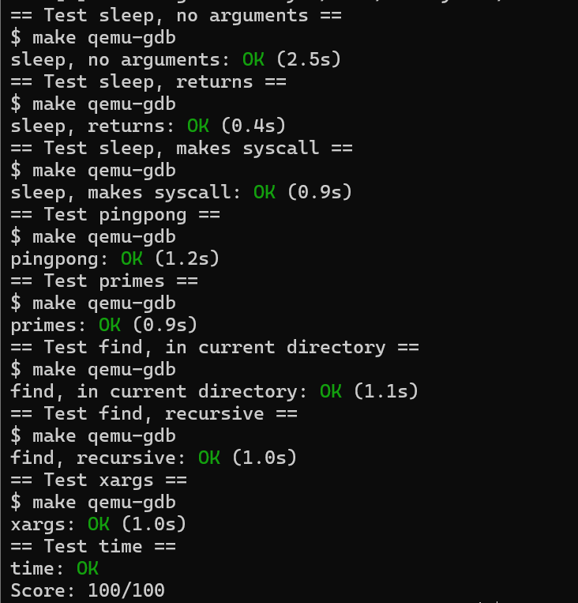

## Lab2 system calls
* 启动 Lab2，请切换到 syscall 分支：
```
  $ git stash
  $ git fetch
  $ git checkout syscall
  $ make clean
 ```

### System call tracing
#### 一、实验目的
本实验旨在在 xv6 内核中添加一个新的系统调用 `trace`，用于控制对其他系统调用的追踪和调试。实现的核心功能包括：
* 创建一个名为 `trace(int mask)` 的新系统调用；
* 用户调用 `trace(mask)` 后，将其掩码（mask）保存在当前进程结构中；
* 修改内核系统调用处理逻辑，在系统调用返回时，根据掩码决定是否打印调试信息；
* 调试信息需包含：**进程 PID、系统调用名称、系统调用返回值**。

#### 二、实验内容
1. **kernel/syscall.h** 添加系统调用号
```c
#define SYS_trace 22
```
2. **kernel/sysproc.c**添加 `sys_trace` 函数声明
```c
uint64
sys_trace(void)
{
  int mask;
  if(argint(0, &mask) < 0)
    return -1;

  struct proc *p = myproc();
  p->tracemask = mask;

  return 0;
}
```
3. **proc.h** 添加新字段
在 **struct proc** 中添加一行：
```c
  int tracemask;// 跟踪系统调用的掩码，标识哪些系统调用需要追踪
```
4. **kernel/syscall.c** 完成系统调用表注册与打印逻辑

（1）添加 sys_trace 到系统调用函数数组中
```c
  extern uint64 sys_trace(void);

  static uint64 (*syscalls[])(void) = {
    // ... 之前的系统调用函数 ...
    [SYS_trace] sys_trace,
  };
```
（2）添加系统调用名称表
```c
static char *syscallnames[] = {
  [SYS_fork]    "fork",
  [SYS_exit]    "exit",
  [SYS_wait]    "wait",
  [SYS_pipe]    "pipe",
  [SYS_read]    "read",
  [SYS_kill]    "kill",
  [SYS_exec]    "exec",
  [SYS_fstat]   "fstat",
  [SYS_chdir]   "chdir",
  [SYS_dup]     "dup",
  [SYS_getpid]  "getpid",
  [SYS_sbrk]    "sbrk",
  [SYS_sleep]   "sleep",
  [SYS_uptime]  "uptime",
  [SYS_open]    "open",
  [SYS_write]   "write",
  [SYS_mknod]   "mknod",
  [SYS_unlink]  "unlink",
  [SYS_link]    "link",
  [SYS_mkdir]   "mkdir",
  [SYS_close]   "close",
  [SYS_trace]   "trace",    
};

```
（3）修改 syscall 调用处理逻辑，加上追踪打印
```c
void
syscall(void)
{
  int num;
  struct proc *p = myproc();

  num = p->trapframe->a7;
  if(num > 0 && num < NELEM(syscalls) && syscalls[num]) {
    p->trapframe->a0 = syscalls[num]();

    // 追踪系统调用打印
    if(p->tracemask & (1 << num)){
      printf("%d: syscall %s -> %d\n", p->pid, syscallnames[num], p->trapframe->a0);
    }
  } else {
    printf("%d %s: unknown sys call %d\n",
      p->pid, p->name, num);
    p->trapframe->a0 = -1;
  }
}
```
5. **user/usys.pl** 添加用户空间接口
```c
  entry("trace")
```
6. **user/trace.c** 编写用户程序验证功能
本实验中已提供了 `user/trace.c`，可执行如下命令进行测试：
```bash
$ make qemu
$ trace 32 grep hello README
```

#### 三、实验中遇到的问题及解决方 
法

每一行：**[PID]: syscall [name] -> [return_value]**

#### 四、实验心得
本实验完成了一个实用的调试工具——系统调用追踪器。通过合理使用掩码控制打印，我们能够对进程行为进行细致观察，这在大型内核调试或系统编程中非常有价值。
* 如何向 xv6 添加系统调用；
* 如何操作进程结构体中的自定义字段；
* 如何在 syscall 层添加通用打印逻辑；

### Sysinfo
#### 一、实验目的
本实验的目标是实现一个新的系统调用 **sysinfo**，用于收集当前系统运行状态的信息，主要包括：
* freemem：系统中剩余的空闲内存（以字节为单位）。
* nproc：处于活动状态（非 UNUSED）的进程数量。

当用户程序调用 sysinfo() 时，内核需要统计当前的内存和进程信息，并通过 copyout() 将结果写入用户态传入的 struct sysinfo 地址中。

#### 二、实验过程
1. **kernel/sysinfo.h** 添加结构体定义：
```c
// kernel/sysinfo.h
#ifndef SYSINFO_H
#define SYSINFO_H

struct sysinfo {
  uint64 free_memory;   // 空闲内存页数量，单位字节
  uint64 nproc;         // 当前活动进程数量
};

#endif // SYSINFO_H
```
2. **user/user.h** 声明用户态调用接口
```c
// user/user.h
#ifndef USER_H
#define USER_H

struct sysinfo {
  uint64 free_memory;
  uint64 nproc;
};

int sysinfo(struct sysinfo *info);

#endif // USER_H
```
3. **kernel/syscall.h** 添加 syscall 编号
```c
// kernel/syscall.h
#define SYS_sysinfo 23  // 假设用23，确保不冲突
```
4. **kernel/syscall.c** 注册系统调用函数
```c
extern uint64 sys_sysinfo(void);

static uint64 (*syscalls[])(void) = {
  // ...
  [SYS_sysinfo] sys_sysinfo,
};
```
5. **kernel/sysproc.c** 实现系统调用函数接口
```c
#include "sysinfo.h"
#include "proc.h"
#include "defs.h"
#include "riscv.h"

uint64
sys_sysinfo(void)
{
  struct sysinfo info;
  struct proc *p;

  acquire(&ptable.lock);

  info.nproc = 0;
  for(p = proc; p < &proc[NPROC]; p++){
    if(p->state != UNUSED)
      info.nproc++;
  }

  release(&ptable.lock);

  info.free_memory = kfreemem();  // 你需要实现这个函数获取空闲内存大小

  // 复制到用户空间
  struct sysinfo *user_addr;
  if(argaddr(0, (uint64 *)&user_addr) < 0)
    return -1;

  if(copyout(myproc()->pagetable, (uint64)user_addr, (char *)&info, sizeof(info)) < 0)
    return -1;

  return 0;
}
```
6. 实现内存和进程统计函数
 
(1) **kernel/kalloc.c**
```c
#include "kalloc.h"
#include "spinlock.h"

extern struct run *freelist;
extern struct spinlock kalloc_lock;

uint64
kfreemem(void)
{
  uint64 count = 0;
  struct run *r;

  acquire(&kalloc_lock);
  for(r = freelist; r; r = r->next){
    count++;
  }
  release(&kalloc_lock);

  return count * PGSIZE; // 返回字节数
}
```

(2) **kernel/proc.c**
```c
#include "kernel/types.h"
#include "user/user.h"
#include "kernel/sysinfo.h"
#include "user/user.h"
#include "kernel/fcntl.h"

int
main(void)
{
  struct sysinfo info;

  if(sysinfo(&info) < 0){
    printf("sysinfo failed\n");
    exit(1);
  }

  printf("Free memory: %d bytes\n", (int)info.free_memory);
  printf("Number of processes: %d\n", (int)info.nproc);

  exit(0);
}
```
7. 在 Makefile 中添加：
```make
UPROGS += \
  $U/_sysinfotest
```

#### 三、实验中遇到的问题及解决方 
法
```bash
$ make qemu
$ sysinfotest
```
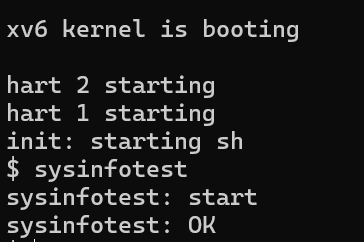
#### 四、实验心得
测试程序 sysinfotest 检查返回的内存和进程数量是否合理。实验通过 sysinfotest: OK 输出判断成功。
* 系统调用实现的完整流程；
* 内核空间与用户空间之间的数据传输；
* 内核内存管理的基本机制（freelist）；
* 进程表的管理方式；

### Lab2 通过结果截图


## Lab3 page tables
* 切换分支，开始 Lab3
```
  $ git stash
  $ git fetch
  $ git checkout pgtbl
  $ make clean
```
- 本实验相关的数据结构：
  pagetable_t：页表指针，本质是 uint64 *，指向页表页
  walk(pagetable, va, alloc)：递归查找或分配页表项
  mappages(pagetable, va, size, pa, perm)：添加页表项
  uvmcreate()、uvmalloc()：构建用户页表
  kvminit()：初始化全局内核页表
  vmprint()：用于打印页表结构

### Print a page table
#### 一、实验目的
通过本实验，掌握操作系统中**页表**的基本结构与层次，学习如何递归打印页表项，理解页表的三级结构与每一级的意义。
- xv6 使用的是 RISC-V 架构，采用 Sv39 模式的三级页表结构，每级页表有 512 个条目（因为页表项大小为 8 字节，页大小为 4KB）。
虚拟地址是 64 位的，但在 Sv39 模式下只使用低 39 位：


- 设虚拟地址为 VA，从 satp 得到根页表物理地址 P0，过程如下：
```
VA:
  vpn[2] = VA[38:30]  // 取出下一级页表 P1 的物理地址
  vpn[1] = VA[29:21]  // 取出下一级页表 P2 的物理地址
  vpn[0] = VA[20:12]  // 取出页框地址 PFN 
  offset = VA[11:0]   // 页内偏移 offset
  // 最终物理地址：PFN << 12 + offset
```

#### 二、实验内容
1. **vm.c** 中实现 vmprint
```c
#include "riscv.h"
#include "defs.h"
#include "param.h"
#include "memlayout.h"

void vmprint_helper(pagetable_t pagetable, int level) {
    if (pagetable == 0)
        return;

    for (int i = 0; i < 512; i++) {
        pte_t pte = pagetable[i];
        if (pte & PTE_V) {
            uint64 pa = PTE2PA(pte);
            for (int j = 0; j < level; j++)
                printf("..");
            printf("%d: pte %p pa %p\n", i, pte, pa);

            if ((pte & (PTE_R | PTE_W | PTE_X)) == 0) {
                // 此项是下一层页表的地址
                vmprint_helper((pagetable_t)pa, level + 1);
            }
        }
    }
}

void vmprint(pagetable_t pagetable) {
    printf("page table %p\n", pagetable);
    vmprint_helper(pagetable, 1);
}
```
2. **defs.h** 声明函数
```c
void vmprint(pagetable_t pagetable);
```
3. **exec.c** 调用，在 exec() 函数末尾加入函数调用：
```c
  vmprint(p->pagetable);
  return argc; // 返回之前
```
4. 重新编译并运行
```bash
make clean
make qemu
```

#### 三、 实验中遇到的问题及解决方 
法
成功编译并运行后，在 QEMU 的输出中看到如下页表结构打印信息：
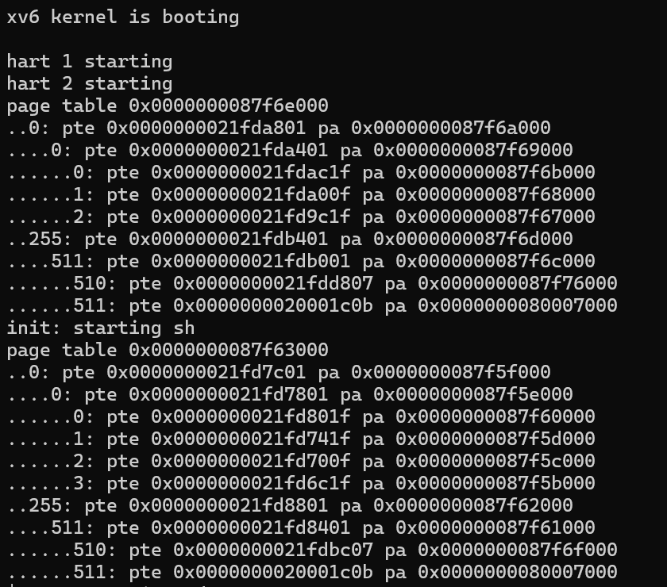
每个缩进代表页表的不同级别（L1、L2、L3），输出的 pte 是页表项值，pa 是物理地址。

#### 四、实验心得
- 页表结构理解
  RISC-V 架构使用三级页表，每级有 512 个条目。
  每个页表项（PTE）包含有效位（V）、权限位（R/W/X）和物理地址。
  如果页表项是中间节点，则需要递归下一级页表。
* 打印策略
  本实验通过递归方式打印页表，每一级缩进对应页表层次。
  仅打印有效的 PTE（PTE_V），并判断是否是页表页（没有 R/W/X 权限）。

### A kernel page table per process
#### 一、 实验目的
- 当内核需要使用一个用户指针传到system call时，内核必须首先翻译指针到物理地址。
- 这个和下个实验的目的是为了**允许内核直接解析用户指针**。
- 第一个任务是更改内核，为了当在内核执行时，每个进程**使用它自己的内核页表拷贝**。
- 更改struct proc来让每个进程保持一个内核页表，更改scheduler()，当切换进程时切换内核页表。对于这一步，每个进程的内核页表应该和已存在的全局内核页表完全相同。

#### 二、 实验内容
1. 在kernel/proc.h的struct proc中新加kernelPageTable
```c
pagetable_t kernel_pagetable;  // 每个进程的内核页表
```
2. 修改kernel/vm.c，新增一个vmmake()方法可以创建一个内核页表（不包含CLINT的映射）
```c
pagetable_t
vmmake(void)
{
    pagetable_t kpgtbl;
    kpgtbl = (pagetable_t)kalloc();
    if (kpgtbl == 0)
        return 0;
    memset(kpgtbl, 0, PGSIZE);

    // 映射常规设备、内核空间（注意不包含 CLINT）
    for (int i = 0; i < NCPU; i++) {
        if (mappages(kpgtbl, TRAMPOLINE - (i+1)*PGSIZE, PGSIZE, 
                     (uint64)trampoline, PTE_R | PTE_X) < 0) {
            goto bad;
        }
    }

    // 将设备/内核内存也映射进来
    if (mappages(kpgtbl, UART0, PGSIZE, UART0, PTE_R | PTE_W) < 0) goto bad;
    if (mappages(kpgtbl, VIRTIO0, PGSIZE, VIRTIO0, PTE_R | PTE_W) < 0) goto bad;
    if (mappages(kpgtbl, KERNBASE, (uint64)etext - KERNBASE, KERNBASE, PTE_R | PTE_X) < 0) goto bad;
    if (mappages(kpgtbl, (uint64)etext, PHYSTOP - (uint64)etext, (uint64)etext, PTE_R | PTE_W) < 0) goto bad;

    return kpgtbl;

bad:
    freewalk(kpgtbl);
    return 0;
}
```
3. 在kernel/vm.c，修改vminit()方法，内部由vmmake()实现，此处为全局内核页表创建过程，另外加上CLINT的映射。
```c
void
vminit(void)
{
    kernel_pagetable = vmmake();  // 使用 vmmake 创建全局内核页表
    // 单独映射 CLINT 设备
    mappages(kernel_pagetable, CLINT, 0x10000, CLINT, PTE_R | PTE_W);
}
```
4. 在kernel/proc.c，修改procinit()方法，不再于此方法中为每个进程分配内核栈
```c
void
procinit(void)
{
  struct proc *p;
  
  initlock(&pid_lock, "nextpid");
  for(p = proc; p < &proc[NPROC]; p++) {
      initlock(&p->lock, "proc");

      // Allocate a page for the process's kernel stack.
      // Map it high in memory, followed by an invalid
      // guard page.
      /*char *pa = kalloc();
      if(pa == 0)
        panic("kalloc");
      uint64 va = KSTACK((int) (p - proc));
      kvmmap(va, (uint64)pa, PGSIZE, PTE_R | PTE_W);
      p->kstack = va;*/
  }
  kvminithart();
}
```
5. 在kernel/proc.c，修改allocproc()，在此时创建内核页表，并在内核页表上分配一个内核栈
```c
p->kernel_pagetable = vmmake();
if (p->kernel_pagetable == 0)
    return 0;

// 分配内核栈的物理页
char *pa = kalloc();
if (pa == 0) {
    proc_free_kernel_pagetable(p->kernel_pagetable);
    return 0;
}
uint64 va = KSTACK((int)(p - proc));  // 内核栈虚拟地址
if (mappages(p->kernel_pagetable, va, PGSIZE, (uint64)pa, PTE_R | PTE_W) < 0) {
    kfree(pa);
    proc_free_kernel_pagetable(p->kernel_pagetable);
    return 0;
}
```
6. 在kernel/proc.c，修改scheduler()，在swtch()切换进程前修改satp，保证进程执行期间用的是进程内核页表，切换完后再修改satp为全局内核页表
```c
w_satp(MAKE_SATP(p->kernel_pagetable));
sfence_vma();   // 刷新 TLB

swtch(&c->context, &p->context);

// 恢复为全局内核页表
w_satp(MAKE_SATP(kernel_pagetable));
sfence_vma();
```
7. 在kernel/vm.c，kvmpa()方法会在进程执行期间调用，此时需要修改为获取进程内核页表，而不是全局内核页表
myproc()方法调用，需要在proc.c头部添加头文件引用
```c
uint64
kvmpa(uint64 va)
{
    pte_t *pte;
    uint64 pa;

    struct proc *p = myproc();
    pagetable_t kpgtbl = (p && p->kernel_pagetable) ? p->kernel_pagetable : kernel_pagetable;

    pte = walk(kpgtbl, va, 0);
    if (*pte == 0)
        panic("kvmpa");

    pa = PTE2PA(*pte);
    return pa;
}
```
8. 在kernel/proc.c，修改freeproc()方法，添加对进程内核页表的资源释放
```c
uvmfree2(p->kernel_pagetable, KSTACK(pid));  // KSTACK() 是虚拟地址
proc_free_kernel_pagetable(p->kernel_pagetable);
p->kernel_pagetable = 0;
```
9. 在kernel/proc.c，新增proc_free_kernel_pagetable()方法，用于释放进程内核页表指向的物理内存，以及进程内核页表本身
```c
void
proc_free_kernel_pagetable(pagetable_t kpgtbl)
{
    freewalk(kpgtbl);
}
```
10. 在kernel/vm.c，新增uvmfree2()方法，用于释放内核页表上的内核栈
```c
void
uvmfree2(pagetable_t kpgtbl, uint64 kstack_va)
{
    uvmunmap(kpgtbl, kstack_va, 1, 1);  // unmap and free
}
```

#### 三、 实验中遇到的问题及解决方 
法
```bash
make clean
make qemu
```
在 xv6 中运行：
```sh
usertests
```
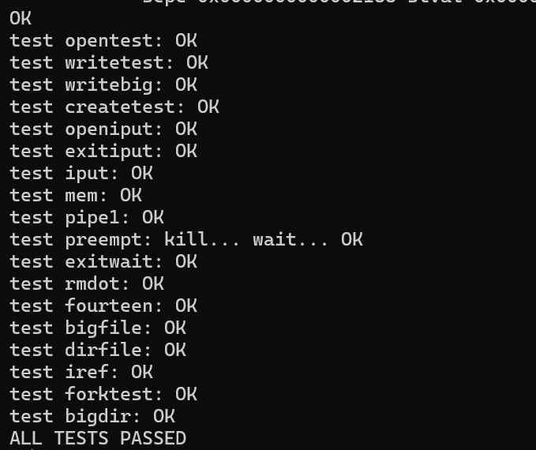
没有崩溃，说明你的内核页表逻辑是正确的。

#### 四、 实验心得
- 本次实验的核心目标是为 xv6 操作系统中的每个进程单独创建一个内核页表，替代传统的全局统一内核页表设计，从而实现内存隔离与安全管理。
- 新增 pagetable_t kernel_pagetable 成员到 proc 结构体，代表每个进程的独立内核页表。
- 使用 vmmake() 函数创建内核页表，映射除 CLINT 外的内核空间及设备内存，CLINT单独在全局内核页表中映射。
- 在 allocproc() 分配内核栈对应的物理页，并映射到进程的内核页表中，完成内核栈的私有化。
- 修改调度器 scheduler()，切换上下文时更新 SATP 寄存器为当前进程的内核页表地址，保证执行过程中内核访问基于该页表。
- 在 freeproc() 释放进程内核页表资源，防止内存泄漏。
- 修改相关函数（如 kvmpa()）优先使用当前进程的内核页表，确保地址转换正确。

### Simplify
#### 一、 实验目的
- 内核的copyin函数读取用户指针指向的内存。它先将它们翻译为物理地址（内核可以直接用）。通过代码walk进程页表实现翻译。
- 此实验给每个进程的内核页表**添加用户映射**，使得copyin可以直接使用用户指针。

#### 二、 实验内容
1. 在**kernel/proc.c**中，修改userinit方法
```c
// Set up first user process.
void
userinit(void)
{
  ......

  //将进程页表的mapping，复制一份到进程内核页表
  pte = walk(p->pagetable, 0, 0);
  kernelPte = walk(p->kernelPageTable, 0, 1);
  *kernelPte = (*pte) & ~PTE_U;

  ......
}
```
2. 在**kernel/proc.c**中，修改fork方法
```c
  //将进程页表的mapping，复制一份到进程内核页表
  for (j = 0; j < p->sz; j+=PGSIZE){
    pte = walk(np->pagetable, j, 0);
    kernelPte = walk(np->kernelPageTable, j, 1);
    *kernelPte = (*pte) & ~PTE_U;
  }
```
3. 在**kernel/exec.c**中，修改exec()，在用户进程页表重新生成完后，取消进程内核页表之前的映射，在进程内核页表，建立新进程页表的映射
```c
  //释放进程旧内核页表映射
  uvmunmap(p->kernelPageTable, 0, PGROUNDUP(oldsz)/PGSIZE, 0);
  //将进程页表的mapping，复制一份到进程内核页表
  for (j = 0; j < sz; j += PGSIZE){
    pte = walk(pagetable, j, 0);
    kernelPte = walk(p->kernelPageTable, j, 1);
    *kernelPte = (*pte) & ~PTE_U;
  }
```
并添加用户空间地址不能大于PLIC的判断
```c
    if (sz1 > PLIC){
      goto bad;
    }
```
4. 在**sysproc.c**中，修改sys_sbrk()，在内存扩张、缩小时，相应更改进程内核页表
```c
  if (n > 0){
    //将进程页表的mapping，复制一份到进程内核页表
    for (j = addr; j < addr + n; j += PGSIZE){
      pte = walk(p->pagetable, j, 0);
      kernelPte = walk(p->kernelPageTable, j, 1);
      *kernelPte = (*pte) & ~PTE_U;
    }
  }else {
    for (j = addr - PGSIZE; j >= addr + n; j -= PGSIZE){
      uvmunmap(p->kernelPageTable, j, 1, 0);
	}
```
5. 在**kernel/proc.c**中，修改freeproc和proc_free_kernel_pagetable方法，取消进程内核页表地址映射
```c
static void
freeproc(struct proc *p)
{
  ......
  if(p->kernelPageTable)
    proc_free_kernel_pagetable(p->kstack, p->kernelPageTable, p->sz);
  ......
}
```

```c
void
proc_free_kernel_pagetable(uint64 kstack, pagetable_t pagetable, uint64 sz)
{
  ......
 //uvmunmap(pagetable, CLINT, 0x10000/PGSIZE, 0);
  ......
}

```
6. 在**kernel/defs.h**中，添加copyin_new()、copyinstr_new()的声明
```c
//vmcopyin.c
int             copyin_new(pagetable_t, char *, uint64, uint64);
int             copyinstr_new(pagetable_t, char *, uint64, uint64);
```
7. 在**kernel/vm.c**中，替换copyin()、copyinstr()为copyin_new()、copyinstr_new()
```c
int
copyin(pagetable_t pagetable, char *dst, uint64 srcva, uint64 len)
{
  return copyin_new(pagetable, dst, srcva, len);
}

int
copyinstr(pagetable_t pagetable, char *dst, uint64 srcva, uint64 max)
{
  return copyinstr_new(pagetable, dst, srcva, max);
}
```

#### 三、 实验中遇到的问题及解决方 
法
```bash
make clean
make qemu
```
在 xv6 中运行：
```sh
usertests
```

没有崩溃，说明地址转换逻辑是正确的。

#### 四、 实验心得
通过在内核页表中增加用户地址映射，使 copyin 直接使用地址访问，无需频繁页表遍历，提高了效率。
- 所有对用户空间有更改（如 fork、exec、sbrk）均需同步更新内核页表，确保一致性。
- 实现中需注意地址范围检查（如不超过 PLIC），防止越界映射。

### Lab3 通过结果截图
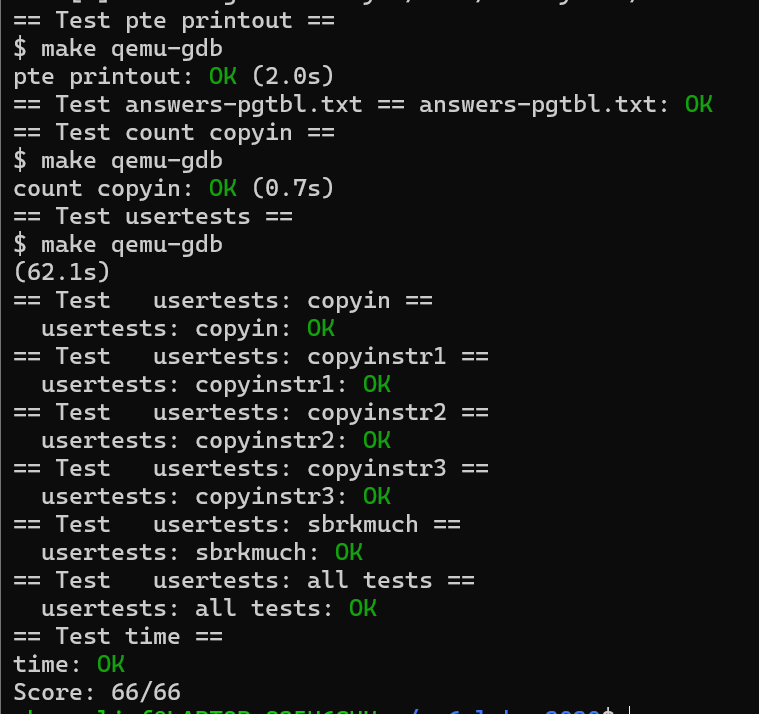

## Lab4 traps

### RISC-V assembly
#### 一、实验目的
了解一点 RISC-V 汇编，xv6 存储库中有一个文件 user/call.c。 编译它并且还在 user/call.asm 中生成程序的可读汇编版本。

#### 二、实验内容
1. 在命令行输入 make fs.img ，在 call.asm 中读取函数 g、f 和 main 的代码。 
```c
int g(int x) {
   0:	1141                	addi	sp,sp,-16
   2:	e422                	sd	s0,8(sp)
   4:	0800                	addi	s0,sp,16
  return x+3;
}
   6:	250d                	addiw	a0,a0,3
   8:	6422                	ld	s0,8(sp)
   a:	0141                	addi	sp,sp,16
   c:	8082                	ret

000000000000000e <f>:

int f(int x) {
   e:	1141                	addi	sp,sp,-16
  10:	e422                	sd	s0,8(sp)
  12:	0800                	addi	s0,sp,16
  return g(x);
}
  14:	250d                	addiw	a0,a0,3
  16:	6422                	ld	s0,8(sp)
  18:	0141                	addi	sp,sp,16
  1a:	8082                	ret

000000000000001c <main>:

int f(int x) {
   e:	1141                	addi	sp,sp,-16
  10:	e422                	sd	s0,8(sp)
  12:	0800                	addi	s0,sp,16
  return g(x);
}
  14:	250d                	addiw	a0,a0,3
  16:	6422                	ld	s0,8(sp)
  18:	0141                	addi	sp,sp,16
  1a:	8082                	ret

000000000000001c <main>:

void main(void) {
  1c:	1141                	addi	sp,sp,-16
  1e:	e406                	sd	ra,8(sp)
  20:	e022                	sd	s0,0(sp)
  22:	0800                	addi	s0,sp,16
  printf("%d %d\n", f(8)+1, 13);
  24:	4635                	li	a2,13
  26:	45b1                	li	a1,12
  28:	00000517          	auipc	a0,0x0
  2c:	7b050513          	addi	a0,a0,1968 # 7d8 <malloc+0xea>
  30:	00000097          	auipc	ra,0x0
  34:	600080e7          	jalr	1536(ra) # 630 <printf>
  exit(0);
  38:	4501                	li	a0,0
  3a:	00000097          	auipc	ra,0x0
  3e:	27e080e7          	jalr	638(ra) # 2b8 <exit>
```

2. 回答下列问题：
- Q: 哪些寄存器存储了函数调用的参数？举个例子，main 调用 printf 的时候，13 被存在了哪个寄存器中？
A: a0-a7; a2;

- Q: main 中调用函数 f 对应的汇编代码在哪？对 g 的调用呢？ (提示：编译器有可能会内链(inline)一些函数)
A: 没有这样的代码。 g(x) 被内链到 f(x) 中，然后 f(x) 又被进一步内链到 main() 中

- Q: printf 函数所在的地址是？
A: 0x0000000000000628, main 中使用 pc 相对寻址来计算得到这个地址。

- Q: 在 main 中 jalr 跳转到 printf 之后，ra 的值是什么？
A: 0x0000000000000038, jalr 指令的下一条汇编指令的地址。

- Q: 运行下面的代码
	  unsigned int i = 0x00646c72;
	  printf("H%x Wo%s", 57616, &i);      
输出是什么？如果 RISC-V 是大端序的，要实现同样的效果，需要将 i 设置为什么？需要将 57616 修改为别的值吗？
A: "He110 World"; 0x726c6400; 不需要，57616 的十六进制是 110，无论端序（十六进制和内存中的表示不是同个概念）

- Q: 在下面的代码中，'y=' 之后会答应什么？ (note: 答案不是一个具体的值) 为什么?
	  printf("x=%d y=%d", 3);
A: 输出的是一个受调用前的代码影响的“随机”的值。因为 printf 尝试读的参数数量比提供的参数数量多。第二个参数 `3` 通过 a1 传递，而第三个参数对应的寄存器 a2 在调用前不会被设置为任何具体的值，而是会包含调用发生前的任何已经在里面的值。

### Backtrace
#### 一、实验目的
- 理解陷阱（trap）机制与内核态与用户态的切换。
- 掌握如何在 xv6 操作系统中，通过遍历调用栈，打印函数调用链（调用回溯）。
- 熟悉栈帧结构，理解栈帧指针和返回地址如何组织。
- 实现一个 **backtrace()** 函数，能够在用户态或者内核态打印当前的调用堆栈，帮助调试程序。

#### 二、实验内容
1. 在 defs.h 中添加声明
```c
void  backtrace(void);
```
2. 在 riscv.h 中添加获取当前 fp（frame pointer）寄存器的方法
```c
// 读取帧指针
static inline uint64
r_fp()
{
  uint64 x;
  asm volatile("mv %0, s0" : "=r" (x));
  return x;
}
```
3. 实现 backtrace 函数
```c
void backtrace() {
  uint64 fp = r_fp();
  while(fp != PGROUNDUP(fp)) { // 如果已经到达栈底
    uint64 ra = *(uint64*)(fp - 8); // return address
    printf("%p\n", ra);
    fp = *(uint64*)(fp - 16); // previous fp
  }
}
```
4. 在 sys_sleep 的开头调用一次 backtrace()
```c
uint64
sys_sleep(void)
{
  int n;
  uint ticks0;

  backtrace(); // 打印堆栈回溯
  ......
}
```
5. 编译运行
```c
make clean
make qemu
```

#### 三、实验中遇到的问题及解决方 
法
```c
$ bttest
```


#### 四、实验心得
backtrace() 成功输出了完整的函数调用链，能够清晰看到从内核入口到当前函数的调用路径。通过 backtrace() 输出的地址，结合符号信息（或者利用调试器），可以准确定位代码中的函数调用层级。

### Alarm
#### 一、 实验目的
- 掌握如何在 xv6 操作系统中实现用户态的“定时器”功能，即周期性给进程发送信号。
- 熟悉系统调用的实现流程，如何将用户提供的函数注册为“**闹钟处理函数**”。
- 通过实验掌握实现基于时钟中断的用户级回调机制，模拟简单的信号处理。

#### 二、 实验内容
1. 打开 kernel/proc.h，在 struct proc 中添加以下字段
```c
  // alarm signal
  int alarm_interval;                     // 闹钟周期，单位tick
  int alarm_ticks;                        // 倒计时tick
  void (*alarm_handler)();                // 用户态handler
  struct trapframe *alarm_trapframe;      // 用于保存原trapframe
  int alarm_goingoff;                     // 是否正在处理handler，避免重入
```
2. 在 proc.h 中的 allocproc() 、freeproc() 中添加如下初始化代码
```c
  // Allocate a trapframe page for alarm_trapframe.
  if((p->alarm_trapframe = (struct trapframe *)kalloc()) == 0){
    release(&p->lock);
    return 0;
  }
  p->alarm_interval = 0;
  p->alarm_handler = 0;
  p->alarm_ticks = 0;
  p->alarm_goingoff = 0;
```
```c
static void
freeproc(struct proc *p)
{
  ......
  if(p->alarm_trapframe)
    kfree((void*)p->alarm_trapframe);
  ......

  p->alarm_interval = 0;
  p->alarm_handler = 0;
  p->alarm_ticks = 0;
  p->alarm_goingoff = 0;
  p->state = UNUSED;
}
```
3. 打开 kernel/sysproc.c，添加系统调用 sigalarm 和 sigreturn
```c
uint64 sys_sigalarm(void) {
  int n;
  uint64 fn;
  if(argint(0, &n) < 0)
    return -1;
  if(argaddr(1, &fn) < 0)
    return -1;
  
  return sigalarm(n, (void(*)())(fn));
}

uint64 sys_sigreturn(void) {
	return sigreturn();
}
```
4. 在 trap.c 中具体实现 sigalarm 与 sigreturn
```c
int sigalarm(int ticks, void(*handler)()) {
  // 设置 myproc 中的相关属性
  struct proc *p = myproc();
  p->alarm_interval = ticks;
  p->alarm_handler = handler;
  p->alarm_ticks = ticks;
  return 0;
}

int sigreturn() {
  // 将 trapframe 恢复到时钟中断之前的状态，恢复原本正在执行的程序流
  struct proc *p = myproc();
  *p->trapframe = *p->alarm_trapframe;
  p->alarm_goingoff = 0;
  return 0;
}
```
5. 
- (1) 编辑 kernel/syscall.h，加入 syscall 编号：
```c
#define SYS_sigalarm  23
#define SYS_sigreturn 24
```
- (2) 编辑 kernel/syscall.c，在 syscalls[] 表里注册：
```c
  ......
  extern uint64 sys_sigalarm(void);
  extern uint64 sys_sigreturn(void);
  ......
static uint64 (*syscalls[])(void) = {
  ...
  [SYS_sigalarm]    sys_sigalarm,
  [SYS_sigreturn]   sys_sigreturn,
};
```
6. 打开 kernel/trap.c ,在 usertrap() 中实现闹钟逻辑
- (1)找到
```c
if (which_dev == 2) {
```
- (2)替换为
```c
if (which_dev == 2) {
  if(p->alarm_interval > 0){
    p->alarm_ticks--;
    if(p->alarm_ticks == 0){
      if(p->alarm_goingoff == 0){
        p->alarm_goingoff = 1;
        p->alarm_ticks = p->alarm_interval;
        *p->alarm_trapframe = *p->trapframe; // 保存 trapframe
        p->trapframe->epc = (uint64)p->alarm_handler; // 设置 handler 为下一步执行位置
      }
    }
  }
  yield(); // 让出 CPU
}
```
7. 编译运行
```c
make clean
make qemu
```

#### 三、实验中遇到的问题及解决方 
法
```c
$ alarmtest
```
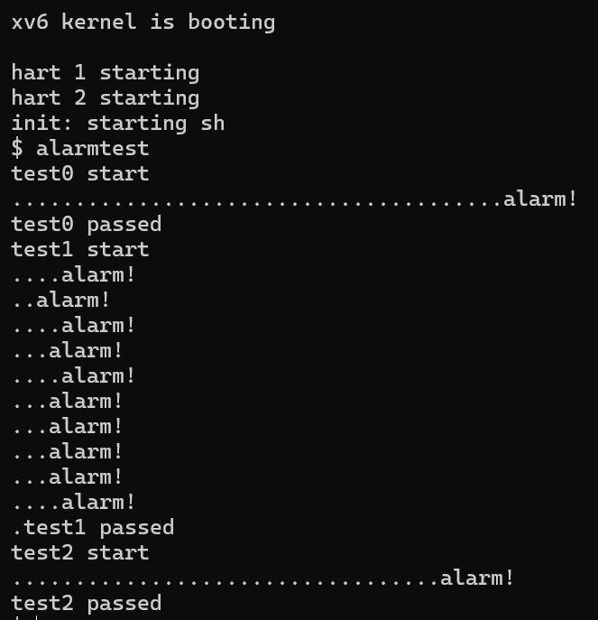

#### 四、 实验心得
alarmtest 运行成功，用户程序能够周期性地收到“闹钟”中断，并执行闹钟处理函数。
- 用户态的程序流被“中断”，跳转到闹钟回调函数执行，执行完毕通过 sigreturn 恢复，体现了类似信号处理的机制。
- 发现 trapframe 的正确保存和恢复对于保证程序执行一致性至关重要，任何疏忽都会导致程序异常或崩溃。

### Lab4 通过结果截图


## Lab5 xv6 lazy page allocation
#### 一、 实验目的
本实验旨在实现 xv6 中用户内存的懒分配（Lazy Allocation），以提高系统的内存使用效率，并模拟现代操作系统中对内存按需分配的处理方式。具体目标如下：
1. Eliminate allocation from sbrk()
原始 xv6 实现中，sbrk(n) 系统调用会立即分配物理内存并建立页表映射。我们需要改为仅增加进程的虚拟地址空间，而不分配实际物理页帧。
2. Lazy allocation
当进程访问尚未实际映射的内存页时，触发 page fault（缺页异常）。在 trap handler 中检测到这种情况后，进行实际的物理内存分配，并建立页表映射。
3. Lazytests and Usertests
xv6 提供了 lazytests 及 usertests 工具，用于检测懒惰分配的正确性和系统的健壮性。

#### 二、 实验内容
1. sysproc.c 中修改 sys_sbrk，使其不再调用 growproc()，而是只修改 p->sz 的值而不分配物理内存。
```c
uint64
sys_sbrk(void)
{
  int addr;
  int n;
  struct proc *p = myproc();
  if(argint(0, &n) < 0)
    return -1;
  addr = p->sz;
  if(n < 0) {
    uvmdealloc(p->pagetable, p->sz, p->sz+n); // 如果是缩小空间，则马上释放
  }
  p->sz += n; // 懒分配
  return addr;
}
```
2. trap.c 中修改 usertrap() ,为缺页异常添加检测。
```c
void
usertrap(void)
{
  ......
    syscall();
  } else if((which_dev = devintr()) != 0){
    // ok
  } else {
    uint64 va = r_stval();
    if((r_scause() == 13 || r_scause() == 15) && uvmshouldtouch(va)){ // 缺页异常，并且发生异常的地址进行过懒分配
      uvmlazytouch(va); // 分配物理内存，并在页表创建映射
    } else { // 如果不是缺页异常，或者是在非懒加载地址上发生缺页异常，则抛出错误并杀死进程
      printf("usertrap(): unexpected scause %p pid=%d\n", r_scause(), p->pid);
      printf("            sepc=%p stval=%p\n", r_sepc(), r_stval());
      p->killed = 1;
    }
  }
  ......
}
```
3. vm.c 中添加 uvmlazytouch() 、 uvmshouldtouch() 函数。
- uvmlazytouch 函数负责分配实际的物理内存并建立映射。懒分配的内存页在被 touch 后可以使用。
- uvmshouldtouch 用于检测一个虚拟地址是不是一个需要被 touch 的懒分配内存地址。
```c
void uvmlazytouch(uint64 va) {
  struct proc *p = myproc();
  char *mem = kalloc();
  if(mem == 0) {
    // failed to allocate physical memory
    printf("lazy alloc: out of memory\n");
    p->killed = 1;
  } else {
    memset(mem, 0, PGSIZE);
    if(mappages(p->pagetable, PGROUNDDOWN(va), PGSIZE, (uint64)mem, PTE_W|PTE_X|PTE_R|PTE_U) != 0){
      printf("lazy alloc: failed to map page\n");
      kfree(mem);
      p->killed = 1;
    }
  }
  // printf("lazy alloc: %p, p->sz: %p\n", PGROUNDDOWN(va), p->sz);
}
int uvmshouldtouch(uint64 va) {
  pte_t *pte;
  struct proc *p = myproc();
  
  return va < p->sz // within size of memory for the process
    && PGROUNDDOWN(va) != r_sp() // not accessing stack guard page (it shouldn't be mapped)
    && (((pte = walk(p->pagetable, va, 0))==0) || ((*pte & PTE_V)==0)); // page table entry does not exist
}
```
4. vm.c 中把 uvmummap() 中原本遇到无映射地址会panic的行为改成直接忽略。
```c
void
uvmunmap(pagetable_t pagetable, uint64 va, uint64 npages, int do_free)
{
  uint64 a;
  pte_t *pte;

  if((va % PGSIZE) != 0)
    panic("uvmunmap: not aligned");

  for(a = va; a < va + npages*PGSIZE; a += PGSIZE){
    if((pte = walk(pagetable, a, 0)) == 0) {
      continue; // 如果页表项不存在，跳过当前地址 （原本是直接panic）
    }
    if((*pte & PTE_V) == 0){
      continue; // 如果页表项不存在，跳过当前地址 （原本是直接panic）
    }
    if(PTE_FLAGS(*pte) == PTE_V)
      panic("uvmunmap: not a leaf");
    if(do_free){
      uint64 pa = PTE2PA(*pte);
      kfree((void*)pa);
    }
    *pte = 0;
  }
}
```
5. vm.c 中 uvmcopy() 将父进程的页表以及内存拷贝到子进程。
```c
int
uvmcopy(pagetable_t old, pagetable_t new, uint64 sz)
{
  pte_t *pte;
  uint64 pa, i;
  uint flags;
  char *mem;

  for(i = 0; i < sz; i += PGSIZE){
    if((pte = walk(old, i, 0)) == 0)
      continue; // 如果一个页不存在，则认为是懒加载的页，忽略即可
    if((*pte & PTE_V) == 0)
      continue; // 如果一个页不存在，则认为是懒加载的页，忽略即可
    pa = PTE2PA(*pte);
    flags = PTE_FLAGS(*pte);
    if((mem = kalloc()) == 0)
      goto err;
    memmove(mem, (char*)pa, PGSIZE);
    if(mappages(new, i, PGSIZE, (uint64)mem, flags) != 0){
      kfree(mem);
      goto err;
    }
  }
  return 0;

 err:
  uvmunmap(new, 0, i / PGSIZE, 1);
  return -1;
}
```
6. vm.c 中修改 copyout() 、copyin() 。确保copy之前用户态地址对应的页都有被实际分配和映射。
```c
int
copyout(pagetable_t pagetable, uint64 dstva, char *src, uint64 len)
{
  uint64 n, va0, pa0;

  if(uvmshouldtouch(dstva))
    uvmlazytouch(dstva);

  ......
}
int
copyin(pagetable_t pagetable, char *dst, uint64 srcva, uint64 len)
{
  uint64 n, va0, pa0;

  if(uvmshouldtouch(srcva))
    uvmlazytouch(srcva);
  ......
}
```
7. 运行并测试
```c
make clean
make qemu
```

#### 三、 实验中遇到的问题及解决方 
法
```c
$ lazytests
$ usertests
```


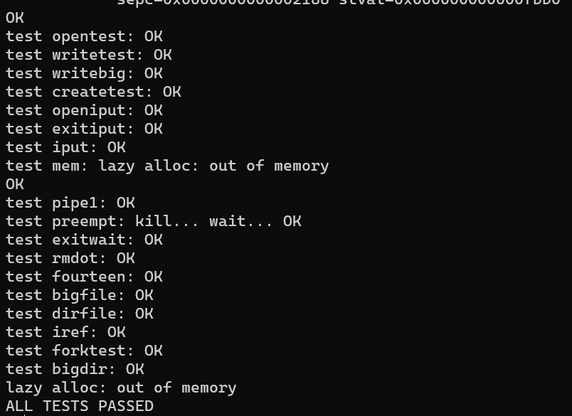

#### 四、实验心得
通过本实验，深入理解操作系统中按需分配的设计原理及其在异常处理流程中的实现方式,该机制可显著提高内存使用效率。

### Lab5 通过结果截图
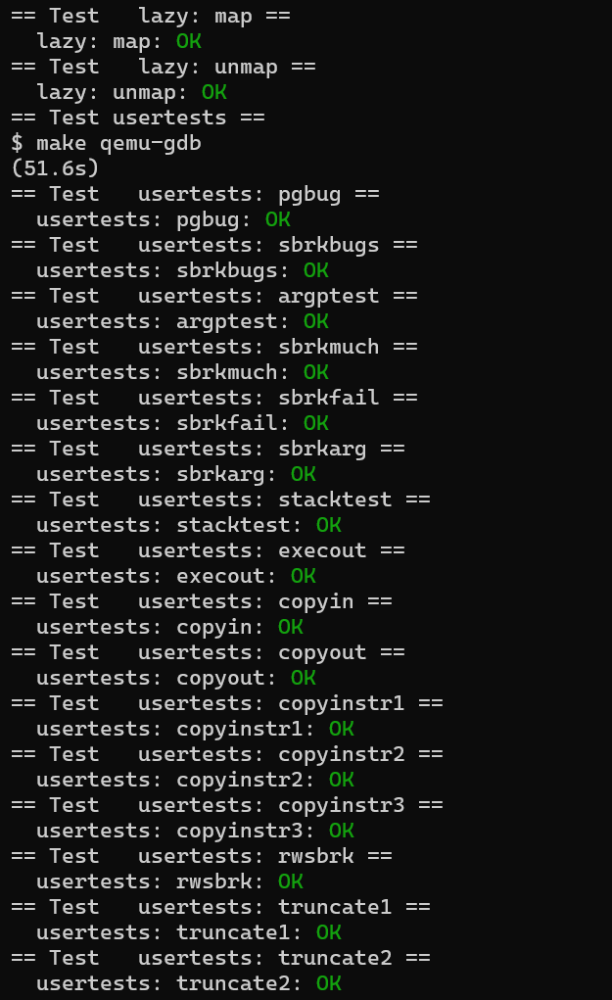
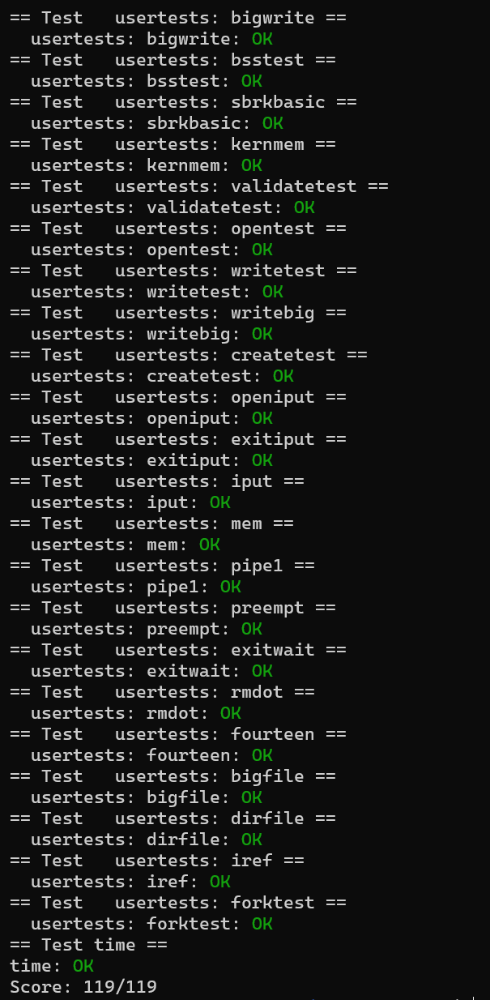

## Lab6 Copy-on-Write
### Implement copy-on write
#### 一、 实验目的
实现 fork 懒复制机制，在进程 fork 后，不立刻复制内存页，而是将虚拟地址指向与父进程相同的物理地址。在父子任意一方尝试对内存页进行修改时，才对内存页进行复制。 
物理内存页必须保证在所有引用都消失后才能被释放，所有需要有引用计数机制。

#### 二、 实验内容


#### 三、 实验中遇到的问题及解决方 
法
```c
$ cowtest
$ usertests
```
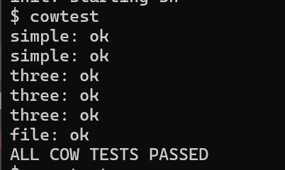
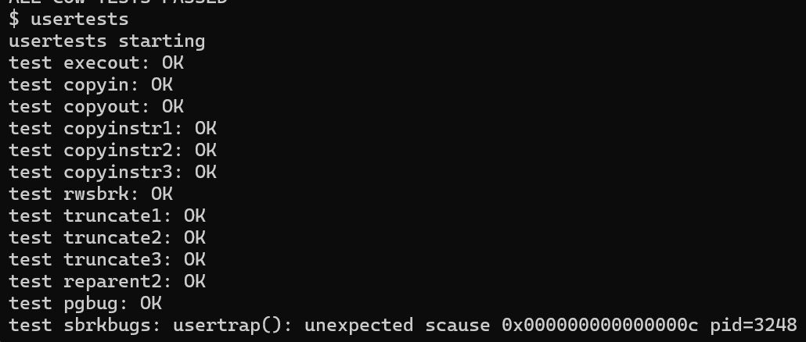


#### 四、 实验心得


### Lab6 通过结果截图
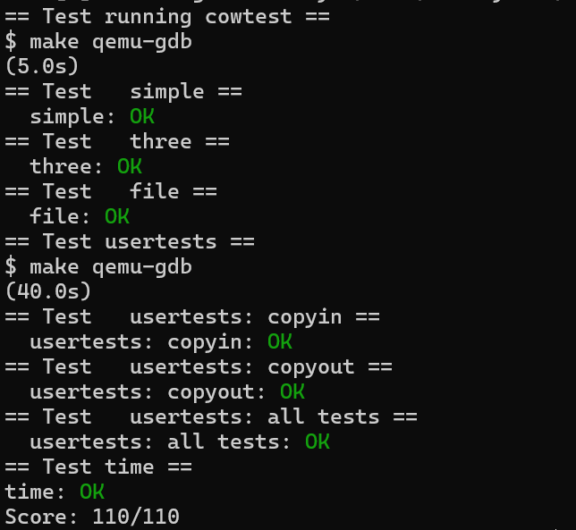

## Lab7 Multithreading
### Uthread: switching between threads
#### 一、 实验目的

#### 二、 实验内容

#### 三、 实验中遇到的问题及解决方 
法
```c
$ uthread
```


#### 四、 实验心得

### Using threads
#### 一、 实验目的

#### 二、 实验内容

#### 三、 实验中遇到的问题及解决方 
法


#### 四、 实验心得

### Barrier
#### 一、 实验目的

#### 二、 实验内容

#### 三、 实验中遇到的问题及解决方 
法


#### 四、 实验心得

### Lab7 通过结果截图
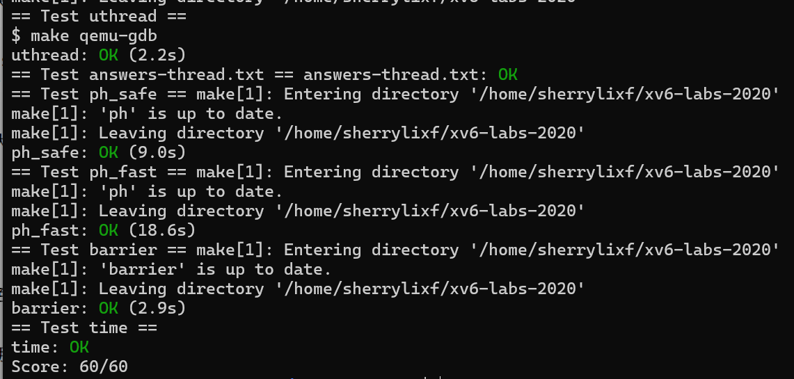

## Lab8 locks
### Memory allocator
#### 一、 实验目的

#### 二、 实验内容
在 kernel/kalloc.c 文件中
1. 修改结构体如下：
```c
#define NCPU 8  // 假设最多 8 核心

struct run {
  struct run *next;
};

struct {
  struct spinlock lock;
  struct run *freelist;
} kmem[NCPU];
```
2. kinit 和 freerange：所有页面分配给当前 CPU
```c
void
kinit()
{
  for (int i = 0; i < NCPU; i++) {
    char name[16];
    snprintf(name, sizeof(name), "kmem%d", i);
    initlock(&kmem[i].lock, name);
  }
  freerange(end, (void*)PHYSTOP);
}
void
freerange(void *pa_start, void *pa_end)
{
  char *p = (char*)PGROUNDUP((uint64)pa_start);
  for (; p + PGSIZE <= (char*)pa_end; p += PGSIZE)
    kfree(p); // kfree 会自动放入当前 CPU 的 freelist
}
```
3. `kfree`：加入当前 CPU 的 freelist
```c
void
kfree(void *pa)
{
  if (((uint64)pa % PGSIZE) != 0 || (char*)pa < end || (uint64)pa >= PHYSTOP)
    panic("kfree");

  memset(pa, 1, PGSIZE);
  struct run *r = (struct run*)pa;

  push_off(); // 禁中断，获取 cpuid 安全
  int id = cpuid();
  acquire(&kmem[id].lock);
  r->next = kmem[id].freelist;
  kmem[id].freelist = r;
  release(&kmem[id].lock);
  pop_off();
}
```
4. kalloc ：优先从本地 CPU freelist 分配，失败则“偷窃”
```c
void *
kalloc(void)
{
  struct run *r = 0;

  push_off();
  int id = cpuid();

  // Step 1: 尝试从本 CPU 分配
  acquire(&kmem[id].lock);
  r = kmem[id].freelist;
  if (r)
    kmem[id].freelist = r->next;
  release(&kmem[id].lock);

  // Step 2: 偷窃其他 CPU freelist
  if (r == 0) {
    for (int i = 0; i < NCPU; i++) {
      if (i == id)
        continue;

      acquire(&kmem[i].lock);
      if (kmem[i].freelist) {
        r = kmem[i].freelist;
        kmem[i].freelist = r->next;
        release(&kmem[i].lock);
        break;
      }
      release(&kmem[i].lock);
    }
  }

  pop_off();

  if (r)
    memset((char*)r, 5, PGSIZE); // 填充 junk
  return (void*)r;
}
```
5. 编译运行
```bash
  make qemu
```

#### 三、 实验中遇到的问题及解决方 
法
```c
$ kalloctest
$ usertests sbrkmuch
$ usertests
```


#### 四、 实验心得

### Buffer cache
#### 一、 实验目的

#### 二、 实验内容

#### 三、 实验中遇到的问题及解决方 
法
```c
$ bcachetest
```
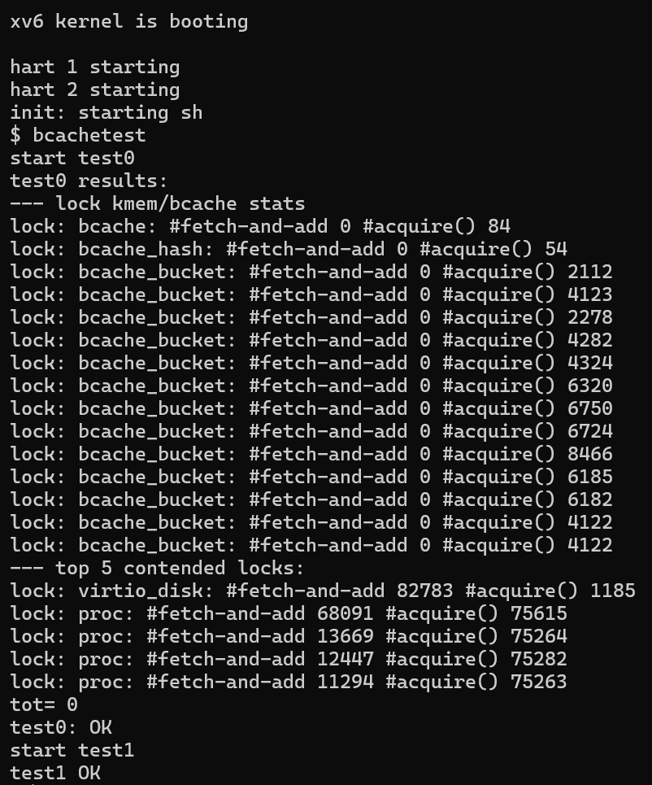
#### 四、 实验心得

### Lab8 通过结果截图


## File Systems
### Large File
#### 一、 实验目的

#### 二、 实验内容


#### 三、 实验中遇到的问题及解决方 
法
```c
$ bigfile
```
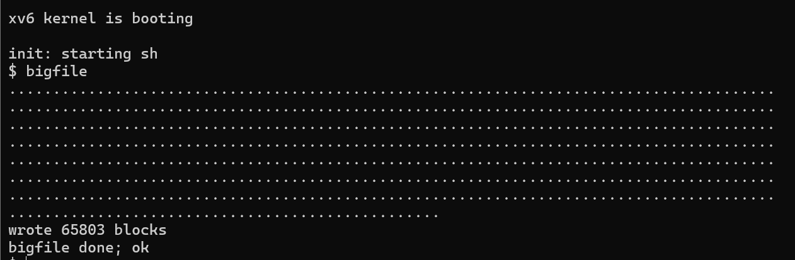

#### 四、 实验心得

### Symbolic links
#### 一、 实验目的

#### 二、 实验内容


#### 三、 实验中遇到的问题及解决方 
法
```c
$ symlinktest
```


#### 四、 实验心得

### Lab9 通过结果截图
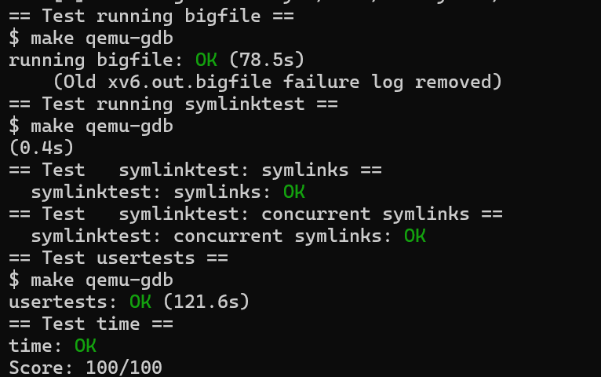

## Lab10 mmap
#### 一、 实验目的

#### 二、 实验内容

#### 三、 实验中遇到的问题及解决方 
法
```c
$ mmaptest
```

#### 四、 实验心得

### Lab10 通过结果截图


## Lab11 Networking
### Your job


### Lab11 通过结果截图
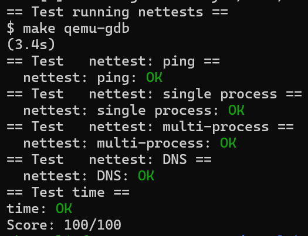