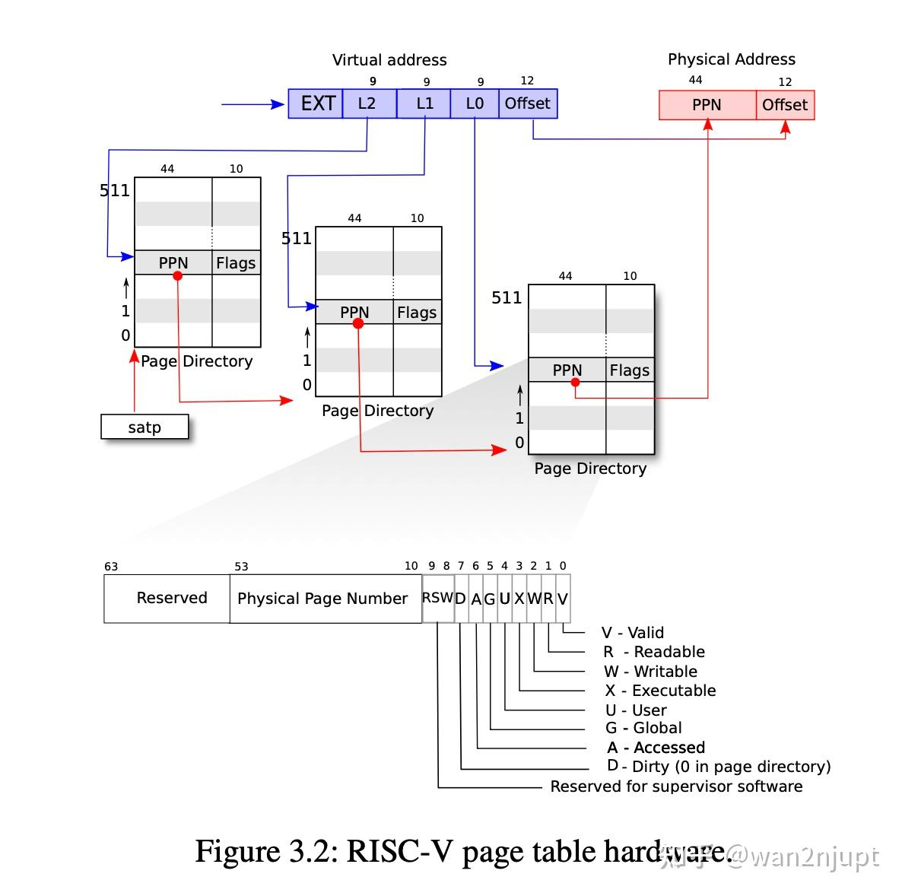
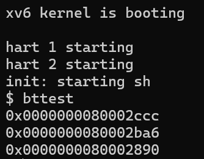
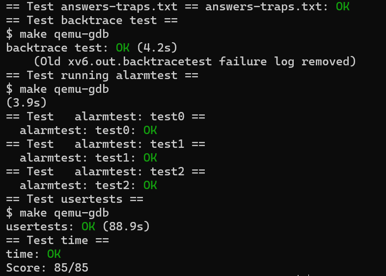
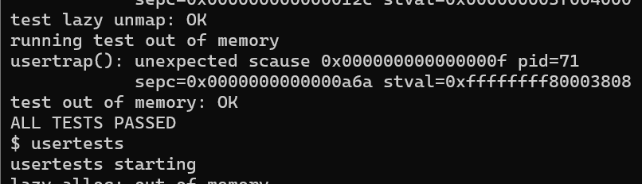
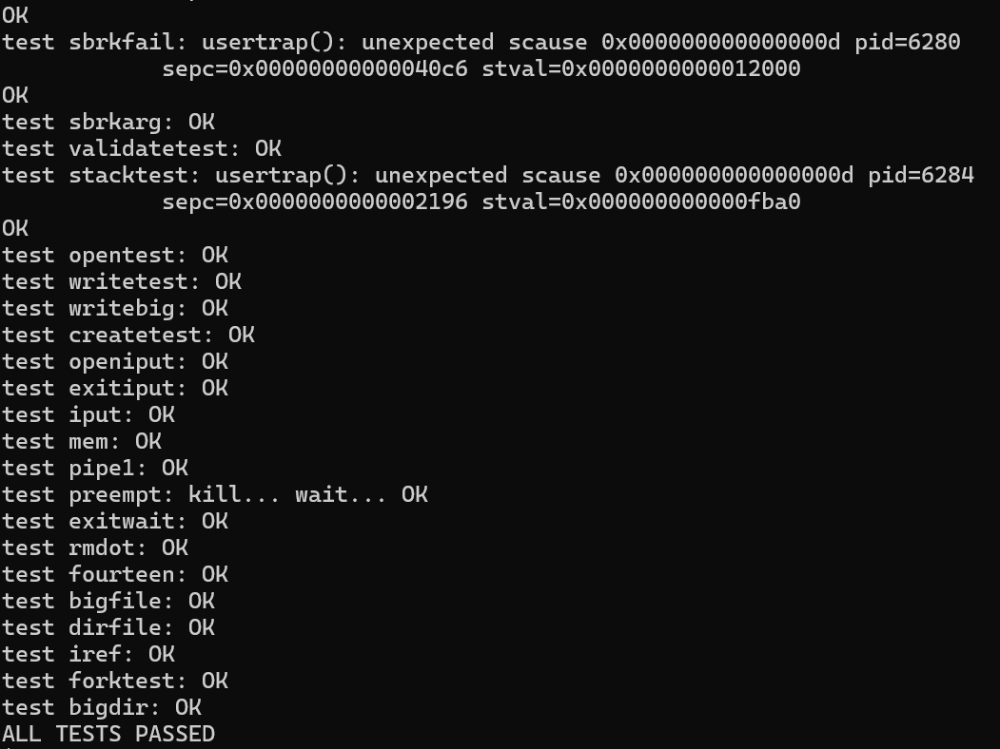
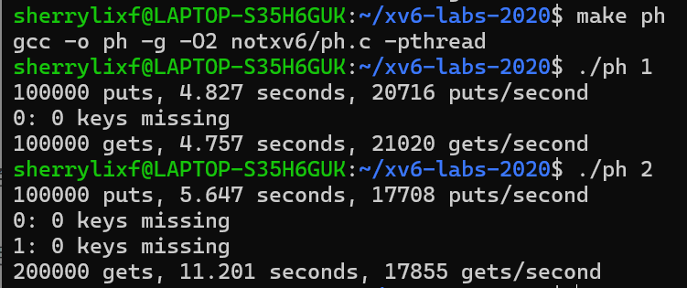

## Lab1 Xv6 and Unix utilities

* 熟悉 xv6 的用户程序编写方法；
* 理解系统调用的使用；

### sleep
一、实验目的

* 编写一个用户级程序 `sleep`，使其能暂停指定数量的时间片。

二、、实验步骤
1. 获取并切换分支
```bash
  cd xv6-labs-2021
  git checkout util
```
2. 创建并编写 **user/sleep.c**
```c
#include "kernel/types.h"
#include "user/user.h"

int main(int argc, char *argv[]) {
  if (argc != 2) {
    fprintf(2, "usage: sleep [ticks num]\n");
    exit(1);
  }
  // atoi sys call guarantees return an integer
  int ticks = atoi(argv[1]);
  int ret = sleep(ticks);
  exit(ret);
}
```
3. 修改 Makefile,在 `UPROGS` 中添加一项：
```make
  UPROGS=\
    $U/_sleep\
```
4. 编译并运行
```bash
  make qemu
```

三、实验结果
* 输入 `sleep 10` 后，程序成功暂停一段时间，再次返回 shell 提示符，说明 `sleep` 实现正确。
```bash
  $ sleep 10
```

四、实验总结
* 本实验加深了对 xv6 系统调用机制的理解；
* 掌握了在 xv6 中创建用户程序、解析命令行参数、调用系统调用的方法；
* sleep 的实现展示了如何与内核通信、如何编写可移植的用户程序。


### pingpong

一、实验目的

* 编写一个使用 UNIX 系统调用的 `pingpong` 程序，实现父子进程通过两个单向管道（pipe）进行双向通信；
* 加深对 xv6 系统调用、进程控制与管道机制的理解；
* 掌握在 xv6 中创建用户程序并进行编译运行的方法。

二、实验步骤

1. 获取并切换到 util 分支
```bash
cd xv6-labs-2021
git checkout util
```

2. 创建并编写 **user/pingpong.c**


3. 修改 `Makefile`
```make
UPROGS=\
  $U/_pingpong\
```

#### 4. 编译并运行
```bash
make qemu
```
在 xv6 shell 中输入：
```bash
$ pingpong
```

三、实验结果
* 在 xv6 shell 中运行 `pingpong`，父子进程成功完成通信。
```bash
$ pingpong
    4: received ping
    3: received pong
```

四、实验总结
* 通过实现 `pingpong`，掌握了 xv6 中父子进程的创建与通信机制；
* 熟悉了管道 pipe 的使用方式，以及如何基于 `fork()` 实现数据双向流动；

### primes

一、实验目的
* 理解并实现一个基于进程和管道的素数筛选器（prime sieve）；
* 熟悉 UNIX 风格的管道通信与 `fork()`、`pipe()`、`read()`、`write()` 的协同使用；

二、实验步骤
1. 创建文件 **user/primes.c**
```c
#include "user/user.h"

void prime_sieve(int p_read) {
    // Read the first prime number from the pipe
    int n;
    if (read(p_read, &n, sizeof(int)) != sizeof(int)) {
        close(p_read);
        exit(0);
    }

    int prime = n;
    printf("prime %d\n", prime);

    int p[2];
    pipe(p);

    int pid = fork();
    if (pid == 0) { 
        // child process
        close(p[1]);         
        prime_sieve(p[0]);  
    } 
    else {
        // parent process
        close(p[0]); 
        while (read(p_read, &n, sizeof(int)) == sizeof(int)) {
            if (n % prime != 0) {
                write(p[1], &n, sizeof(int));
            }
        }
        close(p_read);
        close(p[1]);
        wait(0); 
    }

    exit(0);
} 

int main() {
    // Create a pipe for communication
    int p[2]; 
    pipe(p);  

    int pid = fork();
    if (pid == 0) {
        // child process
        close(p[1]);         
        prime_sieve(p[0]);  
    } 
    else {
        // parent process
        close(p[0]); 
        for (int i = 2; i <= 35; i++) {
            write(p[1], &i, sizeof(int));
        }
        close(p[1]); 
        wait(0);     
    }

    exit(0);
}
```

2. 修改 `Makefile`
```make
$U/_primes\
```

3. 编译并运行程序
```bash
make qemu
```

在 xv6 shell 中运行：
```bash
$ primes
```

三、实验结果
运行结果如下，输出了 2\~35 之间的所有素数：
```bash
$ primes
prime 2
prime 3
prime 5
prime 7
prime 11
prime 13
prime 17
prime 19
prime 23
prime 29
prime 31
$
```

四、实验总结
* 本实验成功实现了一个基于管道和进程的并发素数筛选器；
* 深刻理解了 `fork()`、`pipe()`、`read()`、`write()`、`wait()` 在进程通信中的角色；

### find

一、实验目的
* 实现简易版 UNIX 命令 `find`，递归查找目录中与给定名字匹配的文件。
* 熟悉 xv6 文件系统结构与递归遍历机制。

二、实验过程

1. 新建文件 **user/find.c** ：
```c
#include "kernel/types.h"
#include "kernel/stat.h"
#include "user/user.h"
#include "kernel/fs.h"

char* fmtname(char* path) {
  static char buf[DIRSIZ + 1];
  char* p;

  // Find first character after last slash.
  for (p = path + strlen(path); p >= path && *p != '/'; p--)
    ;
  p++;
  memmove(buf, p, strlen(p));
  buf[strlen(p)] = '\0';
  return buf;
}

void find(char* path, char* target) {
  char buf[512], *p;
  int fd;
  struct dirent de;
  struct stat st;

  if ((fd = open(path, 0)) < 0) {
    fprintf(2, "find: cannot open %s\n", path);
    return;
  }

  if (fstat(fd, &st) < 0) {
    fprintf(2, "find: cannot stat %s\n", path);
    close(fd);
    return;
  }

  if (st.type != T_DIR) {
    if (strcmp(fmtname(path), target) == 0)
      printf("%s\n", path);
    close(fd);
    return;
  }

  if (strlen(path) + 1 + DIRSIZ + 1 > sizeof buf) {
    printf("find: path too long\n");
    close(fd);
    return;
  }

  strcpy(buf, path);
  p = buf + strlen(buf);
  *p++ = '/';

  while (read(fd, &de, sizeof(de)) == sizeof(de)) {
    if (de.inum == 0)
      continue;

    memmove(p, de.name, DIRSIZ);
    p[DIRSIZ] = 0;

    if (strcmp(de.name, ".") == 0 || strcmp(de.name, "..") == 0)
      continue;

    find(buf, target);
  }

  close(fd);
}

int main(int argc, char* argv[]) {
  if (argc != 3) {
    fprintf(2, "Usage: find <path> <filename>\n");
    exit(1);
  }

  find(argv[1], argv[2]);
  exit(0);
}

```

2. 修改 Makefile：
```make
 UPROGS=\
   $U/_find\
```

3. 编译并运行测试：
```bash
  make qemu
```

   在 shell 中输入：
   ```bash
   $ echo > b
   $ mkdir a
   $ echo > a/b
   $ find . b
   ```

三、实验结果
```bash
$ find . b
./b
./a/b
```

四、实验分析
* 利用 `read` 读取目录项，配合 `stat` 获取元信息；
* 使用 `strcmp` 字符串比较匹配文件名；
* 使用递归函数跳过 `"."` 和 `".."`，向子目录深入。

### xargs

一、实验目的
* 实现简易版 `xargs`，读取标准输入并逐行作为参数运行给定命令。
* 熟悉 `fork/exec/wait` 调用机制和标准输入读取。

二、实验过程
1. 新建文件 **user/xargs.c** ：
```c
#include "kernel/types.h"
#include "kernel/stat.h"
#include "user/user.h"

int main(int argc, char* argv[]) {
    if (argc < 2) { // Check at least one command is provided
        fprintf(2, "Usage: xargs <command> [args...]\n");
        exit(1);
    }

    char buf[512];
    int i = 0;
    char ch;

    // Read input from stdin until EOF or newline
    while (read(0, &ch, 1) == 1) {
        if (ch == '\n') {
            buf[i] = 0;
            i = 0;

            char* args[32];
            int j;
            for (j = 1; j < argc; j++) {
                args[j - 1] = argv[j];
            }
            args[j - 1] = buf;
            args[j] = 0;

            if (fork() == 0) {
                // child process 
                exec(argv[1], args);
                fprintf(2, "xargs: exec failed\n");
                exit(1);
            } 
            else {
                // parent process
                wait(0);
            }
        } 
        else {
            buf[i++] = ch;
        }
    }

    exit(0);
}
```

2. 修改 Makefile：
```make
  UPROGS=\
    $U/_xargs\
```

3. 测试脚本运行：
```bash
  $ sh < xargstest.sh
```

三、实验结果
```bash
$ sh < xargstest.sh
$ $ $ $ $ $ hello
hello
hello
$
```

四、实验分析
* 使用 `read` 按字符读取，直到 `\n` 分割命令；
* 构造 `argv` 并通过 `fork()` + `exec()` 启动命令；
* 在父进程中使用 `wait()` 等待子进程执行完成；
* 学会处理标准输入并拼接命令参数，理解 UNIX 管道组合思想。

### Lab1 通过结果截图


## Lab2 system calls
* 启动 Lab2，请切换到 syscall 分支：
```
  $ git stash
  $ git fetch
  $ git checkout syscall
  $ make clean
 ```

### System call tracing
一、实验目的
本实验旨在在 xv6 内核中添加一个新的系统调用 `trace`，用于控制对其他系统调用的追踪和调试。实现的核心功能包括：
* 创建一个名为 `trace(int mask)` 的新系统调用；
* 用户调用 `trace(mask)` 后，将其掩码（mask）保存在当前进程结构中；
* 修改内核系统调用处理逻辑，在系统调用返回时，根据掩码决定是否打印调试信息；
* 调试信息需包含：**进程 PID、系统调用名称、系统调用返回值**。

二、实验步骤
1. **kernel/syscall.h** 添加系统调用号
```c
#define SYS_trace 22
```

2. **kernel/sysproc.c**添加 `sys_trace` 函数声明
  

3. **proc.h** 添加新字段
在 **struct proc** 中添加一行：


4. **kernel/syscall.c** 完成系统调用表注册与打印逻辑
（1）添加 sys_trace 到系统调用函数数组中

（2）添加系统调用名称表

（3）修改 syscall 调用处理逻辑，加上追踪打印

5. **user/usys.pl** 添加用户空间接口

6. **user/trace.c** 编写用户程序验证功能
本实验中已提供了 `user/trace.c`，可执行如下命令进行测试：
```bash
$ make qemu
$ trace 32 grep hello README
```


三、实验结果

每一行：**[PID]: syscall [name] -> [return_value]**
如：4: syscall read -> 1023
说明 PID 为 4 的进程调用了 read() 系统调用，并且返回值为 1023，即成功读取了 1023 字节。

四、实验分析
本实验完成了一个实用的调试工具——系统调用追踪器。通过合理使用掩码控制打印，我们能够对进程行为进行细致观察，这在大型内核调试或系统编程中非常有价值。
* 如何向 xv6 添加系统调用；
* 如何操作进程结构体中的自定义字段；
* 如何在 syscall 层添加通用打印逻辑；

### Sysinfo
一、实验目的
本实验的目标是实现一个新的系统调用 **sysinfo**，用于收集当前系统运行状态的信息，主要包括：
* freemem：系统中剩余的空闲内存（以字节为单位）。
* nproc：处于活动状态（非 UNUSED）的进程数量。

当用户程序调用 sysinfo() 时，内核需要统计当前的内存和进程信息，并通过 copyout() 将结果写入用户态传入的 struct sysinfo 地址中。

二、实验过程
1. **kernel/sysinfo.h** 添加结构体定义：

2. **user/user.h** 声明用户态调用接口

3. **kernel/syscall.h** 添加 syscall 编号

4. **kernel/syscall.c** 注册系统调用函数

5. **kernel/sysproc.c** 实现系统调用函数接口

6. 实现内存和进程统计函数
- 
  (1) **kernel/kalloc.c**
  
-
  (2) **kernel/proc.c**
  
7. 在 Makefile 中添加：
```make
UPROGS += \
  $U/_sysinfotest
```

三、实验结果
```bash
$ make qemu
$ sysinfotest
```


四、实验分析
测试程序 sysinfotest 检查返回的内存和进程数量是否合理。实验通过 sysinfotest: OK 输出判断成功。
* 系统调用实现的完整流程；
* 内核空间与用户空间之间的数据传输；
* 内核内存管理的基本机制（freelist）；
* 进程表的管理方式；

### Lab2 通过结果截图


## Lab3 page tables
* 切换分支，开始 Lab3
```
  $ git stash
  $ git fetch
  $ git checkout pgtbl
  $ make clean
```
- 本实验相关的数据结构：
  pagetable_t：页表指针，本质是 uint64 *，指向页表页
  walk(pagetable, va, alloc)：递归查找或分配页表项
  mappages(pagetable, va, size, pa, perm)：添加页表项
  uvmcreate()、uvmalloc()：构建用户页表
  kvminit()：初始化全局内核页表
  vmprint()：用于打印页表结构

### print a page table
一、实验目的
通过本实验，掌握操作系统中**页表**的基本结构与层次，学习如何递归打印页表项，理解页表的三级结构与每一级的意义。
- xv6 使用的是 RISC-V 架构，采用 Sv39 模式的三级页表结构，每级页表有 512 个条目（因为页表项大小为 8 字节，页大小为 4KB）。
虚拟地址是 64 位的，但在 Sv39 模式下只使用低 39 位：

虚拟地址 (VA) 结构如下：
|  25位保留  | 9位 (VPN[2]) | 9位 (VPN[1]) | 9位 (VPN[0]) | 12位 (页内偏移) |
|------------|--------------|--------------|--------------|-----------------|
| 高位保留位 | 一级页索引   | 二级页索引   | 三级页索引   | 页内偏移        |

- 设虚拟地址为 VA，从 satp 得到根页表物理地址 P0，过程如下：
```
VA:
  vpn[2] = VA[38:30]  // 取出下一级页表 P1 的物理地址
  vpn[1] = VA[29:21]  // 取出下一级页表 P2 的物理地址
  vpn[0] = VA[20:12]  // 取出页框地址 PFN 
  offset = VA[11:0]   // 页内偏移 offset
  // 最终物理地址：PFN << 12 + offset
```

二、实验步骤
1. **vm.c** 中实现 vmprint

2. **defs.h** 声明函数

3. **exec.c** 调用，在 exec() 函数末尾加入函数调用：
```c
  return argc; // 返回之前
```

4. 重新编译并运行
```bash
make clean
make qemu
```

三、 实验结果
成功编译并运行后，在 QEMU 的输出中看到如下页表结构打印信息：

每个缩进代表页表的不同级别（L1、L2、L3），输出的 pte 是页表项值，pa 是物理地址。

四、实验分析
- 页表结构理解
  RISC-V 架构使用三级页表，每级有 512 个条目。
  每个页表项（PTE）包含有效位（V）、权限位（R/W/X）和物理地址。
  如果页表项是中间节点，则需要递归下一级页表。
* 打印策略
  本实验通过递归方式打印页表，每一级缩进对应页表层次。
  仅打印有效的 PTE（PTE_V），并判断是否是页表页（没有 R/W/X 权限）。

### A kernel page table per process
一、 实验目的
为每个进程维护一个专属的**内核页表**，从而当内核执行该进程，不仅切换用户页表，还需要切换内核页表。该内核页表应该包含：所有内核空间的映射和该进程的内核栈映射。

二、 实验步骤
1. **struct proc** 增加

2. **kernel/vm.c** 实现 kpagetableinit() (参考 kvminit())

3. **kernel/proc.c** 在 allocproc() 生成并初始化进程的 kpagetable

4. **kernel/proc.c** 在 scheduler() 中切换页表

5. **kernel/proc.c** 中的 scheduler() 函数,当没有进程运行时，恢复 

6. **kernel/proc.c** 在 freeproc() 中释放页表（但不释放物理页）

**kernel/vm.c** 添加辅助函数（模拟 freewalk()，但不释放页内容）：

7. **kernel/exec.c** 添加调试工具 vmprint() 调页表结构

8. 编译并运行
```bash
make clean
make qemu
```

三、 实验结果
在 xv6 中运行：
```sh
usertests
```
确保没有崩溃，说明你的内核页表逻辑是正确的。

四、 实验分析

