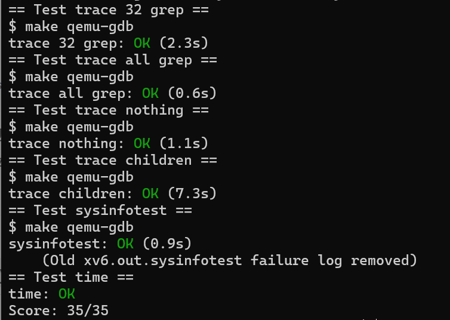

touch time.txt
echo 5 > time.txt

[TOC]

## Lab1 Xv6 and Unix utilities
* 启动 Lab2，请切换到 util 分支：
```
  $ git stash
  $ git fetch
  $ git checkout util
  $ make clean
 ```
* 熟悉 xv6 的用户程序编写方法；
* 理解系统调用的使用；

### sleep
一、实验目的

* 编写一个用户级程序 `sleep`，使其能暂停指定数量的时间片。

二、、实验步骤
1. 获取并切换分支
```bash
  cd xv6-labs-2021
  git checkout util
```
2. 创建并编写 **user/sleep.c**
```c
#include "kernel/types.h"
#include "user/user.h"

int main(int argc, char *argv[]) {
  if (argc != 2) {
    fprintf(2, "usage: sleep [ticks num]\n");
    exit(1);
  }
  // atoi sys call guarantees return an integer
  int ticks = atoi(argv[1]);
  int ret = sleep(ticks);
  exit(ret);
}
```
3. 修改 Makefile,在 `UPROGS` 中添加一项：
```make
  UPROGS=\
    $U/_sleep\
```
4. 编译并运行
```bash
  make qemu
```

三、实验结果
* 输入 `sleep 10` 后，程序成功暂停一段时间，再次返回 shell 提示符，说明 `sleep` 实现正确。
```bash
  $ sleep 10
```

四、实验总结
* 本实验加深了对 xv6 系统调用机制的理解；
* 掌握了在 xv6 中创建用户程序、解析命令行参数、调用系统调用的方法；
* sleep 的实现展示了如何与内核通信、如何编写可移植的用户程序。


### pingpong
一、实验目的
* 编写一个使用 UNIX 系统调用的 `pingpong` 程序，实现父子进程通过两个单向管道（pipe）进行双向通信；
* 加深对 xv6 系统调用、进程控制与管道机制的理解；
* 掌握在 xv6 中创建用户程序并进行编译运行的方法。

二、实验步骤
1. 获取并切换到 util 分支
```bash
cd xv6-labs-2021
git checkout util
```

2. 创建并编写 **user/pingpong.c**
```c
#include "kernel/types.h"
#include "user/user.h"

int main(int argc, char *argv[]) {
  int pid;
  int pipes1[2], pipes2[2];
  char buf[] = {'a'};
  pipe(pipes1);
  pipe(pipes2);

  int ret = fork();

  if (ret == 0) {
    // child
    pid = getpid();
    close(pipes1[1]);
    close(pipes2[0]);
    read(pipes1[0], buf, 1);
    printf("%d: received ping\n", pid);
    write(pipes2[1], buf, 1);
    exit(0);
  } else {
    // parent
    pid = getpid();
    close(pipes1[0]);
    close(pipes2[1]);
    write(pipes1[1], buf, 1);
    read(pipes2[0], buf, 1);
    printf("%d: received pong\n", pid);
    exit(0);
  }
}
```
3. 修改 `Makefile`
```make
UPROGS=\
  $U/_pingpong\
```
4. 编译并运行
```bash
make qemu
```
在 xv6 shell 中输入：
```bash
$ pingpong
```

三、实验结果
* 在 xv6 shell 中运行 `pingpong`，父子进程成功完成通信。
```bash
$ pingpong
    4: received ping
    3: received pong
```

四、实验总结
* 通过实现 `pingpong`，掌握了 xv6 中父子进程的创建与通信机制；
* 熟悉了管道 pipe 的使用方式，以及如何基于 `fork()` 实现数据双向流动；

### primes

一、实验目的
* 理解并实现一个基于进程和管道的素数筛选器（prime sieve）；
* 熟悉 UNIX 风格的管道通信与 `fork()`、`pipe()`、`read()`、`write()` 的协同使用；

二、实验步骤
1. 创建文件 **user/primes.c**
```c
#include "user/user.h"

void prime_sieve(int p_read) {
    // Read the first prime number from the pipe
    int n;
    if (read(p_read, &n, sizeof(int)) != sizeof(int)) {
        close(p_read);
        exit(0);
    }

    int prime = n;
    printf("prime %d\n", prime);

    int p[2];
    pipe(p);

    int pid = fork();
    if (pid == 0) { 
        // child process
        close(p[1]);         
        prime_sieve(p[0]);  
    } 
    else {
        // parent process
        close(p[0]); 
        while (read(p_read, &n, sizeof(int)) == sizeof(int)) {
            if (n % prime != 0) {
                write(p[1], &n, sizeof(int));
            }
        }
        close(p_read);
        close(p[1]);
        wait(0); 
    }

    exit(0);
} 

int main() {
    // Create a pipe for communication
    int p[2]; 
    pipe(p);  

    int pid = fork();
    if (pid == 0) {
        // child process
        close(p[1]);         
        prime_sieve(p[0]);  
    } 
    else {
        // parent process
        close(p[0]); 
        for (int i = 2; i <= 35; i++) {
            write(p[1], &i, sizeof(int));
        }
        close(p[1]); 
        wait(0);     
    }

    exit(0);
}
```

2. 修改 `Makefile`
```make
$U/_primes\
```

3. 编译并运行程序
```bash
make qemu
```

在 xv6 shell 中运行：
```bash
$ primes
```

三、实验结果
运行结果如下，输出了 2\~35 之间的所有素数：
```bash
$ primes
prime 2
prime 3
prime 5
prime 7
prime 11
prime 13
prime 17
prime 19
prime 23
prime 29
prime 31
$
```

四、实验总结
* 本实验成功实现了一个基于管道和进程的并发素数筛选器；
* 深刻理解了 `fork()`、`pipe()`、`read()`、`write()`、`wait()` 在进程通信中的角色；

### find

一、实验目的
* 实现简易版 UNIX 命令 `find`，递归查找目录中与给定名字匹配的文件。
* 熟悉 xv6 文件系统结构与递归遍历机制。

二、实验过程

1. 新建文件 **user/find.c** ：
```c
#include "kernel/types.h"
#include "kernel/stat.h"
#include "user/user.h"
#include "kernel/fs.h"

char* fmtname(char* path) {
  static char buf[DIRSIZ + 1];
  char* p;

  // Find first character after last slash.
  for (p = path + strlen(path); p >= path && *p != '/'; p--)
    ;
  p++;
  memmove(buf, p, strlen(p));
  buf[strlen(p)] = '\0';
  return buf;
}

void find(char* path, char* target) {
  char buf[512], *p;
  int fd;
  struct dirent de;
  struct stat st;

  if ((fd = open(path, 0)) < 0) {
    fprintf(2, "find: cannot open %s\n", path);
    return;
  }

  if (fstat(fd, &st) < 0) {
    fprintf(2, "find: cannot stat %s\n", path);
    close(fd);
    return;
  }

  if (st.type != T_DIR) {
    if (strcmp(fmtname(path), target) == 0)
      printf("%s\n", path);
    close(fd);
    return;
  }

  if (strlen(path) + 1 + DIRSIZ + 1 > sizeof buf) {
    printf("find: path too long\n");
    close(fd);
    return;
  }

  strcpy(buf, path);
  p = buf + strlen(buf);
  *p++ = '/';

  while (read(fd, &de, sizeof(de)) == sizeof(de)) {
    if (de.inum == 0)
      continue;

    memmove(p, de.name, DIRSIZ);
    p[DIRSIZ] = 0;

    if (strcmp(de.name, ".") == 0 || strcmp(de.name, "..") == 0)
      continue;

    find(buf, target);
  }

  close(fd);
}

int main(int argc, char* argv[]) {
  if (argc != 3) {
    fprintf(2, "Usage: find <path> <filename>\n");
    exit(1);
  }

  find(argv[1], argv[2]);
  exit(0);
}

```

2. 修改 Makefile：
```make
 UPROGS=\
   $U/_find\
```

3. 编译并运行测试：
```bash
  make qemu
```

   在 shell 中输入：
   ```bash
   $ echo > b
   $ mkdir a
   $ echo > a/b
   $ find . b
   ```

三、实验结果
```bash
$ find . b
./b
./a/b
```

四、实验分析
* 利用 `read` 读取目录项，配合 `stat` 获取元信息；
* 使用 `strcmp` 字符串比较匹配文件名；
* 使用递归函数跳过 `"."` 和 `".."`，向子目录深入。

### xargs

一、实验目的
* 实现简易版 `xargs`，读取标准输入并逐行作为参数运行给定命令。
* 熟悉 `fork/exec/wait` 调用机制和标准输入读取。

二、实验过程
1. 新建文件 **user/xargs.c** ：
```c
#include "kernel/types.h"
#include "kernel/stat.h"
#include "user/user.h"

int main(int argc, char* argv[]) {
    if (argc < 2) { // Check at least one command is provided
        fprintf(2, "Usage: xargs <command> [args...]\n");
        exit(1);
    }

    char buf[512];
    int i = 0;
    char ch;

    // Read input from stdin until EOF or newline
    while (read(0, &ch, 1) == 1) {
        if (ch == '\n') {
            buf[i] = 0;
            i = 0;

            char* args[32];
            int j;
            for (j = 1; j < argc; j++) {
                args[j - 1] = argv[j];
            }
            args[j - 1] = buf;
            args[j] = 0;

            if (fork() == 0) {
                // child process 
                exec(argv[1], args);
                fprintf(2, "xargs: exec failed\n");
                exit(1);
            } 
            else {
                // parent process
                wait(0);
            }
        } 
        else {
            buf[i++] = ch;
        }
    }

    exit(0);
}
```

2. 修改 Makefile：
```make
  UPROGS=\
    $U/_xargs\
```

3. 测试脚本运行：
```bash
  $ sh < xargstest.sh
```

三、实验结果
```bash
$ sh < xargstest.sh
$ $ $ $ $ $ hello
hello
hello
$
```

四、实验分析
* 使用 `read` 按字符读取，直到 `\n` 分割命令；
* 构造 `argv` 并通过 `fork()` + `exec()` 启动命令；
* 在父进程中使用 `wait()` 等待子进程执行完成；
* 学会处理标准输入并拼接命令参数，理解 UNIX 管道组合思想。

### Lab1 通过结果截图


## Lab2 system calls
* 启动 Lab2，请切换到 syscall 分支：
```
  $ git stash
  $ git fetch
  $ git checkout syscall
  $ make clean
 ```

### System call tracing
一、实验目的
本实验旨在在 xv6 内核中添加一个新的系统调用 `trace`，用于控制对其他系统调用的追踪和调试。实现的核心功能包括：
* 创建一个名为 `trace(int mask)` 的新系统调用；
* 用户调用 `trace(mask)` 后，将其掩码（mask）保存在当前进程结构中；
* 修改内核系统调用处理逻辑，在系统调用返回时，根据掩码决定是否打印调试信息；
* 调试信息需包含：**进程 PID、系统调用名称、系统调用返回值**。

二、实验步骤
1. **kernel/syscall.h** 添加系统调用号
```c
#define SYS_trace 22
```
2. **kernel/sysproc.c**添加 `sys_trace` 函数声明
```c
uint64
sys_trace(void)
{
  int mask;
  if(argint(0, &mask) < 0)
    return -1;

  struct proc *p = myproc();
  p->tracemask = mask;

  return 0;
}
```
3. **proc.h** 添加新字段
在 **struct proc** 中添加一行：
```c
  int tracemask;// 跟踪系统调用的掩码，标识哪些系统调用需要追踪
```
4. **kernel/syscall.c** 完成系统调用表注册与打印逻辑

（1）添加 sys_trace 到系统调用函数数组中
```c
  extern uint64 sys_trace(void);

  static uint64 (*syscalls[])(void) = {
    // ... 之前的系统调用函数 ...
    [SYS_trace] sys_trace,
  };
```
（2）添加系统调用名称表
```c
static char *syscallnames[] = {
  [SYS_fork]    "fork",
  [SYS_exit]    "exit",
  [SYS_wait]    "wait",
  [SYS_pipe]    "pipe",
  [SYS_read]    "read",
  [SYS_kill]    "kill",
  [SYS_exec]    "exec",
  [SYS_fstat]   "fstat",
  [SYS_chdir]   "chdir",
  [SYS_dup]     "dup",
  [SYS_getpid]  "getpid",
  [SYS_sbrk]    "sbrk",
  [SYS_sleep]   "sleep",
  [SYS_uptime]  "uptime",
  [SYS_open]    "open",
  [SYS_write]   "write",
  [SYS_mknod]   "mknod",
  [SYS_unlink]  "unlink",
  [SYS_link]    "link",
  [SYS_mkdir]   "mkdir",
  [SYS_close]   "close",
  [SYS_trace]   "trace",    
};

```
（3）修改 syscall 调用处理逻辑，加上追踪打印
```c
void
syscall(void)
{
  int num;
  struct proc *p = myproc();

  num = p->trapframe->a7;
  if(num > 0 && num < NELEM(syscalls) && syscalls[num]) {
    p->trapframe->a0 = syscalls[num]();

    // 追踪系统调用打印
    if(p->tracemask & (1 << num)){
      printf("%d: syscall %s -> %d\n", p->pid, syscallnames[num], p->trapframe->a0);
    }
  } else {
    printf("%d %s: unknown sys call %d\n",
      p->pid, p->name, num);
    p->trapframe->a0 = -1;
  }
}
```
5. **user/usys.pl** 添加用户空间接口
```c
  entry("trace")
```
6. **user/trace.c** 编写用户程序验证功能
本实验中已提供了 `user/trace.c`，可执行如下命令进行测试：
```bash
$ make qemu
$ trace 32 grep hello README
```

三、实验结果

每一行：**[PID]: syscall [name] -> [return_value]**

四、实验分析
本实验完成了一个实用的调试工具——系统调用追踪器。通过合理使用掩码控制打印，我们能够对进程行为进行细致观察，这在大型内核调试或系统编程中非常有价值。
* 如何向 xv6 添加系统调用；
* 如何操作进程结构体中的自定义字段；
* 如何在 syscall 层添加通用打印逻辑；

### Sysinfo
一、实验目的
本实验的目标是实现一个新的系统调用 **sysinfo**，用于收集当前系统运行状态的信息，主要包括：
* freemem：系统中剩余的空闲内存（以字节为单位）。
* nproc：处于活动状态（非 UNUSED）的进程数量。

当用户程序调用 sysinfo() 时，内核需要统计当前的内存和进程信息，并通过 copyout() 将结果写入用户态传入的 struct sysinfo 地址中。

二、实验过程
1. **kernel/sysinfo.h** 添加结构体定义：
```c
// kernel/sysinfo.h
#ifndef SYSINFO_H
#define SYSINFO_H

struct sysinfo {
  uint64 free_memory;   // 空闲内存页数量，单位字节
  uint64 nproc;         // 当前活动进程数量
};

#endif // SYSINFO_H
```
2. **user/user.h** 声明用户态调用接口
```c
// user/user.h
#ifndef USER_H
#define USER_H

struct sysinfo {
  uint64 free_memory;
  uint64 nproc;
};

int sysinfo(struct sysinfo *info);

#endif // USER_H
```
3. **kernel/syscall.h** 添加 syscall 编号
```c
// kernel/syscall.h
#define SYS_sysinfo 23  // 假设用23，确保不冲突
```
4. **kernel/syscall.c** 注册系统调用函数
```c
extern uint64 sys_sysinfo(void);

static uint64 (*syscalls[])(void) = {
  // ...
  [SYS_sysinfo] sys_sysinfo,
};
```
5. **kernel/sysproc.c** 实现系统调用函数接口
```c
#include "sysinfo.h"
#include "proc.h"
#include "defs.h"
#include "riscv.h"

uint64
sys_sysinfo(void)
{
  struct sysinfo info;
  struct proc *p;

  acquire(&ptable.lock);

  info.nproc = 0;
  for(p = proc; p < &proc[NPROC]; p++){
    if(p->state != UNUSED)
      info.nproc++;
  }

  release(&ptable.lock);

  info.free_memory = kfreemem();  // 你需要实现这个函数获取空闲内存大小

  // 复制到用户空间
  struct sysinfo *user_addr;
  if(argaddr(0, (uint64 *)&user_addr) < 0)
    return -1;

  if(copyout(myproc()->pagetable, (uint64)user_addr, (char *)&info, sizeof(info)) < 0)
    return -1;

  return 0;
}
```
6. 实现内存和进程统计函数
 
(1) **kernel/kalloc.c**
```c
#include "kalloc.h"
#include "spinlock.h"

extern struct run *freelist;
extern struct spinlock kalloc_lock;

uint64
kfreemem(void)
{
  uint64 count = 0;
  struct run *r;

  acquire(&kalloc_lock);
  for(r = freelist; r; r = r->next){
    count++;
  }
  release(&kalloc_lock);

  return count * PGSIZE; // 返回字节数
}
```

(2) **kernel/proc.c**
```c
#include "kernel/types.h"
#include "user/user.h"
#include "kernel/sysinfo.h"
#include "user/user.h"
#include "kernel/fcntl.h"

int
main(void)
{
  struct sysinfo info;

  if(sysinfo(&info) < 0){
    printf("sysinfo failed\n");
    exit(1);
  }

  printf("Free memory: %d bytes\n", (int)info.free_memory);
  printf("Number of processes: %d\n", (int)info.nproc);

  exit(0);
}
```
7. 在 Makefile 中添加：
```make
UPROGS += \
  $U/_sysinfotest
```

三、实验结果
```bash
$ make qemu
$ sysinfotest
```

四、实验分析
测试程序 sysinfotest 检查返回的内存和进程数量是否合理。实验通过 sysinfotest: OK 输出判断成功。
* 系统调用实现的完整流程；
* 内核空间与用户空间之间的数据传输；
* 内核内存管理的基本机制（freelist）；
* 进程表的管理方式；

### Lab2 通过结果截图


## Lab3 page tables
* 切换分支，开始 Lab3
```
  $ git stash
  $ git fetch
  $ git checkout pgtbl
  $ make clean
```
- 本实验相关的数据结构：
  pagetable_t：页表指针，本质是 uint64 *，指向页表页
  walk(pagetable, va, alloc)：递归查找或分配页表项
  mappages(pagetable, va, size, pa, perm)：添加页表项
  uvmcreate()、uvmalloc()：构建用户页表
  kvminit()：初始化全局内核页表
  vmprint()：用于打印页表结构

### Print a page table
一、实验目的
通过本实验，掌握操作系统中**页表**的基本结构与层次，学习如何递归打印页表项，理解页表的三级结构与每一级的意义。
- xv6 使用的是 RISC-V 架构，采用 Sv39 模式的三级页表结构，每级页表有 512 个条目（因为页表项大小为 8 字节，页大小为 4KB）。
虚拟地址是 64 位的，但在 Sv39 模式下只使用低 39 位：


- 设虚拟地址为 VA，从 satp 得到根页表物理地址 P0，过程如下：
```
VA:
  vpn[2] = VA[38:30]  // 取出下一级页表 P1 的物理地址
  vpn[1] = VA[29:21]  // 取出下一级页表 P2 的物理地址
  vpn[0] = VA[20:12]  // 取出页框地址 PFN 
  offset = VA[11:0]   // 页内偏移 offset
  // 最终物理地址：PFN << 12 + offset
```

二、实验步骤
1. **vm.c** 中实现 vmprint
```c
#include "riscv.h"
#include "defs.h"
#include "param.h"
#include "memlayout.h"

void vmprint_helper(pagetable_t pagetable, int level) {
    if (pagetable == 0)
        return;

    for (int i = 0; i < 512; i++) {
        pte_t pte = pagetable[i];
        if (pte & PTE_V) {
            uint64 pa = PTE2PA(pte);
            for (int j = 0; j < level; j++)
                printf("..");
            printf("%d: pte %p pa %p\n", i, pte, pa);

            if ((pte & (PTE_R | PTE_W | PTE_X)) == 0) {
                // 此项是下一层页表的地址
                vmprint_helper((pagetable_t)pa, level + 1);
            }
        }
    }
}

void vmprint(pagetable_t pagetable) {
    printf("page table %p\n", pagetable);
    vmprint_helper(pagetable, 1);
}
```
2. **defs.h** 声明函数
```c
void vmprint(pagetable_t pagetable);
```
3. **exec.c** 调用，在 exec() 函数末尾加入函数调用：
```c
  vmprint(p->pagetable);
  return argc; // 返回之前
```
4. 重新编译并运行
```bash
make clean
make qemu
```

三、 实验结果
成功编译并运行后，在 QEMU 的输出中看到如下页表结构打印信息：

每个缩进代表页表的不同级别（L1、L2、L3），输出的 pte 是页表项值，pa 是物理地址。

四、实验分析
- 页表结构理解
  RISC-V 架构使用三级页表，每级有 512 个条目。
  每个页表项（PTE）包含有效位（V）、权限位（R/W/X）和物理地址。
  如果页表项是中间节点，则需要递归下一级页表。
* 打印策略
  本实验通过递归方式打印页表，每一级缩进对应页表层次。
  仅打印有效的 PTE（PTE_V），并判断是否是页表页（没有 R/W/X 权限）。

### A kernel page table per process
一、 实验目的
- 当内核需要使用一个用户指针传到system call时，内核必须首先翻译指针到物理地址。
- 这个和下个实验的目的是为了**允许内核直接解析用户指针**。
- 第一个任务是更改内核，为了当在内核执行时，每个进程**使用它自己的内核页表拷贝**。
- 更改struct proc来让每个进程保持一个内核页表，更改scheduler()，当切换进程时切换内核页表。对于这一步，每个进程的内核页表应该和已存在的全局内核页表完全相同。

二、 实验步骤
1. 在kernel/proc.h的struct proc中新加kernelPageTable
```c
pagetable_t kernel_pagetable;  // 每个进程的内核页表
```
2. 修改kernel/vm.c，新增一个vmmake()方法可以创建一个内核页表（不包含CLINT的映射）
```c
pagetable_t
vmmake(void)
{
    pagetable_t kpgtbl;
    kpgtbl = (pagetable_t)kalloc();
    if (kpgtbl == 0)
        return 0;
    memset(kpgtbl, 0, PGSIZE);

    // 映射常规设备、内核空间（注意不包含 CLINT）
    for (int i = 0; i < NCPU; i++) {
        if (mappages(kpgtbl, TRAMPOLINE - (i+1)*PGSIZE, PGSIZE, 
                     (uint64)trampoline, PTE_R | PTE_X) < 0) {
            goto bad;
        }
    }

    // 将设备/内核内存也映射进来
    if (mappages(kpgtbl, UART0, PGSIZE, UART0, PTE_R | PTE_W) < 0) goto bad;
    if (mappages(kpgtbl, VIRTIO0, PGSIZE, VIRTIO0, PTE_R | PTE_W) < 0) goto bad;
    if (mappages(kpgtbl, KERNBASE, (uint64)etext - KERNBASE, KERNBASE, PTE_R | PTE_X) < 0) goto bad;
    if (mappages(kpgtbl, (uint64)etext, PHYSTOP - (uint64)etext, (uint64)etext, PTE_R | PTE_W) < 0) goto bad;

    return kpgtbl;

bad:
    freewalk(kpgtbl);
    return 0;
}
```
3. 在kernel/vm.c，修改vminit()方法，内部由vmmake()实现，此处为全局内核页表创建过程，另外加上CLINT的映射。
```c
void
vminit(void)
{
    kernel_pagetable = vmmake();  // 使用 vmmake 创建全局内核页表
    // 单独映射 CLINT 设备
    mappages(kernel_pagetable, CLINT, 0x10000, CLINT, PTE_R | PTE_W);
}
```
4. 在kernel/proc.c，修改procinit()方法，不再于此方法中为每个进程分配内核栈
```c
void
procinit(void)
{
  struct proc *p;
  
  initlock(&pid_lock, "nextpid");
  for(p = proc; p < &proc[NPROC]; p++) {
      initlock(&p->lock, "proc");

      // Allocate a page for the process's kernel stack.
      // Map it high in memory, followed by an invalid
      // guard page.
      /*char *pa = kalloc();
      if(pa == 0)
        panic("kalloc");
      uint64 va = KSTACK((int) (p - proc));
      kvmmap(va, (uint64)pa, PGSIZE, PTE_R | PTE_W);
      p->kstack = va;*/
  }
  kvminithart();
}
```
5. 在kernel/proc.c，修改allocproc()，在此时创建内核页表，并在内核页表上分配一个内核栈
```c
p->kernel_pagetable = vmmake();
if (p->kernel_pagetable == 0)
    return 0;

// 分配内核栈的物理页
char *pa = kalloc();
if (pa == 0) {
    proc_free_kernel_pagetable(p->kernel_pagetable);
    return 0;
}
uint64 va = KSTACK((int)(p - proc));  // 内核栈虚拟地址
if (mappages(p->kernel_pagetable, va, PGSIZE, (uint64)pa, PTE_R | PTE_W) < 0) {
    kfree(pa);
    proc_free_kernel_pagetable(p->kernel_pagetable);
    return 0;
}
```
6. 在kernel/proc.c，修改scheduler()，在swtch()切换进程前修改satp，保证进程执行期间用的是进程内核页表，切换完后再修改satp为全局内核页表
```c
w_satp(MAKE_SATP(p->kernel_pagetable));
sfence_vma();   // 刷新 TLB

swtch(&c->context, &p->context);

// 恢复为全局内核页表
w_satp(MAKE_SATP(kernel_pagetable));
sfence_vma();
```
7. 在kernel/vm.c，kvmpa()方法会在进程执行期间调用，此时需要修改为获取进程内核页表，而不是全局内核页表
myproc()方法调用，需要在proc.c头部添加头文件引用
```c
uint64
kvmpa(uint64 va)
{
    pte_t *pte;
    uint64 pa;

    struct proc *p = myproc();
    pagetable_t kpgtbl = (p && p->kernel_pagetable) ? p->kernel_pagetable : kernel_pagetable;

    pte = walk(kpgtbl, va, 0);
    if (*pte == 0)
        panic("kvmpa");

    pa = PTE2PA(*pte);
    return pa;
}
```
8. 在kernel/proc.c，修改freeproc()方法，添加对进程内核页表的资源释放
```c
uvmfree2(p->kernel_pagetable, KSTACK(pid));  // KSTACK() 是虚拟地址
proc_free_kernel_pagetable(p->kernel_pagetable);
p->kernel_pagetable = 0;
```
9. 在kernel/proc.c，新增proc_free_kernel_pagetable()方法，用于释放进程内核页表指向的物理内存，以及进程内核页表本身
```c
void
proc_free_kernel_pagetable(pagetable_t kpgtbl)
{
    freewalk(kpgtbl);
}
```
10. 在kernel/vm.c，新增uvmfree2()方法，用于释放内核页表上的内核栈
```c
void
uvmfree2(pagetable_t kpgtbl, uint64 kstack_va)
{
    uvmunmap(kpgtbl, kstack_va, 1, 1);  // unmap and free
}
```

三、 实验结果
```bash
make clean
make qemu
```
在 xv6 中运行：
```sh
usertests
```

没有崩溃，说明你的内核页表逻辑是正确的。

四、 实验分析
- 本次实验的核心目标是为 xv6 操作系统中的每个进程单独创建一个内核页表，替代传统的全局统一内核页表设计，从而实现内存隔离与安全管理。
- 新增 pagetable_t kernel_pagetable 成员到 proc 结构体，代表每个进程的独立内核页表。
- 使用 vmmake() 函数创建内核页表，映射除 CLINT 外的内核空间及设备内存，CLINT单独在全局内核页表中映射。
- 在 allocproc() 分配内核栈对应的物理页，并映射到进程的内核页表中，完成内核栈的私有化。
- 修改调度器 scheduler()，切换上下文时更新 SATP 寄存器为当前进程的内核页表地址，保证执行过程中内核访问基于该页表。
- 在 freeproc() 释放进程内核页表资源，防止内存泄漏。
- 修改相关函数（如 kvmpa()）优先使用当前进程的内核页表，确保地址转换正确。

### Simplify
一、 实验目的
- 内核的copyin函数读取用户指针指向的内存。它先将它们翻译为物理地址（内核可以直接用）。通过代码walk进程页表实现翻译。
- 此实验给每个进程的内核页表**添加用户映射**，使得copyin可以直接使用用户指针。

二、 实验步骤
1. 在**kernel/proc.c**中，修改userinit方法
```c
// Set up first user process.
void
userinit(void)
{
  ......

  //将进程页表的mapping，复制一份到进程内核页表
  pte = walk(p->pagetable, 0, 0);
  kernelPte = walk(p->kernelPageTable, 0, 1);
  *kernelPte = (*pte) & ~PTE_U;

  ......
}
```
2. 在**kernel/proc.c**中，修改fork方法
```c
  //将进程页表的mapping，复制一份到进程内核页表
  for (j = 0; j < p->sz; j+=PGSIZE){
    pte = walk(np->pagetable, j, 0);
    kernelPte = walk(np->kernelPageTable, j, 1);
    *kernelPte = (*pte) & ~PTE_U;
  }
```
3. 在**kernel/exec.c**中，修改exec()，在用户进程页表重新生成完后，取消进程内核页表之前的映射，在进程内核页表，建立新进程页表的映射
```c
  //释放进程旧内核页表映射
  uvmunmap(p->kernelPageTable, 0, PGROUNDUP(oldsz)/PGSIZE, 0);
  //将进程页表的mapping，复制一份到进程内核页表
  for (j = 0; j < sz; j += PGSIZE){
    pte = walk(pagetable, j, 0);
    kernelPte = walk(p->kernelPageTable, j, 1);
    *kernelPte = (*pte) & ~PTE_U;
  }
```
并添加用户空间地址不能大于PLIC的判断
```c
    if (sz1 > PLIC){
      goto bad;
    }
```
4. 在**sysproc.c**中，修改sys_sbrk()，在内存扩张、缩小时，相应更改进程内核页表
```c
  if (n > 0){
    //将进程页表的mapping，复制一份到进程内核页表
    for (j = addr; j < addr + n; j += PGSIZE){
      pte = walk(p->pagetable, j, 0);
      kernelPte = walk(p->kernelPageTable, j, 1);
      *kernelPte = (*pte) & ~PTE_U;
    }
  }else {
    for (j = addr - PGSIZE; j >= addr + n; j -= PGSIZE){
      uvmunmap(p->kernelPageTable, j, 1, 0);
	}
```
5. 在**kernel/proc.c**中，修改freeproc和proc_free_kernel_pagetable方法，取消进程内核页表地址映射
```c
static void
freeproc(struct proc *p)
{
  ......
  if(p->kernelPageTable)
    proc_free_kernel_pagetable(p->kstack, p->kernelPageTable, p->sz);
  ......
}
```

```c
void
proc_free_kernel_pagetable(uint64 kstack, pagetable_t pagetable, uint64 sz)
{
  ......
 //uvmunmap(pagetable, CLINT, 0x10000/PGSIZE, 0);
  ......
}

```
6. 在**kernel/defs.h**中，添加copyin_new()、copyinstr_new()的声明
```c
//vmcopyin.c
int             copyin_new(pagetable_t, char *, uint64, uint64);
int             copyinstr_new(pagetable_t, char *, uint64, uint64);
```
7. 在**kernel/vm.c**中，替换copyin()、copyinstr()为copyin_new()、copyinstr_new()
```c
int
copyin(pagetable_t pagetable, char *dst, uint64 srcva, uint64 len)
{
  return copyin_new(pagetable, dst, srcva, len);
}

int
copyinstr(pagetable_t pagetable, char *dst, uint64 srcva, uint64 max)
{
  return copyinstr_new(pagetable, dst, srcva, max);
}
```

三、 实验结果
```bash
make clean
make qemu
```
在 xv6 中运行：
```sh
usertests
```

没有崩溃，说明地址转换逻辑是正确的。

四、 实验分析
通过在内核页表中增加用户地址映射，使 copyin 直接使用地址访问，无需频繁页表遍历，提高了效率。
- 所有对用户空间有更改（如 fork、exec、sbrk）均需同步更新内核页表，确保一致性。
- 实现中需注意地址范围检查（如不超过 PLIC），防止越界映射。

### Lab3 通过结果截图
